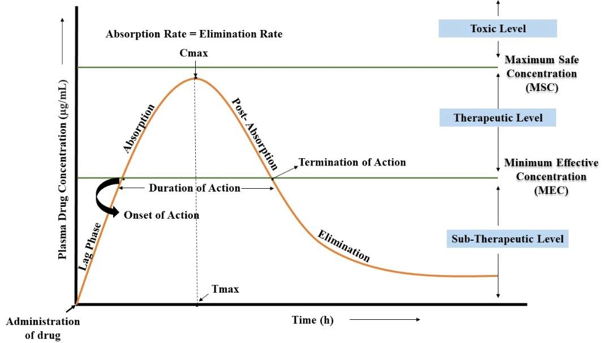

# Biopharmaceutics

`Drugs produce effects; desired or undesired.`

The **site of action** is where the drug causes an effect to occur.

The objective of drug therapy is to deliver the correct drug at the necessary:

- concentration
- site of action
- time to produced the desired effect

## Mechanisms of Action

### Receptors

`most drugs interact with receptors at a particular site of action`

**Receptors** are specialized proteins (usually located on cell membranes or within cells) that recognize and bind specific molecules. When a drug binds to a receptor, it triggers a biochemical or physiological response.

Receptors are **selective**, meaning they only respond to molecules that match their structure (the classic *lock‑and‑key* model).

When molecules bind to a receptor, they cause a reaction based on the drug's characteristics:

- **Agonists**: activate the receptor; mimicking naturally-ocurring agonists & stimulating responses
- **Antagonists**: block the receptor; preventing agonists from binding & inhibiting responses
- **Partial agonists**: activate the receptor *weakly*; producing a weak response

When all available receptors are occupied, the site is **saturated**. Increasing the dose beyond this point will not increase the effect.

#### Withdrawal

Prolonged exposure to drugs that **stimulate** receptors (agonists) can cause the body to *down‑regulate* or desensitize those receptors, making them less responsive.

Prolonged exposure to drugs that **block** receptors (antagonists) can cause the body to *up‑regulate* or increase receptor sensitivity.

When the drug is suddenly removed, the body’s altered receptor balance causes **withdrawal symptoms**.  
This is why certain drugs must be **tapered** rather than stopped abruptly.

#### Receptor Mechanisms

##### **Membrane Protein Bonding / Alteration**

A drug affects ion channels, transporters, or structural proteins in cell membranes.  

*Example:* **Sodium channel blockers** regulate sodium ion flow to control nerve conduction or cardiac rhythm.

##### **Modifying Hormone Control**

A drug alters hormone release, receptor sensitivity, or downstream signaling.

*Example:* **Dopamine**, which functions as both a neurotransmitter and a hormone, influences cardiovascular and renal processes.

##### **Supplementing Hormone Supply**

Introduction of exogenous hormones in order to supplement deficiencies.

*Example:* **Biological Insulins** treat diabetes by directly addressing the deficiency of production.

### Other Mechanisms

`Some drugs produce an effect without interacting with a receptor`

#### **Physical Action**

A drug produces a mechanical or protective effect without chemical interaction.

*Example:* **Aquaphor** forms a physical barrier to prevent moisture loss.

#### **Chemical Reaction**

A drug directly reacts with other substances in the body to neutralize or modify them.

*Example:* **Antacids** neutralize gastric acid through acid–base reactions.

#### **Alter Osmolarity**

A drug changes the osmotic gradient to move water or solutes across membranes.

*Example:* **Peritoneal dialysis solutions** draw waste products out of the bloodstream.

#### **Process Interference**

A drug disrupts a biological or biochemical process essential for cell survival or function.

*Example:* **Penicillin** inhibits bacterial cell wall synthesis.

#### **Complex Formation**

A drug binds to another molecule to form a larger complex. This can:

- enhance excretion  
- slow metabolism  
- prevent absorption  

*Example:* **Doxorubicin liposome injections** use PEGylated liposomes to evade immune detection.

#### **Enzymatic Bonding / Alteration**

`Receptor-like Targets`

A drug modifies enzyme activity or interferes with metabolic pathways.

*Example:* **Reverse Transcriptase Inhibitors** (e.g., abacavir) block viral DNA synthesis.

---

## Concentration & Effect

### Dose-Response Curve

Because drug concentrations at the **site of action** are usually impossible to measure directly, we measure **drug effect** instead.

A **Dose–Response Curve** plots the relationship between the amount of drug administered and the magnitude of the observed effect.

Human variability means individuals differ in how they:

- absorb, distribute, metabolize, and excrete the drug  
- respond to the drug at the receptor or cellular level  
- transport the drug from the site of administration to the site of action  

Therefore, population averages are used to characterize typical drug responses.

Concentrations are typically impossible to measure at the site of action, so effects are measured instead.

### Blood-Concentration Profile

`If a drug cannot reach the site of action in high enough concentrations, it cannot produce a therapeutic effect.`

For **most drugs**, systemic blood concentration reflects the concentration at the site of action because the drug rapidly equilibrates between blood and tissues.

> Serum and plasma concentrations are commonly used and reliably reflect blood concentration.

Systemic concentration is shaped by the four major pharmacokinetic processes:

- **Absorption**: entry of the drug into the bloodstream  
- **Distribution**: movement from blood to tissues, including the site of action  
- **Metabolism**: chemical alteration into active or inactive forms  
- **Excretion**: removal from the body via kidneys, liver, lungs, etc.

Local concentration is also influenced by **biological membranes**. Most drugs cross these membranes by **passive diffusion**.

#### Passive Diffusion

**Passive diffusion** is the movement of drug molecules from an area of **high concentration to low concentration** across a membrane **without energy use** and **without carrier proteins**.

It depends on:

- lipid solubility  
- molecular size  
- degree of ionization  
- concentration gradient  

#### Applications

Blood‑concentration data are used by:

- **Manufacturers**: to evaluate drug performance and determine dosing  
- **Pharmacy professionals**: to understand consequences of incorrect compounding or wrong routes  
- **Researchers & clinicians**: to study human variability and optimize therapy  
- **Physicians & pharmacists**: to monitor drug therapy and adjust doses

### Effective Concentrations

- **Minimum Effective Concentration (MEC)**: the lowest concentration at the site of action that produces a therapeutic effect  
- **Minimum Toxic Concentration (MTC)** / **Maximum Safe Concentration (MSC)**: the concentration at which toxic or harmful effects begin  
- **Therapeutic Window**: the range between MEC and MTC where the drug is effective and safe  

A narrow therapeutic window requires careful monitoring (e.g., warfarin, lithium, digoxin).

### Onset & Duration of Effects

Blood samples taken over time create a **Blood‑Concentration Profile**.

- **Onset of Action**: time from administration until the concentration first reaches MEC  
- **Duration of Action**: the time the drug concentration remains above MEC  

Between doses, drug levels rise to a **peak** and fall to a **trough**.  
These values guide dosing intervals and adjustments.

---

## Absorption

Drugs must enter the blood to be carried to the site of action.

### Enteral Drugs

**Gastric Emptying Time**
Metabolism by GI fluids and the intestinal membrane affect absorption.
First Pass Metabolism

### Parenteral Drugs

Bypass the liver

---

## Distribution

Many drugs bond to blood plasma proteins to form a complex that is too large to penetrate biological membranes, rendering them inert; being filtered out by the kidneys.

---

## Metabolism

`Drugs are metabolized by enzymatic activity.`

A **metabolite** is the result of an enzyme interacting with a drug, which are more likely than not inactivates the drug; becoming waste to be excreted.

---

## Elimination / Excretion

### Renal Processes

`The kidneys filter blood and remove wastes, drugs, and metabolites from the body.`

### Failure to Absorb

Enteral drugs that fail to absorb into the blood stream are expelled as fecal matter.
Inhalants can be expelled with breath.
Eye drops simply falls out of the eye due to volume.

---

## Bioavailability

**Bioavailability** is the percent of drug, relative to the total amount administered, that manages to make it to the desired site of action.

---

## Bioequivalency

Bioequivalent drug products are pharmaceutical equivalents or alternatives that have the same bioavailabilities (i.e. rate & extent of absorption) when administered in the same dose under the same conditions.

Pharmaceutical equivalents are drug products that contain identical amounts of the same active ingredient in the same dosage form; often containing different excipients.

Pharmaceutical alternatives are drug products with the same active ingredient, but not necessarily in the same salt form, same amount, or dosage form.

> Bioequivalency can be evaluated in the FDA's Orange Book.

---

## 🗺️🔗 Nav Links

- 🏠 [Home Directory](./readme.md)
