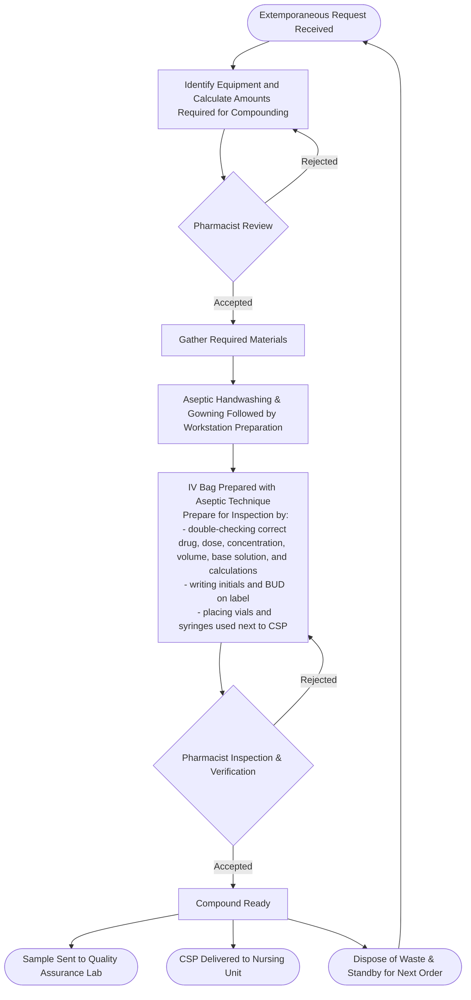

# 💉 Compounded Sterile Preparations (CSPs)

Compounded Sterile Preparations (**CSPs**) are medications prepared in a **sterile environment** according to **USP <797>** 🦅. These preparations are typically administered via **injection, infusion, or irrigation**, making sterility essential for patient safety.

Pharmacy technicians who participate in sterile compounding must demonstrate competency in:

- Initial + annual **aseptic technique training** (written + practical) 🛡️
- *Media-fill testing** and **gloved fingertip sampling**
- Accurate pharmaceutical calculations
- Proper cleanroom workflow under pharmacist supervision 🩺
- **Hand hygiene, garbing, and environmental cleaning** per USP <797> standards

> 🦅 *All Joint Commission–accredited hospitals must comply with USP <797>.*

---

## 🔑 Key Contamination Risks

CSPs must be prepared using strict, **aseptic techniques** and must be free of the following key contaminants:

- **Pyrogens:** fever‑inducing microbial byproducts
- **Microorganisms:** organisms invisible to the naked eye; including bacteria, viruses, fungi, archaea, protozoa, and some algae
- **Particulate Matter:** organic and inorganic impurities that are not included in the formula that can introduce health complications

> 🛡️ *CSPs are routinely sampled and tested in quality‑assurance labs.*

---

## 🏷️ Labeling Requirements

All compounded sterile products must include:

- Generic drug name, strength, concentration, dosage form  
- Total volume + base solution  
- Route + rate of administration  
- **Beyond‑Use Date (BUD)** and time (not the manufacturer’s expiration date)
- Storage requirements (e.g., refrigerate, room temp)
- Initials of compounder + verifying pharmacist 🩺

> 📌 *BUDs are assigned based on stability and USP <797> risk level (Low, Medium, High).*

---

## 🛡️ Final Product Verification

Before dispensing, a pharmacist must verify:

- Correct **drug, dose, and diluent**
- **Compatibility + physical stability**  
  - Example: *Amphotericin B is incompatible with NaCl and will precipitate.*
- Proper **labeling** and documentation
- Compliance with BUD and storage requirements

> 🚨 *Any cloudiness, particulates, or unexpected color change = DO NOT USE.*

---

## 🧪 Sterile Compounding Environment

Sterile compounding must take place in a **cleanroom suite** or **segregated compounding area (SCA)** using:

- **Laminar Airflow Workbenches (LAFWs)**  
- **Biological Safety Cabinets (BSCs)** ☣️ (for hazardous drugs)  
- **Compounding Aseptic Isolators (CAIs)** — sealed systems that may replace full cleanrooms  
- **ISO‑classified rooms** (ISO 5 for critical areas)  

**Negative‑pressure rooms** are used for hazardous or radioactive materials ☣️.

---

## Types of Preparations

### Batch‑Prepared CSPs

CSPs with standardized formulas, prepared in advance for multiple patients; economically viable to prepare in bulk
Includes:  

- **SVPs** — Small Volume Parenterals  
- **LVPs** — Large Volume Parenterals  

### Admixtures

Customized CSPs prepared for individual patient clinical need; extemporaneously compounded for economic practicality
Includes:  

- Modified SVPs/LVPs  
- **Total Parenteral Nutrition (TPN)** 🛡️

### ⏳ Unstable or Short‑Stability Preparations

Some CSPs require **immediate use** due to chemical instability, lack of preservatives, or strict sterility requirements. These preparations often have **very short BUDs** and must be administered soon after compounding.

> 🚨 *Technicians may be required to consult with the patient's nurse to find out exactly when the dose will be administered in order to schedule the medication for compounding.*

Characteristics:  

- **Chemically unstable** after reconstitution or dilution  
  - Examples: **sulfamethoxazole/trimethoprim**, **phenytoin**  
- **Preservative‑free formulations** required for sensitive administration routes  
  - Example: **epidural preparations** (must be preservative‑free to avoid neurotoxicity)  

> 🚨 *Unstable CSPs must never be stored beyond their assigned BUD and often require immediate pharmacist verification.*

---

## 🩸 Intravenous (IV) Solutions Overview

IV solutions are used for:

- Hydration  
- Medication delivery (e.g., antibiotics, pain meds, chemotherapy)
- Electrolyte replacement and rebalancing (e.g., sodium chloride, potassium chloride)
- Nutrition (**TPN**)  
- Emergency resuscitation  

> 📌 *IV Fluid is abbreviated as **IV‑F**.*

### Common IV Solutions

The following is a table of pre-made IV solutions that can be found as floor stock in nursing units.

| Abbreviation | Full Name | Composition | Osmolarity (Relative to Blood) | Clinical Use / Indication | Special Considerations |
| --- | --- | --- | --- | --- | --- |
| NS | Normal Saline | 0.9% Sodium Chloride in Water | Isotonic | Hydration, fluid resuscitation, compatible with most meds, drug administration, surgical irrigation, commonly used in surgery, trauma, and emergency situations | Can cause hyperchloremic acidosis with large volumes, not ideal for patients with conditions like heart failure due to sodium content |
| 1/2NS | Half Normal Saline | 0.45% Sodium Chloride in Water | Hypotonic | Maintenance fluids, chronic dehydration, hypertonic dehydration, used for hydration when less sodium is needed | Avoid in head trauma or hyponatremia, not suitable for resuscitation, caution in patietnts with liver disease as it can exacerbate fluid shifts |
| D5W | 5% Dextrose in Water | 5g Dextrose per 100mL Water | Isotonic* → Hypotonic in body | Treat hypoglycemia, provide calories for patients who cannot eat, Hydration, diluent for certain medications | Avoid in diabetics; becomes hypotonic after metabolism, not a source of electrolytes |
| D5NS | Dextrose 5% in 0.9% Sodium Chloride | 5g Dextrose + 0.9% NaCl per 100mL Water | Hypertonic | Provides calories and sodium; treat hypoglycemia, used post-op or for NPO pts | Monitor for fluid overload; avoid in renal or cardiac pts |
| LR (RL) | Lactated Ringer’s Solution | NaCl, KCl, CaCl₂, Sodium Lactate in Water | Isotonic | fluid replacement with hydration and glucose, acute blood loss, used in surgery, trauma, & burn recovery, corrects metabolic acidosis | Contains potassium—use cautiously in renal failure |
| SW or SWFI | Sterile Water for Injection | Sterile Water (no solutes) | Hypotonic | Used to dilute or reconstitute medications, irrigation of wounds | NEVER give IV push—risk of hemolysis |

> 📌 *D5W is isotonic in the bag but becomes hypotonic once glucose is metabolized.*

### 🧴 IV Admixtures

IV admixtures are CSPs created by **adding medications, electrolytes, or nutrients** to a sterile base solution (e.g., NS, D5W, LR). These preparations are individualized and must be compounded using aseptic technique.

Dosing considerations include:  

- **Patient weight** or **BSA**  
- **Fluid restrictions**  
- **Renal/hepatic function**  
- **Key lab values** (Na⁺, K⁺, Cr, glucose)  

> 🧠 *Example: A medication is injected into a minibag (e.g., 50 mL NS), then gently inverted to mix.*

#### 🧪 Additive Vials

Additives used in IV admixtures typically come in **vials**, which must be handled according to their labeling and USP <797> requirements.

**Single‑Dose Vials (SDVs)**:

- Intended for **one‑time use only**  
- **No preservatives**  
- Must be discarded immediately after first puncture  
- BUD after opening: **6 hours** (if opened in ISO 5 environment), unless manufacturer specifies otherwise
  <!-- todo fact check this one -->

**Multi‑Dose Vials (MDVs)**:

- Intended for **multiple uses**  
- Contain **antimicrobial preservatives**
  - 📌 Preservatives in MDVs make them unsafe for certain routes (e.g., intrathecal, epidural).
- Must be **relabeled with a new BUD** after first puncture  
  - Typical BUD: **28 days**, unless manufacturer specifies a shorter period  
- Still require aseptic technique for each access  

🔍 **Visual Inspection**

Before each use, **all vials must be visually inspected** for:

- Particulate matter
- Cloudiness  
- Crystals or precipitate  
- Color changes  
- Cracked or compromised containers  

> 🚨 *Any vial showing contamination or instability must be discarded immediately.*

#### 🍽️ Total Parenteral Nutrition (TPN)

TPN provides complete nutrition intravenously for patients who:

- Are critically ill  
- Are marked "Nothing by Mouth" (**NPO**)
- Cannot tolerate enteral feeding  
- Have GI dysfunction  

**Preparation Notes**:

- May be **2‑in‑1** (AA + dextrose) or **3‑in‑1** (AA + dextrose + lipids)  
- Prepared in‑house or outsourced  
- Technicians often set up the **TPN compounder**

---

<!-- todo navlink -->
