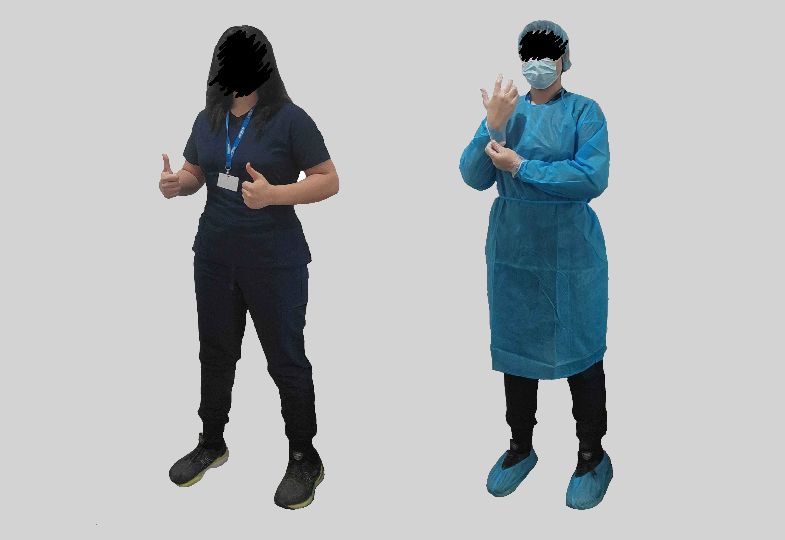
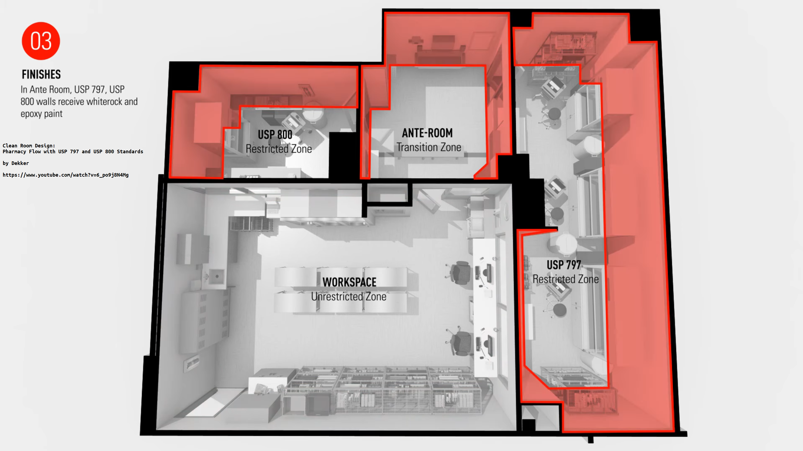

# 🛠️ SOP – Clean Room Entry & Exit

## 🔑 Purpose

To prevent contamination of sterile compounding environments by establishing a standardized gowning process, which is critical to ensuring product safety. Contaminants such as microorganisms, particles, and chemicals from the environment or personnel can compromise compounded medications, posing serious risks to patient health. Adhering to strict gowning procedures helps maintain sterility, comply with regulatory standards (e.g., USP <797>), and uphold the integrity of pharmaceutical preparations.

## 🔗 Scope

This SOP applies to all personnel entering an ISO-classified cleanroom for sterile compounding. Gowning must be performed **before** entering the buffer area and **after** performing aseptic handwashing.

## 🧱 Facility Design and Engineering Controls

Clean rooms are areas designed for the preparation of sterile products.

### 🟢 Unrestricted Zone (Workspace)

The outermost area where personnel and materials enter before gowning. Not subject to air quality classification. General public and pharmacy workflow intersect here.

- **Key Function**: Staging and administrative work
- **Engineering Controls**: None required
- **Examples**: Office, receiving, general storage

### ➕ Antechamber / Gowning Room / Transition Zone

A **segregated space between the cleanroom (buffer rooms) and uncontrolled areas** used for:

- Gowning and hand hygiene
- Staging of materials entering the cleanroom
- Pressure control between cleanroom zones

🧪 **Typical Classification**: ISO Class 7 (if leading to hazardous compounding) or ISO Class 8 (for non-hazardous)

🔧 **Engineering Controls (Secondary)**:

- **Pressure gradients**  
  - Positive toward USP <797> buffer room  
  - Negative or neutral toward USP <800> buffer room  
- **HEPA-filtered HVAC supply**  
- **Sealed ceilings, walls, and floors**  
- **Hands-free sinks** (outside the buffer zone)

### 🧪 USP <797> Restricted Zone (Non-Hazardous Sterile Compounding)

Sterile compounding area for non-hazardous drugs. Must meet **ISO Class 7** conditions.

🔹 **Primary Engineering Controls (PECs)**:

- **Laminar Airflow Workbenches (LAFWs)**  
- **Compounding Aseptic Isolators (CAIs)**  
- Provide ISO 5 environment where sterile work occurs

🔸 **Secondary Engineering Controls (SECs)**:

- **Positive pressure** buffer room  
- **HEPA-filtered air from ceiling with low-wall returns**  
- **Continuous or logged differential pressure monitors**  
- **Impervious, seamless surfaces**

### ☣️ USP <800> Restricted Zone (Hazardous Drug Buffer Room)

Dedicated for sterile compounding of hazardous drugs under **negative pressure** and **ISO Class 7**.

🔹 **Primary Engineering Controls**:

- **Biological Safety Cabinets (BSCs)** – Class II, Type B2 preferred  
- **Compounding Aseptic Containment Isolators (CACIs)**  
- Maintain ISO 5 conditions internally

🔸 **Secondary Engineering Controls**:

- **Negative pressure** relative to the ante-room  
  - Minimum: −0.01 inch water column  
- **Externally vented exhaust**  
- **Sealed, chemical-resistant surfaces**  
- **HEPA-filtered ISO 7 environment**

### 🔑 Summary of Engineering Control Roles

| Control Type | Description | Examples | Purpose |
| -------------- | ------------- | ---------- | --------- |
| **Primary (PEC)** | Direct compounding environment (ISO 5) | LAFW, BSC, CAI, CACI | Protect product sterility |
| **Secondary (SEC)** | Architectural/airflow support systems | Buffer room HVAC, HEPA, pressure diffs | Maintain classified environment |
