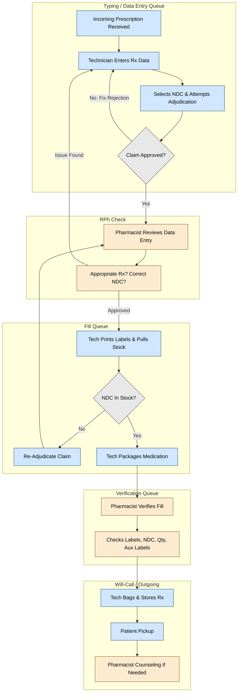

# Core Pharmacy Workflows & Standard Operating Procedures (SOP)

---

## Pharmacy Roles & Responsibilities

A safe and efficient pharmacy depends on the coordinated work of pharmacists and pharmacy technicians. Although both roles contribute to the prescription‑filling process, each carries distinct responsibilities defined by state and federal regulations, professional standards, and the needs of patient care. Understanding these responsibilities is essential for maintaining accuracy, preventing medication errors, and ensuring that every patient receives the highest standard of service. The following section outlines the core duties of pharmacists and pharmacy technicians and clarifies the tasks that may only be performed by a licensed pharmacist.

### Pharmacist Responsibilities

Pharmacists use their clinical expertise to ensure that all physician orders are carried out accurately and safely. Their responsibilities include verifying that:

- The **correct medication, strength, and dosage form** are dispensed to the correct patient
- Directions for use are **clear, accurate, and unambiguous**
- The patient understands **how to take the medication**
- The patient knows **how and when to request refills**
- There are no potential **drug–allergy, drug–drug, or drug–disease interactions**
  - (Computer systems generate DUR warnings to support this review)
- The patient understands the **expected therapeutic benefits**
- The patient is aware of **possible side effects** and when to seek help
- The prescriber has been contacted for clarification or intervention when necessary
- The prescription has been **accurately billed** to the patient and/or third party

#### Only Pharmacists May

- Counsel patients on the use of **over‑the‑counter (OTC)** medications
- Recommend **over‑the‑counter (OTC)** medications to patients
- Receive **telephone requests for new prescriptions** (varies by state law)

### Pharmacy Technician Responsibilities

Pharmacy technicians support the pharmacist by performing routine, technical, and operational tasks that contribute to safe and efficient prescription processing. Responsibilities include:

- Assisting the pharmacist in **technical aspects** of prescription filling
- Treating each patient, their personal information, and their medications with **respect and confidentiality**
- Accepting new prescriptions from patients, gathering all required information, and entering it into the computer system **accurately and efficiently**
- Faxing or telephoning **refill AND renewal** requests to prescribers
- Alerting the pharmacist whenever a **DUR warning** appears during order entry
- Consulting formularies and responding appropriately to third‑party adjudication messages such as **non‑preferred drug**, **prior authorization**, or **step‑therapy required**
- Quickly locating the correct medication for dispensing, calculating quantities, repackaging medication, and retrieving the appropriate **Medication Guide**
- Compounding prescriptions **under pharmacist supervision**
- Recording the dispensing of **controlled substances** in accordance with regulations
- Checking the work of other technicians **when delegated by a pharmacist**
- Assisting with **inventory management**, including removing outdated or recalled medications
- Referring patients to a pharmacist for counseling on prescription or OTC medications, or for any question requiring **clinical judgment**
- Ensuring **accuracy and safety** throughout the prescription‑filling process by incorporating quality‑control checks at every step

---

## Legal Designations of Drugs

Federal and state law divide drugs into major categories based on how they may be distributed, their potential for abuse, and required labeling.

- 🔗 [The Durham-Humphrey Amendment](./law/fda_fdca.md#durham-humphrey-amendment-1951)
- 🔗 [Controlled & Listed Substance Policy](./law/csa_cmea.md)

### 💊 Legend Drugs

Prescription-only medications authorized under the **Durham-Humphrey Amendment (1951)**. These drugs:

- Must be dispensed **only** on the **written, electronic, or verbal order** of a licensed prescriber.
- Require the **federal legend** on the manufacturer’s label:
  > "Caution: Federal law prohibits dispensing without a prescription"  
  or  
  > "Rx Only"
- Include:
  - **Non-controlled prescription medications** (e.g. antibiotics, blood pressure drugs)
  - **Controlled substances** (see below)

#### 🔐 Controlled Substances

- **Regulated by the DEA** under the **Controlled Substances Act (1970)**.
- Categorized into **Schedules I-V** based on **abuse potential**, **medical use**, and **dependence risk**.
- Subject to strict handling, labeling, inventory, and security requirements.
- Dispensing often involves:
  - 🦅 **ID verification** and limited refill authorizations
  - 🐻 `7 year recordkeeping` & CURES reporting requirement in California

> 📌 Pharmacists & Prescribers are equally liable for patient incidences involving CII medications. **Technicians** will be held liable for misconduct or negligence even while following orders.

### 💸 Over-the-Counter (OTC) Drugs

Medications that may be sold without a prescription as long as they are:

- Properly labeled for **self-directed use**
- Contain **adequate directions and warnings** for consumers
- Considered **safe and effective** when used as directed

Examples: `Acetaminophen, ibuprofen, diphenhydramine, loratadine`

**OTC drugs are not inherently safe** just because they don’t require a prescription. Many OTC medications can cause significant drug interactions, adverse effects, or even life-threatening complications; especially when combined with prescription drugs or taken incorrectly.

> 📌 OTC medications do not require a prescription but sometimes they are written for them.

When performing **medication reconciliation** (the process of gathering a patient’s full medication history), pharmacy technicians must:

- **Ask about all OTC medications**, supplements, and herbal products
- **Document** them in the patient’s profile
- **Refer patients to the pharmacist** for counseling if any concerns arise

> 📌 Technicians may direct customers to a product but should involve the pharmacist when making recommendations

🔗 [Considerations for OTC Analgesics](./medications/otc_analgesics.md)

#### ⚠️ Subcategories and Exceptions

- **Exempt Narcotics**:  
  - Contain **habit-forming ingredients** (e.g. small amounts of codeine)
  - May be sold **by a pharmacist** without a prescription to individuals **18+**
  - Must be logged in a record book with ID verification and quantity tracking  
  - 🐻 There are no exempt narcotics in California
- **Emergency Contraceptives**:  
  - Example: `Plan B One-Step`
  - Sold **OTC without age restrictions**
  - May also be **prescribed or furnished** by a pharmacist for minors per 🐻 California protocol
  - Dual marketing as both **OTC and legend** allows flexible access depending on clinical situation
- **Listed Substances**:  
  - Products containing precursors to **methamphetamine** (e.g. pseudoephedrine, ephedrine)
  - Require:
    - ID verification
    - Signature logbook
    - Quantity limits (daily and 30-day)
    - Locked display or behind-the-counter storage
  - Monitored under the **Combat Methamphetamine Epidemic Act (2005)**  
    - 🦅 Federal control  
    - 🐻 California may impose stricter limits

### Hazardous Drugs (HDs) in Healthcare

#### NIOSH Guidelines

The **National Institute for Occupational Safety and Health (NIOSH)** publishes guidelines for safe handling of chemotherapy and other hazardous drugs.

Reference:  
**NIOSH Publication No. 2004‑165 — Preventing Occupational Exposure to Antineoplastic and Other Hazardous Drugs**  
https://stacks.cdc.gov/view/cdc/6570

#### USP <800>

**USP <800> Hazardous Drugs—Handling in Healthcare Settings** establishes standards for the safe handling of hazardous drugs (HDs) to protect both patients and healthcare workers.

The chapter outlines requirements for:

- Receipt  
- Storage  
- Compounding  
- Dispensing  
- Administration  

Affected workers include pharmacists, technicians, nurses, physicians, physician assistants, home‑health workers, veterinarians, and veterinary technicians. It also applies to the facilities in which they work.

Reference:  
https://www.usp.org/compounding/general-chapter-hazardous-drugs-handling-healthcare

---

## 📞 Customer Service

### Phone Calls

Pharmacy technicians must answer calls promptly, communicate clearly and respectfully, gather accurate information, and route clinical inquiries appropriately to ensure professional, accurate, and HIPAA-compliant telephone communication with patients, providers, and other parties contacting the pharmacy.

**Retail technicians are the first point of contact for most patients**. Professional demeanor, clear communication, and operational efficiency are critical for ensuring medication safety and customer satisfaction.

- Listen actively and make eye contact  
- Confirm understanding by repeating concerns  
- Use a respectful, positive tone  
- Refer to patients by name when possible  
- Identify the pharmacy when answering the phone  
- Always follow facility policies and procedures  
- Refer all clinical questions to the pharmacist

Link to 🔗 [**Standard Operating Procedure**](./sop/phone_calls.md)

### New Patient Intake

When a patient shows up to the pharmacy for the first time, they usually bring a prescription with them. In order for the pharmacy to be properly reimbursed by insurance companies, the patient's information must be present on the pharmacy's computer system for adjudication.

Link to 🔗 [**Standard Operating Procedure**](./sop/pt_intake.md)

---

## Prescription Processing

**Prescription processing workflows are the *bread and butter* of pharmacy practice**; the essential, safety‑driven sequence that ensures every prescription is accurately received, clinically reviewed, filled, verified, and handed off to the correct patient. These workflows create structured checkpoints that protect against errors, support pharmacists’ clinical decision‑making, and keep daily operations running smoothly across community, outpatient, and institutional settings.

Link to 🔗 [**Standard Operating Procedures**](./sop/prescriptions.md)

---

## Inventory Management & Workflows

Effective inventory management ensures that pharmacies maintain the **right medications, in the right quantities, under the right conditions**, supporting safe, efficient, and compliant patient care. This section explains how inventory is structured, monitored, and controlled—from understanding formularies and stock behavior to using automated systems, unit‑dose packaging, and turnover metrics to guide purchasing and workflow. Technicians play a central role in maintaining accurate counts, preventing shortages or waste, and supporting systems that track every movement of medication across the pharmacy.

You’ll learn:

- How formularies, fast movers, and usage trends shape **community vs. institutional** inventory  
- How **PAR levels, turnover rates, and automated systems** guide ordering and stock control  
- The role of **unit‑dose, prepackaged, and therapy‑based packaging** in safety and efficiency  
- Which medications must remain in **original containers** and why  
- How perpetual inventory, POS systems, ADS/ADC devices, and robotics support **real‑time accuracy**  

Mastering these concepts builds a strong foundation for **safe dispensing**, **cost‑effective operations**, and a **high‑functioning inventory system** that supports every other pharmacy workflow.

Link to 🔗 [**Standard Operating Procedures**](./sop/inventory.md)

---

🔙🔗 Back to [**Home Directory**](../readme.md)
