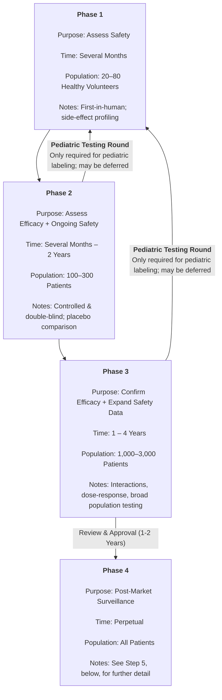
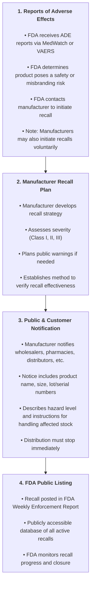

# Production, Marketing, & Distribution of Medicine

🦅 The **U.S. Food and Drug Administration (FDA)** is the primary federal agency responsible for ensuring that drugs are manufactured, labeled, and marketed in compliance with public safety standards. Under the **Federal Food, Drug, and Cosmetic Act (FDCA)**, the FDA enforces rules prohibiting:

- **Adulteration**: Contamination or failure to meet specified purity and quality standards.
- **Misbranding**: False, misleading, confusing, or incomplete labeling, or if the product is harmful when used as labeled.

## 🦅 Federal Legislation

The following are required reading for this chapter:

- 🔗 **FDC, FDCA, & Amendments** (🔗 [Link To](./law/fda_fdca.md))
- 🔗 **Extended Packaging & Labeling Policy** (🔗 [Link To](./law/packaging_labeling.md))

## 🧪 Drug Development, Manufacturing Authorization, & Monitoring

Overseen by the FDA's Center for Drug Evaluation & Research (CDER)

There exist two commercial categories of drugs:

- **Brand Name Drugs**: Original drugs developed by pharmaceutical companies, protected by patents, and marketed under proprietary names
- **Generic Drugs**: Copies of brand-name drugs that have the same active ingredients, strength, dosage form, and route of administration, but sold under generic chemical names or different brand names after the original patent expires

> Other medical products are handled by different FDA centers, which must undergo the same approval process
>
> - Center for Devices & Radiological Health (CDRH): Medical Devices
> - Center for Biologics Evaluation (DBER): Biological Products from Living Organisms

### 🏭 Good Manufacturing Practices (GMP)

Manufacturers of, both, brand and generic drugs must comply with stringent FDA standards during production and distribution. **Good Manufacturing Practices (GMP)** are FDA-enforced standards ensuring drug consistency, safety, and quality. Strengthened by the 🦅 **Kefauver-Harris Amendment (1962)**, GMPs apply to all manufacturers.

GMP compliance requires manufacturers to:

- Use validated, standardized manufacturing processes
- Maintain hygienic, climate-controlled facilities
- Employ qualified personnel with documented training
- Keep detailed batch and quality control records
- Conduct internal audits and allow FDA inspections

🚨 Failure to meet GMP standards may result in:

- Product recalls
- Civil and criminal penalties
- Suspension or revocation of manufacturing licenses

📌 *Pharmacy technicians may encounter GMP topics during FDA recalls, QA investigations, or sterile/non-sterile compounding workflows.*

### Brand Name Drug Development

`Before it is approved for marketing, a new drug must be shown to be both safe and effective; with benefits substantially outweighing risks`

In order for a newly patented, *Brand Name* drug to come to market, the FDA must first approve it. The process generally is as follows

Step 1: **Research & Development** (3-6 Years)

- Identify a biological target
- Screen compounds for activity and specificity
- Select ~25% of promising candidates for preclinical testing

Step 2: **Preclinical Testing** (1 Year)

- Conduct **in vitro** (human cells) tests for efficacy & toxicity
- Conduct **in vivo** (animal) tests to study ADME (Absorption, Distribution, Metabolism, and Excretion) processes
- Test in at least two mammalian species.
- Submit results and a clinical plan to the FDA's CDER in an ***Investigational New Drug (IND)*** application. This application additionally requires a plan for human testing and manufacturing details to comply with the ***Good Manufacturing Practices (GMP)*** provisioned by the Kefauver-Harris Amendment.

Step 3: **Clinical Trials** (4-7 Years)

`Only about 25% of drugs tested on humans are approved for use by the FDA.`

Clinical trials involve **human research** subjects and are conducted in three phases. Participants must give informed consent and the information necessary to provide it (per Kefauver-Harris Amendment). They are free to leave as they wish.

During clinical trials, a proposed new drug is called an **Investigational New Drug (IND)**.

- only available for use within trial groups unless granted special "treatment" status for critically ill patients (e.g. AZT for treatment of AIDS patients)
- expensive and excluded from coverage by most insurers & Medicaid/ Medicare

Patients in a trial are always blind to treatment, meaning that they do not know if they are receiving the drug being tested or a placebo. Placebos are inactive substances, not real medications. In "double-blind" testing, providers are also blind so as not to imagine effects one way or another to make medical results more reliable.

> 📌 Pediatric (i.e. targeting children) clinical trials can take place after Phase 2 or 3 Adult trials if the company is trying to get the drug approved for use in children.

Step 4: **Review & Approval** (1-2 Years)

- Pharmaceutical company files a ***New Drug Application (NDA)*** with the FDA
- FDA reviews for safety, efficacy, and labeling
- Drug is either approved for marketing (regulated by the Kefauver-Harris Amendment) or denied by the FDA and request further testing
  - Drugs and/ or its container may not be imitative of another drug so that the consumer will be misled
  - Tall-Man lettering is encouraged to reduce errors due to look-alike/ sound-alike names

Step 5: **Post-Market Surveillance** (Ongoing)

`Also called Phase 4 Clinical Trials`

- Manufacturer maintains exclusive rights (~20 years) to offset research & development cost
- Continuous monitoring of long-term safety and efficacy after the drug is released to the market

`patents typically last 20 years from the time of filing, therefore drugs are typically released with half of their patent time left; extendable by 5 years due to Hatch-Waxman (1984)`

### Generic Drug Manufacturing Authorization

`Once a patent for a brand name drug expires, other manufacturers may copy the drug and release it under its generic name.`

Generic drugs require FDA approval but do not require full R&D because clinical trials for safety & efficacy were already established by the original producer. To obtain approval, generic manufacturers only need to demonstrate equivalency; shortening the process to 1 - 3 years.

Step 1: **Bioequivalence Studies**

During this process, the manufacturer must prove that their drug is both pharmaceutically and therapeutically equivalent because their inactive ingredients have been altered.

- **Pharmaceutically Equivalent Drugs** contain identical amounts of the same active ingredients in the same dosage form.
- **Therapeutically Equivalent Drugs** produce the same clinical effect; the body's use of the drug is the same

`Evaluations of generic products can be found in the FDA "Orange Book"`

Studies are conducted on a small group of healthy volunteers to compare the generic and brand-name drug's effects on ADME processes. After which, the manufacturer submits an **Abbreviated New Drug Application (ANDA)** to the FDA.

Step 2: **Manufacturing & Quality Assurance**

The FDA checks for trademark violations. Packaging and labeling must be distinct from brand name. Inactive ingredients may vary to lower production cost, but a facility inspection is also conducted to ensure compliance with the aforementioned ***Good Manufacturing Practices (GMP)***.

Step 3: **Post-Market Surveillance & Safety Monitoring**

If the ANDA meets FDA requirements, the generic drug is approved for marketing. Generic drugs are also subject to the same post-market safety monitoring as brand name drugs.

#### Generic Over-the-Counter Drugs

`Monographs are a document that describes a drug, drug ingredient, or chemical`

Generic OTC drugs follow a **different approval pathway** than prescription generics. Instead of submitting an ANDA, most OTC manufacturers rely on **OTC Drug Monographs**, which function like “recipe books” describing what is **Generally Recognized As Safe and Effective (GRASE)**:

An OTC monograph specifies:

- **Active ingredients** allowed  
- **Dosage strengths**  
- **Dosage forms & routes**  
- **Labeling requirements**  
- **Intended uses**  

If a manufacturer follows the monograph exactly, the product is considered **GRASE** and may be marketed **without** submitting a New Drug Application (NDA) or ANDA.

- Manufacturers may produce OTC drugs using **any monograph‑approved active ingredient**  
- No clinical trials are required if the product conforms to the monograph  
- Products must still comply with:
  - **GMP standards**
  - **Labeling rules**
  - **Facility inspections**
  - **Post‑market safety monitoring**

Some OTC drugs were already on the market **before** modern FDA approval requirements existed. These are reviewed under the **OTC Drug Review Program**, which evaluates:

- Safety  
- Effectiveness  
- Labeling  

Until review is complete, these products may remain on the market **unless safety concerns arise**.

## 🏷️ Marketing

`Marketing begins during development`

### Naming

`The **United States Adopted Names (USAN) Council** designates official **non‑proprietary (generic) drug names**.`

Formed in the 1960s through collaboration between the **American Medical Association (AMA)** and the **U.S. Pharmacopeia (USP)**, USAN ensures that drug names are standardized, informative, and safe for clinical use.

The **USP Dictionary of USAN & International Drug Names** serves as a comprehensive reference containing:

- Nonproprietary (generic) names  
- Proprietary (brand) names  
- Drug code designations  
- Empirical and chemical names  
- Molecular structures

#### Naming Progression

1. **Chemical (IUPAC) Name**  
   - Assigned first; describes the drug’s exact chemical structure.  
   - Highly specific but too complex for clinical use.

2. **Code Number / Development Name**  
   - During early development, companies assign internal code numbers (e.g., *MK‑3475* for pembrolizumab).  
   - If the compound shows promise, the sponsor proposes a nonproprietary name to USAN.

3. **Generic (Nonproprietary) Name**  
   - Assigned once USAN approves the proposed name.  
   - Remains constant across all manufacturers.

4. **Brand (Proprietary) Name**  
   - The sponsor applies for trademark protection through the **U.S. Patent and Trademark Office (USPTO)** and foreign agencies.  
   - A drug typically has **one generic name** but may have **multiple brand names** across markets.  
   - Brand names may be discontinued after generics enter the market.

#### Applying for a Drug Name

The **sponsoring company** initiates the naming process by submitting a proposed nonproprietary name to USAN and international regulatory agencies.

##### USAN Naming Recommendations

A proposed name should:

- Be **short, distinctive**, and unlikely to be confused with existing drug names.  
- Indicate the **pharmacologic or therapeutic class**, or reflect chemical characteristics associated with activity.  
- Include **recognized stems or syllables** that link it to a related group of compounds (e.g., *‑pril* for ACE inhibitors, *‑olol* for beta‑blockers).

Once approved by USAN and global regulatory bodies, the name becomes **official**.

### Labeling Requirements

Drug manufacturers must label their products accurately and clearly to comply with federal laws and ensure safe use by healthcare providers and patients. Labeling requirements are enforced primarily by the FDA under the FDCA and related legislation.

Link to 🔗 [Labeling Requirements for Prescription & OTC Drugs](./law/ref/labeling_reqs.md)

## 🚚 Distribution

### 🌐 Logistics

When a new drug is brought to market, pharmacies provision its stock from state-licensed:

- **Suppliers**: produce, label, and package drugs
- **Wholesalers**: purchase drugs in bulk and then sell them to medical facilities

> 🔐 `DEA Form 222` is required for ordering Schedule II drugs via CSOS.
> 🦅x🔐 FDA and DEA registration is also required for controlled substances.
> 🦅 See the 🔗 [PDMA](./law/fda_fdca.md#prescription-drug-marketing-act-pdma-1987) for regulations on manufacturer & wholesaler activities.

#### 🏭 Suppliers

There are 3 main types of supplier: drug manufacturers, specialty pharmacies, and compounding pharmacies. All of them order raw materials or finished goods (like (in)active ingredients) to produce their goods. However, each one exists for a different scale of care.

- **Drug Manufacturers** package medication in standard dosage forms for mass distribution
- **Specialty Pharmacies** focus on providing high-cost, complex medications and specialized services to patients with chronic conditions
- **Compounding Pharmacies** customize medications on a patient-specific basis, often mixing, combining, or altering existing drugs to meet individual needs

> 🦅 [340B](./law/healthcare.md#-public-health-service-act-phsa-1944-340b-in-1992) limits the cost safety-net providers, like medicaid, federally qualified health centers, and qualified hospitals paid for outpatient drugs through wholesalers.

#### 🕸️ Wholesalers

Wholesalers create regional and national distribution networks, storing bulk purchases in strategically placed warehouses to enable 24–48 hour delivery. They also drop ship lower-volume, high-cost medications on an as-needed basis.

## Monitoring Public Safety

**Adverse effects** are unintended side affects of a medication that is negative or in some way injurious to a patient's health.

`Not removing harmful or ineffective products from the market (i.e. recalling bad products) leaves the manufacturer vulnerable to legal action.`

While drug approval processes are thorough, it is impossible to account for everything. The FDA maintains reporting programs called **MedWatch** and the **Vaccine Adverse Event Reporting System (VAERS)** that allow *anyone* to report adverse effects that occur from the use of approved drugs or vaccines.

- Link to 🔗 [Vaccine Adverse Event Reporting System (VAERS) Guide](./sop/vaers.md)
- Link to 🔗 [Reporting Adverse Drug Events (ADEs) to FDA MedWatch](./sop/medwatch.md)

If the FDA determines that any drug or vaccine poses a public health risk, then they may file an **injunction** to prevent distribution; seize the drug from the manufacturer; or issue a recall of the drug.

### Recalls

`Recalls, with a few exceptions, are voluntary on the part of the manufacturer`

- **Manufacturer Recalls**: are initiated when they detect a defect, contamination, or labeling error. When this happens, they are legally required to notify the FDA and take appropriate action.
- **Pharmacy Chain & Distributor Recalls**: Large pharmacy chains and wholesalers may voluntarily recall products from their shelves to to internal quality checks or concerns raised by pharmacists. They may also respond to manufacturer or FDA recalls by removing affected products from circulation. This can happen in the event that it's discovered that medication was held in improper storage conditions that could compromise effectiveness.

Recalls are the most cost-effective way to remove drugs from circulation because they leverage the manufacturer's current infrastructure and knowledge to retrieve offending drugs. Shipping manifests are used to identify where a drug has been delivered in order to focus efforts on that area.

> Before tamper-evident packaging was implemented, Johnson & Johnson had to recall tylenol in 1982 because someone started poisoning bottles

There are 3 numerical classes of recalls.

| Class | Description |
| --- | --- |
| 1 (Highest Urgency) | Likely to cause serious harm or death |
| 2 (Moderate Urgency) | May cause reversible harm; serious effects are unlikely |
| 3 (Lowest Urgency) | Not likely to cause harm; violates labeling or manufacturing standards |

🛑 **Recall Steps**

#### The Role of a Technician

Technicians must stay up to date with recalls posted online. When a recall is brought to their attention, they must alert the pharmacist and store management; providing information for patient outreach.

Link to 🔗 [SOP: Handling Drug and Product Recalls](./sop/inv_recalls.md)

---

## 🗺️🔗 Nav Links

- 🏠 [Home Directory](./readme.md)
