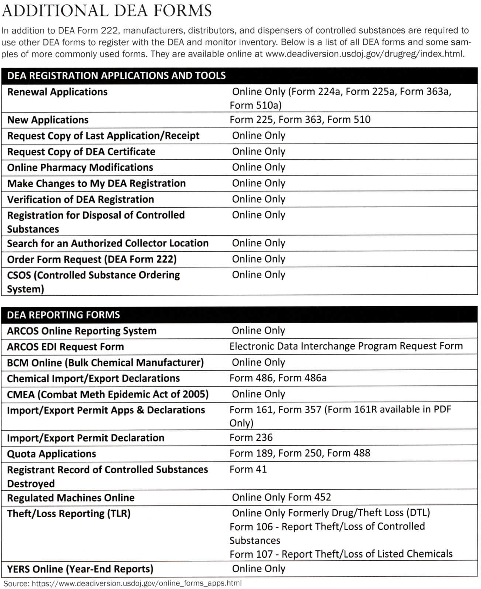

# DEA Policy

## 🔐 Controlled Substances Act (CSA, 1970)

The ***Controlled Substances Act (CSA, 1970)*** classifies five levels of controlled substances that have potential for abuse and therefore restricts their distribution. These five categories are called "schedules" and are determined based on potential for abuse, medical use, and risk to overall safety. Drugs placed in Schedules I–V are controlled substances and are subject to varying degrees of regulation regarding prescribing, dispensing, and recordkeeping.

> **TRIVIA**: The Anabolic Steroids Control Act of 1990 added anabolic steroids (like testosterone) to Schedule III of the CSA.

| Schedule | Mark | 🧾 Description | 💊 Examples | 🔁 Prescribing Restrictions |
|----------|------|----------------|-------------|------------------------|
| 🟥 I      | C-I  | 🚫 No accepted medical use, 🆙 high abuse potential | Heroin, LSD, Ecstasy (MDMA), Cannabis* | ❌ **Not allowed** — Cannot be prescribed |
| 🟥 II     | C-II | ✅ Accepted medical use, 🆙 high abuse risk, severe dependence | Oxycodone (opioid), Methadone (opioid), Fentanyl (opioid), Adderall (most stimulants) | ⛔ **No refills allowed** — New Rx required each time; prescriptions valid for 30 days; prescriptions valid for 30 days to 6 months |
| 🟧 III    | C-III| ⚠️ Moderate to low physical/psychological dependence potential | Tylenol with Codeine (opioid combo), Ketamine (anesthetic), Testosterone (anabolic steroid) | 🔁 Up to **5 refills** in **6 months**; prescriptions valid for 6 months |
| 🟨 IV     | C-IV | 🟡 Low abuse potential and dependence risk | Alprazolam (Xanax), Diazepam (Valium), Zolpidem (Ambien), Tramadol (most benzodiazepines, some sleep aids & analgesics) | 🔁 Up to **5 refills** in **6 months**; prescriptions valid for 6 months |
| 🟩 V      | C-V  | 🟢 Lowest abuse potential, small amounts of narcotics | Robitussin AC (codeine cough syrup), Lomotil (diarrhea), Lyrica (pregabalin) | 🔁 Up to **5 refills** in **6 months**; prescriptions valid for 6 months  |

\*Cannabis remains Schedule I federally, though legal or decriminalized in many U.S. states.

### 📝 DEA Forms & Compliance

- **DEA Form 222** is required for ordering **only** Schedule II drugs via CSOS.
- **DEA Form 41** is used for returning drugs to suppliers or for reverse distribution (destruction).
- **DEA Form 106** must be filed within **one business day** of discovering theft or significant loss.
  - **The California Board of Pharmacy** must also be notified within **30 days**.

#### DEA Form 222

DEA Form 222 is used to order, transfer, or return **only** Schedule II controlled substances.

It is a *triplicate form* (in traditional paper format), though many pharmacies now use the ***Controlled Substance Ordering System (CSOS)*** for digital ordering.

| Copy       | Color | Recipient                              |
| ---------- | ----- | -------------------------------------- |
| **Copy 1** | Brown | **Supplier** keeps                     |
| **Copy 2** | Green | Sent by the supplier to the **DEA**    |
| **Copy 3** | Blue  | **Pharmacy (purchaser)** keeps on file |

- The pharmacy must keep Copy 3 and a record of the quantity received and the date received.
- All copies must be kept on file for 2 years federally (California requires 3 years). **Schedule II records must be kept for 7 years**.
- If a DEA Form 222 is voided, incomplete, or has errors, it must be marked void and retained—never destroyed.
- In CSOS (electronic format), each order is digitally signed and tracked, with strict encryption and audit trails.

> 🔐 Schedule II records must be kept separate from all other controlled substance records and must be readily retrievable for DEA audits.

### 💼 Prescriber & Pharmacy Responsibilities

- A **valid DEA number** is required on all prescriptions for controlled substances.
  - 🔗 [Verifying DEA Numbers](../math/dea_numbers.md)
- Schedule II prescriptions must be written (or e-prescribed where required) and cannot be refilled.
- Partial fills of C-II prescriptions are allowed if requested by the prescriber or patient:
  - The initial partial fill must occur within 30 days of the issue date.
  - The remainder must be filled within that same 30-day window; otherwise, the prescription expires.
- Schedule II records must be stored separately from all others.
- Schedule III–V records must also be maintained separately and be readily retrievable.

> **Joint Responsibility**: By law, both the prescripter and dispenser of the prescription have joint responsibility and liability for the legitimate medical purpose of a prescription.

### 🗃️ Recordkeeping Requirements (CA Laws Referenced)

- All prescription and dispensing records for controlled substances must be stored on-site for at least 3 years (CA B&P Code § 4333). **Schedule II records must be kept for 7 years.**
- Inventory audits must be conducted every 2 years (CA H&S Code § 11190) and must include:
  - Drug name, dosage form, and strength
  - Quantity on hand
  - Date and time of inventory
  - Signature of the responsible pharmacist

### ⚠️ Dispensing & Monitoring Duties

- Schedule II prescriptions generally require a written or e-prescription, except in emergencies:
  - A verbal or faxed order may be accepted temporarily, but a written/electronic Rx must follow within 7 days.
- Pharmacies must maintain dispensing logs for all refills and ensure proper dispensing and recordkeeping.

It is the pharmacy staff’s responsibility to:

- Verify and log all controlled substance prescriptions
- Monitor for abuse or diversion
- Ensure compliance with all state and federal regulations

### 🩺 Controlled Subtances Commonly Prescribed by Physician Specialists

| 🆎     | 🧑‍⚕️ Title | 💊 Common Controlled Medications |
|--------|------------|-----------------------------------|
| DC     | Doctor of Chiropractic |  🚫 None or muscle relaxants (rare, varies by state)  |
| DDS    | Doctor of Dental Surgery | 💉 Hydrocodone, oxycodone, benzodiazepines |
| DEM    | Doctor of Emergency Medicine | 💊 Morphine, fentanyl, ketamine, benzodiazepines |
| DMD    | Doctor of Dental Medicine | 💉 Hydrocodone, oxycodone, local anesthetics |
| DO     | Doctor of Osteopathic Medicine | 💊 Full scope: opioids, ADHD meds, sedatives |
| DPH    | Doctor of Public Health | 🚫 None unless dual-licensed |
| DPM    | Doctor of Podiatric Medicine | 💊 Tramadol, hydrocodone, anxiolytics (if authorized)|
| DTM    | Diploma in Tropical Medicine | (Depends on medical license) |
| DVM/DVS| Doctor of Veterinary Medicine/Surgery | 💊 Ketamine, opioids, tranquilizers for animals |
| MD     | Doctor of Medicine | 💊 Full scope: opioids, benzos, ADHD meds, etc. |
| OphD   | Doctor of Ophthalmology (MD/DO) | 💊 Tramadol, hydrocodone (post-surgery), benzos |
| PharmD | Doctor of Pharmacy | 💊 testosterone (some states) |

### 👩‍🔬 Controlled Subtances Commonly Prescribed by Non-Physician Specialists

| 🆎     | 🧑‍⚕️ Title/Role | 💊 Common Controlled Medications |
|--------|------------------|---------------------------------|
| NP     | Nurse Practitioner | 💊 Hydrocodone, Adderall, alprazolam |
| PA     | Physician Assistant | 💊 Oxycodone, clonazepam, lorazepam |
| CNM    | Certified Nurse Midwife | 💊 Codeine, opioids for labor, benzodiazepines |
| CRNA   | Certified Registered Nurse Anesthetist | 💊 Fentanyl, midazolam, ketamine |
| RN/BSN | Registered Nurse | 🚫 None |
| LPN/LVN| Licensed Practical/Vocational Nurse | 🚫 None |
| Psych NP | Psychiatric Nurse Practitioner | 💊 Clonazepam, lorazepam, Adderall, antidepressants |
| OD     | Doctor of Optometry | 💊 Hydrocodone (post-op), low-dose benzos (rare) |
| PharmD (RPh) | Pharmacist under protocol | 💊 testosterone |

## 🧪 Combat Methamphetamine Epidemic Act (CMEA, 2005)

The CMEA was enacted to combat the illegal production of methamphetamine by creating a list of monitored drugs, equipment, and chemicals while also placing ***strict, time based controls on over-the-counter (OTC)*** sales of:

- **Pseudoephedrine**
- **Ephedrine**
- **Phenylpropanolamine**

| Time Period | Maximum Amount | Notes |
| ------------|----------------|-------|
| **Per Day**              | **3.6 grams** per purchaser | Applies to **all sources** (combined)    |
| **30 Days (in-person)**  | **9 grams** per purchaser | Applies to retail pharmacy purchases     |
| **30 Days (mail-order)** | **7.5 grams** per purchaser | Stricter limit for mobile/online vendors |

These ingredients are commonly found in cold and allergy medications but can also be used in the **illicit manufacture of methamphetamine**.

🔐 **Storage & Access Requirements**:

- Must be kept Behind-the-Counter or in a locked cabinet.
- not available for self-service.

🧾 **Sales & Logbook Requirements**:

- Purchasers must be 18 years or older and present a valid photo ID.
- A logbook must be maintained that records:
  - Purchaser’s name and address
  - Product name
  - Quantity sold
  - Date and time of the sale
  
## 🗺️🔗 Nav Links

- 🦅 Back to [**Federal Law Reference Directory**](./readme.md)
