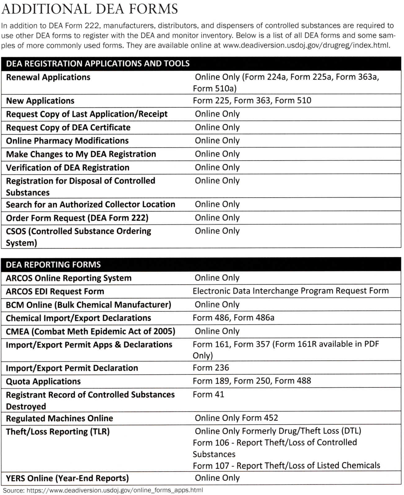

# Drug Enforcement Agency (DEA) Policy

## Harrison Narcotics Tax Act (1914)

`marks the beginning of federal substance control`

The **Harrison Narcotics Tax Act of 1914** was the first major federal drug law in the United States and established the foundation for all modern controlled‑substance regulation. Although framed as a *tax law*, it effectively created federal control over the manufacture, distribution, and dispensing of narcotics.

The Act regulated **opium**, **morphine**, **heroin**, **cocaine**, and related preparations by imposing registration, taxation, and recordkeeping requirements on anyone who handled these substances.

### Key Provisions

- **Registration & Licensing**  
  Physicians, pharmacists, and anyone handling narcotics were required to **register annually** with the federal government.

- **Taxation Requirements**  
  Narcotic transactions required **special order forms** and were subject to federal taxes, creating a traceable paper trail.

- **Recordkeeping**  
  Registrants were required to maintain detailed records of all narcotic sales, transfers, and inventories.

- **Restrictions on Prescribing**  
  Narcotics could only be prescribed **in the course of legitimate medical practice**.  
  Prescribing narcotics to maintain addiction was prohibited

### Creation of "Exempt Narcotic" Preparations

The Harrison Act also created the first legal category of **exempt narcotics**; low‑dose preparations containing small amounts of opium, morphine, codeine, or other narcotics that could be sold **without a prescription** if they fell below specific concentration limits.

These exempt preparations:

- Could be sold **only by a pharmacist**  
- Required purchasers to be **at least 18 years old** & provide identification
- Required a **bound record book** documenting each sale  
- Were limited to a maximum quantity per **48‑hour period**

Examples at the time included paregoric and low‑dose codeine cough syrups.

### Logbook Requirements

The Harrison Narcotics Tax Act required pharmacies to maintain a **bound, written record book** documenting every sale of an exempt narcotic preparation. This logbook served as the federal government's primary method of tracking non‑prescription narcotic sales and preventing diversion.

Each entry in the bound record book was required to include:

- **Purchaser's full name**
- **Purchaser's address**
- **Name of the exempt narcotic sold**
- **Quantity dispensed**
- **Date of sale**
- **Name or initials of the pharmacist** who authorized and dispensed the product

Additional requirements:

- The logbook had to be **bound**, not loose‑leaf, to prevent removal or alteration of pages.
- Entries had to be made **at the time of sale**, not retroactively.
- Records had to be **readily retrievable** for federal inspection.
- Pharmacists were responsible for ensuring accuracy and completeness of all entries.

These logbook requirements formed the earliest version of controlled‑substance tracking in the United States and directly influenced the modern recordkeeping standards later codified under the **Controlled Substances Act (CSA, 1970)**.

## 🔐 Controlled Substances Act (CSA, 1970)

> When the **Controlled Substances Act (CSA, 1970)** replaced the Harrison Act, the exempt narcotic category was preserved and incorporated into **Schedule V**, with modernized restrictions and pharmacist‑only oversight.

`The DEA was established in 1973`

The ***Controlled Substances Act (CSA, 1970)*** classifies five levels of controlled substances that have potential for abuse and therefore restricts their distribution. These five categories are called "schedules" and are determined based on potential for abuse, medical use, and risk to overall safety. Drugs placed in Schedules I–V are controlled substances and are subject to varying degrees of regulation regarding prescribing, dispensing, and recordkeeping.

These drugs **require** special handling.

`In many states, there are laws that require C-II prescriptions to be filled promptly.`

| Schedule | Mark | 🧾 Description | 💊 Examples | 🔁 Prescribing Restrictions |
| --- | --- | --- | --- | --- |
| 🟥 I | C-I | 🚫 No accepted medical use, 🆙 high abuse potential | Heroin, LSD, Ecstasy (MDMA), Cannabis* | ❌ **Not allowed** — Cannot be prescribed |
| 🟥 II | C-II | ✅ Accepted medical use, 🆙 high abuse risk, severe dependence | Morphine, Codeine, Hydrocodone, Opium, Hydromorphone, Methadone, Meperidine, Oxycodone, Fentanyl; Amphetamines, Methylphenidate, cocaine, Amobarbital, Flutethimide, Phenobarbital, Secobarbital | ⛔ **No refills allowed** — New Rx required each time; prescriptions valid for 30 days; prescriptions valid for 30 days to 6 months |
| 🟧 III | C-III | ⚠️ Moderate to low physical/psychological dependence potential | Medications w/ < 15mg hydrocodone (Vicodin) , Medications w/ 90 mg codeine (Tylenol III), Anabolic Steroids, Benzphetamine, Phendimetrazine, Ketamine, Dronabinol | 🔁 Up to **5 refills** in **6 months**; prescriptions valid for 6 months |
| 🟨 IV | C-IV | 🟡 Low abuse potential and dependence risk | Alprazolam (Xanax), Diazepam (Valium), Zolpidem (Ambien), Tramadol (most benzodiazepines, some sleep aids & analgesics) | 🔁 Up to **5 refills** in **6 months**; prescriptions valid for 6 months |
| 🟩 V | C-V | 🟢 Lowest abuse potential, small amounts of narcotics | Robitussin AC (codeine cough syrup), Lomotil (diarrhea), Lyrica (pregabalin) | 🔁 Up to **5 refills** in **6 months**; prescriptions valid for 6 months |

\*Cannabis remains Schedule I federally, though legal or decriminalized in many U.S. states.

### 📝 DEA Forms & Compliance

- **DEA Form 222** is required for ordering **only** Schedule II drugs via CSOS.
- **DEA Form 41** is used for returning drugs to suppliers or for reverse distribution (destruction).
- **DEA Form 106** must be filed within **one business day** of discovering theft or significant loss.
  - **The California Board of Pharmacy** must also be notified within **30 days**.

#### DEA Form 222

DEA Form 222 is used to order, transfer, or return **only** Schedule II controlled substances.

It is a serialized *triplicate form* (in traditional paper format), though many pharmacies now use the ***Controlled Substance Ordering System (CSOS)*** for digital ordering.

| Copy       | Color | Recipient                              |
| ---------- | ----- | -------------------------------------- |
| **Copy 1** | Brown | **Supplier** keeps                     |
| **Copy 2** | Green | Sent by the supplier to the **DEA**    |
| **Copy 3** | Blue  | **Pharmacy (purchaser)** keeps on file |

- The pharmacy must keep Copy 3 and a record of the quantity received and the date received.
- All copies must be kept on file for 2 years federally (California requires 3 years). **Schedule II records must be kept for 7 years**.
- If a DEA Form 222 is voided, incomplete, or has errors, it must be marked void and retained—never destroyed.
- In CSOS (electronic format), each order is digitally signed and tracked, with strict encryption and audit trails.

> 🔐 Schedule II records must be kept separate from all other controlled substance records and must be readily retrievable for DEA audits.

### 💼 Prescriber & Pharmacy Responsibilities

- A **valid DEA number**, for both the prescriber and pharmacist, is required on all prescriptions for controlled substances.
  - 🔗 [Verifying DEA Numbers](../math/dea_numbers.md)
- Schedule II prescriptions must be written (or e-prescribed where required) and cannot be refilled.
- Partial fills of C-II prescriptions are allowed if requested by the prescriber or patient:
  - The initial partial fill must occur within 30 days of the issue date.
  - The remainder must be filled within that same 30-day window; otherwise, the prescription expires.
- Schedule II records must be stored separately from all others.
- Schedule III–V records must also be maintained separately and be readily retrievable.

> **Joint Responsibility**: By law, both the prescripter and dispenser of the prescription have joint responsibility and liability for the legitimate medical purpose of a prescription.

### 🗃️ Recordkeeping Requirements (CA Laws Referenced)

- All prescription and dispensing records for controlled substances must be stored on-site for at least 3 years (CA B&P Code § 4333). **Schedule II records must be kept for 7 years.**
- Inventory audits must be conducted every 2 years (CA H&S Code § 11190) and must include:
  - Drug name, dosage form, and strength
  - Quantity on hand
  - Date and time of inventory
  - Signature of the responsible pharmacist

### ⚠️ Dispensing & Monitoring Duties

- Schedule II prescriptions generally require a written or e-prescription, except in emergencies:
  - A verbal or faxed order may be accepted temporarily, but a written/electronic Rx must follow within 7 days.
- Pharmacies must maintain dispensing logs for all refills and ensure proper dispensing and recordkeeping.

It is the pharmacy staff's responsibility to:

- Ensure compliance with all state and federal regulations
- Verify and log all controlled substance prescriptions
- Monitor for abuse, diversion, or fraud
  - Prescriptions for medication outside of typical prescribing authority may point be evidence of fraud. See the ([🔗 Prescriptive Authority Quick Reference](../ref/prescribers.md)) for more details.

## 🤯 Anabolic Steroid Control Act (1990)

The **Anabolic Steroid Control Act** was created to address the widespread misuse of anabolic steroids; especially among athletes, bodybuilders, and adolescents. It formally placed anabolic steroids under **Schedule III** of the Controlled Substances Act (CSA), imposing stricter controls on prescribing, dispensing, and recordkeeping.

The Anabolic Steroids Control Act of 1990 added anabolic steroids (like testosterone) to Schedule III of the CSA to address the abuse of steroids by athletes and teenagers

Federal law defines an anabolic steroid as:

> Any drug or hormonal substance chemically and pharmacologically related to testosterone  
> *(excluding estrogens, progestins, corticosteroids, and DHEA).*

This includes both naturally occurring hormones and synthetic derivatives.

### 🧩 2004 Anabolic Steroid Control Act Expansion

The **2004 amendment** significantly broadened the definition of anabolic steroids to include **prohormones** and **precursor substances** that were being marketed as “supplements” but acted like anabolic steroids in the body (steroid analogs).

## 🧪 Combat Methamphetamine Epidemic Act (CMEA, 2005)

The CMEA was enacted to combat the illegal production of methamphetamine by creating a list of monitored drugs, equipment, and chemicals while also placing ***strict, time based controls on over-the-counter (OTC)*** sales of:

- **Pseudoephedrine (PSE)**
- **Ephedrine**
- **Phenylpropanolamine**

| Time Period | Maximum Amount | Notes |
| --- | --- | --- |
| **Per Day** | **3.6 grams** per purchaser | Applies to **all sources** (combined) |
| **30 Days (in-person)** | **9 grams** per purchaser | Applies to retail pharmacy purchases |
| **30 Days (mail-order)** | **7.5 grams** per purchaser | Stricter limit for mobile/online vendors |

These ingredients are commonly found in cold and allergy medications but can also be used in the **illicit manufacture of methamphetamine**.

🔐 **Storage & Access Requirements**:

- Must be kept Behind-the-Counter or in a locked display case.
  - not available for self-service.
  - Retailers must give product directly to purchaser

🧾 **Sales & Logbook Requirements**:

- Purchasers must be 18 years or older and present a valid photo ID.
- For purchases involving > 60 mg, a logbook must be maintained that records:
  - Purchaser's name, adress, & signature
  - Date and time of the sale
  - Product name & Quantity sold
  
## 🗺️🔗 Nav Links

- 🦅 Back to [**Federal Law Reference Directory**](./readme.md)
