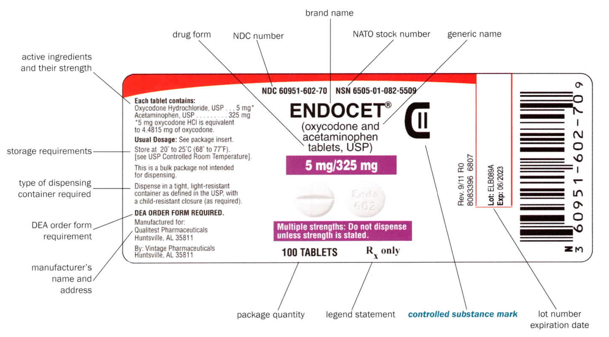
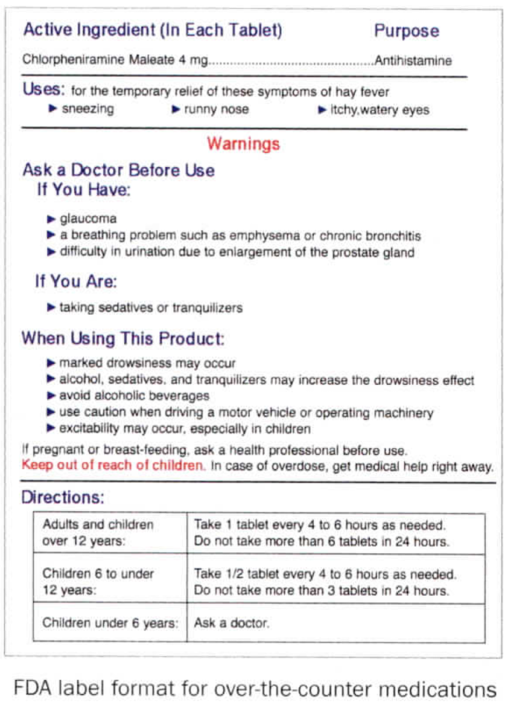

# Labeling Requirements for Prescription & OTC Drugs

## Manufacturer Stock Labels & Tracking

This section synthesizes key federal statutes and regulations governing how drug manufacturers must label products in the United States. "Labeling" includes **labels, inserts, and promotional materials**. Any manufacturer-originated material is subject to FDA review. This includes rules that apply to both prescription (Rx) and over-the-counter (OTC) drugs.

🦅 **Federal Law Overview**:

- 🔗 **FDC, FDCA, & Amendments** (🔗 [Link To](../fda_fdca.md))
- 🔗 **Extended Packaging & Labeling Policy** (🔗 [Link To](../packaging_labeling.md))
- 🔗 **Controlled Substance Policy** (🔗 [Link To](../csa_cmea.md))

### 🏷️ Package Label Requirements

| Requirement | Description | Legal Basis |
| ------------- | ------------- | ------------- |
| **Drug Identity** | Brand and generic name of active ingredient clearly stated | 🦅 21 CFR §201.10; FDCA §502(e) |
| **Strength** | Quantity of active ingredient per unit (e.g. mg per tablet) | 🦅 21 CFR §201.10(b); FDCA §502(a) |
| **Inactive Ingredients** (if OTC) | Excipients used in production must be listed in the **Drug Facts** panel | 🦅 FDCA §502(e); 21 CFR §201.66(c)(8) |
| **Dosage Form** | Physical form (e.g. capsule, solution) and route (oral, topical, etc.) | 🦅 21 CFR §201.100(b); USP standards |
| **Quantity Statement** | Net contents by weight, volume, or count | 🦅 FDCA §502(b)(2); 21 CFR §201.51 |
| **National Drug Code (NDC)** | FDA-assigned **11-digit** code identifying manufacturer, drug, and package; sometimes includes NATO Stock Number (NSN) for NATO countries | 🦅 FDCA §510; 21 CFR §207.35 |
| **"Rx Only" Designation** (if rx) | Required on prescription-only drugs | 🦅 FDCA §503(b)(4) (as amended by FDA Modernization Act of 1997) |
| 🔐 **Controlled Substance Schedule** (if controlled) | DEA Schedule I–V must be shown | 🦅 21 CFR §1302.04; CSA (21 USC §825) |
| 🔐 **DEA Order Form Requirement** (if CII) | Schedule II drugs require **DEA Form 222** or **CSOS** for ordering | 🦅 CSA 21 USC §828; 21 CFR §1305 |
| **Intended Use & Directions** | Declaration of intended use & directions; including recommended dosage and frequency, where applicable. | 🦅 FDCA §502(f); 21 CFR §201.5 |
| **Warnings** | Required safety warnings including contraindications, adverse effects, storage, and Black Box Warnings if applicable | 🦅 FDCA §502(f); 21 CFR §201.57 (Rx); 21 CFR §201.66 (OTC) |
| **Storage Requirements** | Storage conditions to prevent degradation (e.g., temperature, humidity, light) | 🦅 21 CFR §201.18; 21 CFR §211.142 |
| **Dispensing Container Required** (if rx) | Must be dispensed in a container that preserves stability within the labeled use period | 🦅 21 CFR §211.94; USP <659> Packaging & Storage |
| **Manufacturer Info** | Name, business address, and phone number of the manufacturer, packer, or distributor | 🦅 FDCA §502(b); 21 CFR §201.1 |
| **Batch/ Lot Number** | A unique identifier for the production batch to facilitate tracking and recalls if necessary | 🦅 21 CFR §211.130(e); §211.137 |
| **Manufacture & Expiration Dates** | date of manufacture and the expiration or “use by” date to ensure drug potency and safety | 🦅 21 CFR §211.130(e); §211.137 |
| **Barcoding & Serialization Requirements** | Serial Numbers; Linear (1D) and 2D barcodes per DSCSA, encoding NDC, lot, and expiration | 🦅 DSCSA (FDCA §582); 21 CFR §201.25 |
| **Tamper-Evident Packaging** | Required for most OTC drugs to demonstrate integrity | 🦅 21 CFR §211.132; 21 CFR §211.125 |
| **Language** | English required; other languages optional or supplemental | 🦅 21 CFR §201.15(c); FDCA §502(c) |
| **Patient Package Insert (PPI)** (conditional) | Required for certain drug classes (e.g. oral contraceptives, estrogens) and drugs under REMS | 🦅 21 CFR §208; FDCA §505-1 (REMS) |
| 📰 **Medication Guide (MedGuide)** (conditional) | Required when FDA determines information is necessary to prevent serious adverse effects, ensure proper use, or address risks of non-adherence | 🦅 21 CFR §208.1; FDCA §505-1(e) |

> 🛡️ The ISMP recommends **Tall Man Lettering** to distinguish look-alike drug names (e.g. predniSONE vs prednisoLONE)

Manufacturer Stock Label

#### National Drug Code (NDC) Format

The NDC is a unique 10- or **11-digit**, 3-segment number that identifies all FDA-approved drug products. It is required on prescription drug labels and often found on OTC products as well.

| Segment | Digits | Description |
| --- | --- | --- |
| **Labeler Code** | 5 | Identifies the manufacturer or repackager (FDA-assigned) |
| **Product Code** | 3–4 | Identifies the specific strength, dosage form, and formulation (Manufacturer-assigned) |
| **Package Code** | 1–2 | Identifies package type and size (Manufacturer-assigned) |

> 📌 **Normalize to 11 digits** by adding leading zeroes to any segment that does not meet its maximum length. Required for claims submission and electronic records.

**NDC Format Example**  

- Printed NDC: `58160-823-52`  
- Normalized: `058160082352`  
  - Labeler: `058160`  
  - Product: `0823`  
  - Package: `52`

> 🛡️ Always verify the NDC on **both the primary and secondary packaging** during dispensing. Report discrepancies to a pharmacist immediately.

#### Barcodes & Serialization

Barcoding and serialization are mandated under the **Drug Supply Chain Security Act (DSCSA)** to prevent counterfeit drugs and support recalls. Manufacturers must affix machine-readable codes to **each smallest saleable unit**.

| Barcode Type | Appearance | Contents | Use Case |
| --- | --- | --- | --- |
| **Linear (1D)** | Horizontal bars | NDC only | Used in shelf stock scanning or inventory |
| **GS1 DataMatrix (2D)** | Square pixel grid | GTIN + Expiration + Lot + Serial Number | Used in Rx filling & verification |

> - 🔑 **GTIN = Global Trade Item Number**, a globally unique product identifier that incorporates the NDC and labeler code.
> - 🛡️ Pharmacists and technicians must **scan and verify 2D barcodes** during prescription processing, especially for controlled substances and REMS drugs.
> - 📌 Always inspect labels for **tampering or misprints**, especially if barcodes do not resolve in your system.

## Dispensed Prescription Drug Labeling Requirements

Dispensed prescription labels serve as the **primary source of patient-facing instructions** and must meet federal, state, and professional standards for clarity, safety, and accuracy. Technicians are responsible for ensuring that all required elements are present, legible, and consistent with the prescriber’s order and the product dispensed. Errors in labeling can lead to medication misadventures, insurance rejections, and regulatory violations.

### Checklist

A complete prescription label must include the following components:

#### Pharmacy Contact Information

- [ ] **Pharmacy Name**
- [ ] **Address**
- [ ] **Telephone Number**

This information ensures patients and providers can contact the pharmacy for refills, clarifications, or clinical questions.

#### Patient Identifiers

- [ ] **Patient Name**
- [ ] **Patient Address** (required in many states; always required for controlled substances)

Accurate patient identifiers prevent mix-ups and support insurance adjudication and controlled-substance tracking.

#### Prescriber Identifiers

- [ ] **Prescriber Name**
- [ ] (Optional) Prescriber Address or DEA/NPI, depending on state requirements

#### Adjudication & Tracking Details

- [ ] **Prescription Number (Rx#)**  
  - Appears as: `RxNumber–TransactionNumber` when applicable  
- [ ] **National Drug Code (NDC)** or **Drug Identification Number (DIN)**  
- [ ] **Refill Information** (e.g., “0 refills remaining”)

These fields support billing, refill management, and DSCSA traceability.

#### Dispensing Details

- [ ] **Data Entry Technician Initials**
- [ ] **Filling Technician Initials**
- [ ] **Fill Date** (“Date Dispensed”)
- [ ] **Expiration Date**  
  - Use stock bottle expiration **or** 1 year from fill date, whichever is sooner  
- [ ] **Space for Pharmacist Initials**  
  - Signed during final verification

These elements document the workflow and support audit trails, quality assurance, and regulatory compliance.

#### Prescription Directions & Drug Information

- [ ] **Inscription** (drug name, strength, dosage form)
- [ ] **Signa** (patient instructions)
- [ ] **Quantity Dispensed**

The inscription and signa must match the prescriber’s intent and be written in **clear, patient-friendly language**. Avoid abbreviations unless required by system formatting.

### Auxiliary Labels & Safety Information

Depending on the medication, the system may prompt for:

- Shake well  
- Take with food  
- Avoid sunlight  
- May cause drowsiness  
- Refrigerate  
- Controlled substance warnings  
- Hazardous drug precautions  

Technicians must verify that all **required auxiliary labels** are applied and that they do not obscure critical information.

> 🔐 **Controlled Medication** requires the label "Caution: Federal law prohibits the transfer of this drug to any person other than the patient for whom it was prescribed"

### Container Requirements

Dispensed medications must be placed in containers that:

- Preserve stability and integrity  
- Are child-resistant unless exempted  
- Are appropriately sized to avoid crushing or damaging tablets  
- Include tamper-evident features when required  

Refer to **USP <659> Packaging & Storage** and state board regulations for specifics.

### Best Practices for Technicians

- Always compare the NDC on the **label**, **stock bottle**, and **system entry**  
- Ensure the drug name and strength match the product dispensed  
- Confirm that the signa is complete, unambiguous, and readable  
- Verify that the expiration date is correct and not copied incorrectly  
- Ensure labels are applied straight, fully adhered, and not covering critical information  
- For controlled substances, confirm all state‑specific warning labels are present  

Accurate labeling is one of the most important safety steps in the dispensing workflow. Technicians must treat every label as a **critical safety document**, not just a sticker.

### Standalone Printouts

Additional documents, with information not on the stock or prescription label themselves, dispensed with the product

#### 📰 Patient Package Inserts (PPIs)

`For potentially dangerous drugs`

PPIs are FDA-regulated documents that must accompany specific drug classes. They differ from MedGuides in that they are **drug-class specific** and are not required for every outpatient medication. They are dispensed at:

- **Retail Pharmacies** with every fill/refill of a covered product.
- **Institutions** (e.g. hospital) before first administration, and every 30 days during therapy.

☣️ **Common Drug Classes Requiring PPIs**

| Class | Examples |
| --- | --- |
| Estrogens | Conjugated estrogens (Premarin), Estradiol |
| Oral Contraceptives | Combined hormonal products, Progestin-only pills |
| REMS-designated drugs | Isotretinoin, Mifepristone, etc |

> 🛡️ Failure to dispense a required PPI is a violation of FDCA §502(a), rendering the drug **misbranded**.

📂 **Content Breakdown**

| Section | What It Covers |
| --- | --- |
| **Clinical Pharmacology** | How the drug works in the body, including: Mechanism of action, Pharmacokinetics (absorption, distribution, metabolism, excretion), Demographic considerations (e.g., effects in children, pregnancy) |
| **Approved Indications** | Lists the **FDA-approved uses** of the drug (*Note:* Drugs are sometimes used “off-label” for other conditions, based on provider discretion.) |
| **Contraindications** | Situations where the drug **should not be used**, such as certain medical conditions, allergies, or interactions. |
| **Boxed Warnings** | Serious or life-threatening risks associated with the drug (e.g., Black Box Warnings). |
| **Precautions** | Instructions to help avoid harm, including guidance that informs **auxiliary labels**. |
| **Side effects** | Lists all known **adverse reactions**, including those reported during clinical trials or post-marketing. |
| **Dosage & Administration Guide** | How to take the medication, including dose, timing, route, and adjustments. |
| **Overdose Protocol** | Symptoms of overdose & instructions on how to handle. |
| **Abuse Potential & Dependence** | Details on the drug’s potential for **abuse, tolerance, or dependence** (especially important for controlled substances). |
| **How Supplied / Storage** | Describes the drug’s appearance (shape, color, imprint) and **storage conditions** (e.g., keep refrigerated, protect from light). |

> 📌 Many PPIs contain diagrams or step-by-step **patient instructions**, especially for complex dosage forms (e.g., vaginal rings, inhalers, patches).

#### 📋 Medication Guides (MedGuides)

MedGuides are **FDA-required patient labeling** for outpatient prescription drugs that present serious and specific public health concerns. These are distinct from PPIs and are **drug-specific**, not class-based. A MedGuide **must be dispensed** if any of the following conditions apply:

| Trigger | Description |
| --- | --- |
| **Patient labeling could prevent serious adverse effects** | The drug has significant risks that could be avoided or reduced by patient understanding |
| **Serious risks that could affect decision to use** | The drug has known dangers that might change a patient's willingness to begin or continue therapy |
| **Adherence is crucial to effectiveness** | Incorrect use of the medication would result in ineffective treatment or increased risk |

> - 📌 If a MedGuide is required for a product, it must be dispensed **with each fill and refill** in the **outpatient setting**. They are not required for **inpatient settings** unless patient requests or drug is part of a REMS program.
> - 🚨 Failure to provide a required MedGuide renders the drug **misbranded under federal law**, even if all other labeling is correct.

📂 **Content Breakdown**

| Section | What It Explains |
| --- | --- |
| **What is the most important information I should know?** | Key risks and dangers |
| **What is [Drug Name]?** | Description and indication |
| **Who should not take [Drug]?** | Contraindications |
| **How should I take [Drug]?** | Dosing, missed doses |
| **What should I avoid?** | Drug/food/alcohol interactions |
| **Possible side effects** | Sorted by severity |
| **How do I store [Drug]?** | Storage and handling |
| **General information** | Encourages patients to ask their pharmacist or doctor for more details |

> - 🛡️ Always verify MedGuide availability in your pharmacy system. Most eRx platforms and label software include print flags for drugs that require them.
> - 🛡️ Always verify the most recent MedGuide version with the FDA [Medication Guide database](https://www.accessdata.fda.gov/scripts/cder/mg/index.cfm).

---

## Navlinks

- 🔙🔗 Back to [**Production, Marketing, & Distribution of Medicine**](../../discovery_manufacture.md#️-marketing--labeling-requirements)
- 🔙🔗 Back to [**🛠️ SOP — Filling Prescriptions**](../../sop/rx_fill.md#13-the-printing-process)
