# ⚖️ Alligation Calculations for Pharmacy Technicians

<!-- ## Reference

Pharmacy Calculations, 6e; Morton Publishing | Chapter 31
-->

**Alligation** is a method used to determine how to combine **two strengths** (concentrations) of the **same ingredient** to achieve a **desired strength** (concentration) that falls **between** the two.

It is a shortcut technique (often visualized like a tic-tac-toe grid) to avoid solving with full algebra.

Use **alligation** when:

- You are **mixing two known strengths** of the **same active ingredient**
- You need to make a **specific final strength**
- The **desired strength lies between the two** known strengths
- This **dilutions** (use 0%)

You **cannot** use alligation if:

- The desired strength is **not between** the two available strengths
- The solutions contain **different ingredients**

> 🔑 **Definition**: type of calculation to determine how much of two concentrations of the same ingredient are needed to prepare a concentration that is in between

---

## 🔢 Formulas

### 🧩 Table Setup

<!-- | $C_h$ | | ${P_h = C_d - C_l}$ |
|-|-|-|
| | $C_d$ | |
| $C_l$  | | ${P_l = C_h - C_d}$ | -->

> The numbers on the diagonals are always subtractive differences. Always subtract "across" the grid.

Where:

<!-- ${\boxed{\text{Higher, Available Strength } (\% \times 100) = C_h}}$

${\boxed{\text{Lower, Available Strength } (\% \times 100) = C_l}}$

${\boxed{\text{Desired Strength } (\% \times 100) = C_d}}$

${\boxed{\text{Higher Strength in Final Solution (Parts)} = P_h}}$

${\boxed{\text{Lower Strength in Final Solution (Parts)} = P_l}}$ -->

### 🧩 Determining Ratios of Each

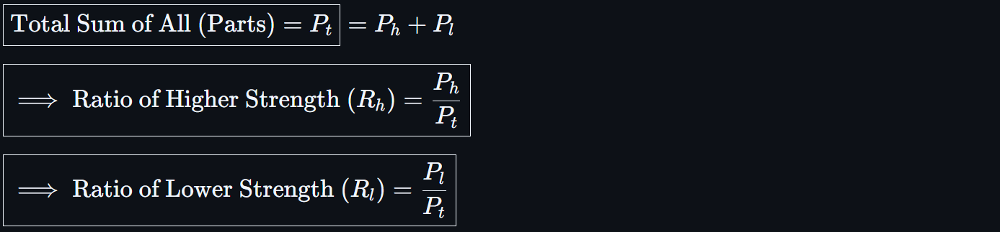
<!-- ${\boxed{\text{Total Sum of All (Parts)} = P_t} = P_h + P_l}$

${\boxed{\implies \text{Ratio of Higher Strength } (R_h)= \frac{P_h}{P_t}}}$

${\boxed{\implies \text{Ratio of Lower Strength } (R_l)= \frac{P_l}{P_t}}}$ -->

> 🔑 **Part**: Relative Amount of Ingredient

### 🧩 Determining Amounts of Each

For **Liquids Use Volume**:

<!-- ${\boxed{\text{Total Sum Volume (mL)} = V_t\ (\text{Given})}}$

${\boxed{\implies \text{Higher Strength Volume } (V_h) = R_h \times V_t = (\frac{P_h}{P_t}) \times V_t}}$

${\boxed{\implies \text{Lower Strength Volume } (V_l) = R_l \times V_t = (\frac{P_l}{P_t}) \times V_t}}$ -->

For **Solids Use Mass**:

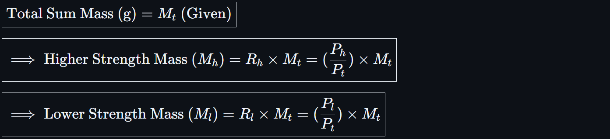
<!-- ${\boxed{\text{Total Sum Mass (g)} = M_t\ (\text{Given})}}$

${\boxed{\implies \text{Higher Strength Mass } (M_h) = R_h \times M_t = (\frac{P_h}{P_t}) \times M_t}}$

${\boxed{\implies \text{Lower Strength Mass } (M_l) = R_l \times M_t = (\frac{P_l}{P_t}) \times M_t}}$ -->

## Examples

### 1.) Liquid Alligation

`Prepare 60 mL of a 15% solution using 10% and 25%`

Step 1: **Set Up Alligation Table**

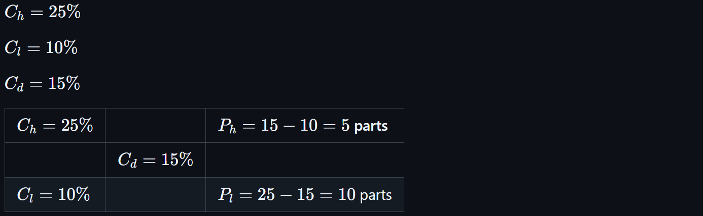
<!-- $C_h = 25\%$

$C_l = 10\%$

$C_d = 15\%$

| $C_h = 25\%$ |                 | $P_h = 15 - 10 = 5$ parts  |
|--------------|-----------------|----------------------------|
|              | $C_d = 15\%$    |                            |
| $C_l = 10\%$ |                 | $P_l = 25 - 15 = 10$ parts | -->

Step 2: **Calculate Ratios**

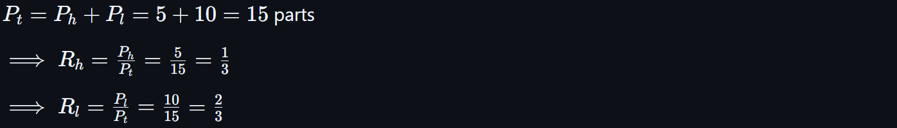
<!-- $P_t = P_h + P_l = 5 + 10 = 15$ parts

$\implies R_h = \frac{P_h}{P_t} = \frac{5}{15} = \frac{1}{3}$

$\implies R_l = \frac{P_l}{P_t} = \frac{10}{15} = \frac{2}{3}$ -->

Step 3: **Determine Volumes**

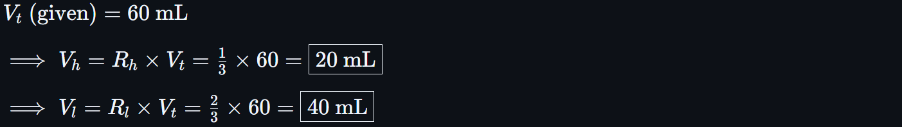
<!-- $V_t \text{ (given)} = 60\ \text{mL}$

$\implies V_h = R_h \times V_t = \frac{1}{3} \times 60 = \boxed{20\ \text{mL}}$

$\implies V_l = R_l \times V_t = \frac{2}{3} \times 60 = \boxed{40\ \text{mL}}$ -->

✅ **Final Answer**: Mix 20 mL of 25% solution with 40 mL of 10% solution to make 60 mL of 15% solution

---

### 2.) Solid Alligation

`Prepare 500 g of a 12% ointment using 8% and 20%`

Step 1: **Set Up Alligation Table**

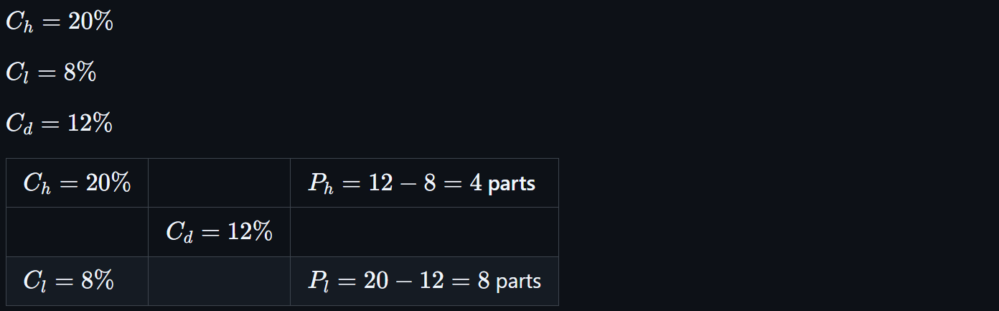
<!-- $C_h = 20\%$

$C_l = 8\%$

$C_d = 12\%$

| $C_h = 20\%$ |                 | $P_h = 12 - 8 = 4$ parts  |
|--------------|-----------------|---------------------------|
|              | $C_d = 12\%$    |                           |
| $C_l = 8\%$  |                 | $P_l = 20 - 12 = 8$ parts | -->

Step 2: **Calculate Ratios**

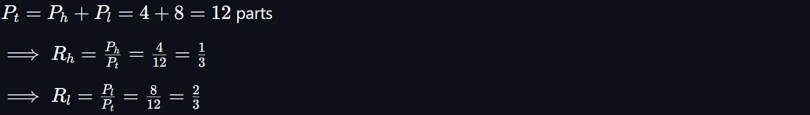
<!-- $P_t = P_h + P_l = 4 + 8 = 12$ parts

$\implies R_h = \frac{P_h}{P_t} = \frac{4}{12} = \frac{1}{3}$

$\implies R_l = \frac{P_l}{P_t} = \frac{8}{12} = \frac{2}{3}$ -->

Step 3: **Determine Masses**

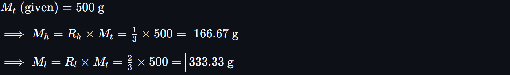
<!-- $M_t \text{ (given)} = 500\ \text{g}$

$\implies M_h = R_h \times M_t = \frac{1}{3} \times 500 = \boxed{166.67\ \text{g}}$

$\implies M_l = R_l \times M_t = \frac{2}{3} \times 500 = \boxed{333.33\ \text{g}}$ -->

✅ **Final Answer**: Mix 166.67 g of 20% ointment with 333.33 g of 8% ointment to make 500 g of 12% ointment

---

### 3.) Dilution

Step 1: **Set Up Alligation Table**

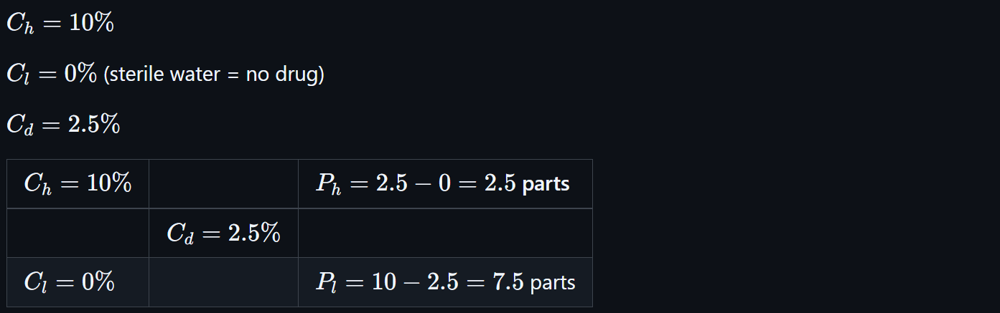
<!-- $C_h = 10\%$

$C_l = 0\%$ (sterile water = no drug)

$C_d = 2.5\%$

| $C_h = 10\%$ |                 | $P_h = 2.5 - 0 = 2.5$ parts  |
|--------------|-----------------|------------------------------|
|              | $C_d = 2.5\%$   |                              |
| $C_l = 0\%$  |                 | $P_l = 10 - 2.5 = 7.5$ parts | -->

Step 2: **Calculate Ratios**

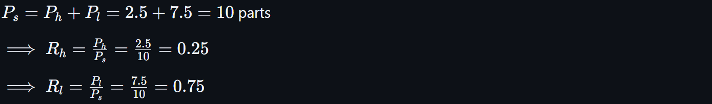
<!-- $P_s = P_h + P_l = 2.5 + 7.5 = 10$ parts

$\implies R_h = \frac{P_h}{P_s} = \frac{2.5}{10} = 0.25$

$\implies R_l = \frac{P_l}{P_s} = \frac{7.5}{10} = 0.75$ -->

Step 3: **Determine Volumes**

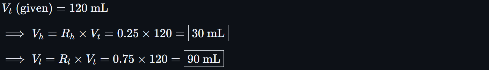
<!-- $V_t \text{ (given)} = 120\ \text{mL}$

$\implies V_h = R_h \times V_t = 0.25 \times 120 = \boxed{30\ \text{mL}}$

$\implies V_l = R_l \times V_t = 0.75 \times 120 = \boxed{90\ \text{mL}}$

✅ **Final Answer**: Mix 30 mL of 10% solution with 90 mL of sterile water to make 120 mL of 2.5% solution -->

---

## 📍 Tips and Best Practices

- 🛡️ Always check that the desired concentration/ strength is **between** the two available.
- 📏 Keep units consistent: mL with mL, g with g.
- ✅ Use exact math before rounding unless a sig fig limit is specified.
- 🤯 Alligation gives **ratios**, not volumes—convert with total quantity.
- 🧮 Don't forget to **sum parts** when scaling to actual quantities.

---

🔗 Back to [**Mathematics Concepts Directory**](./readme.md)
