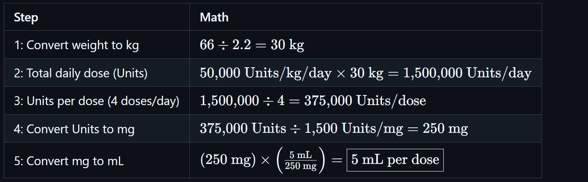
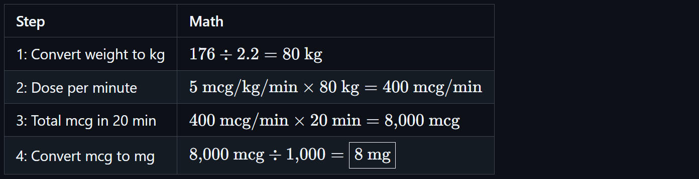
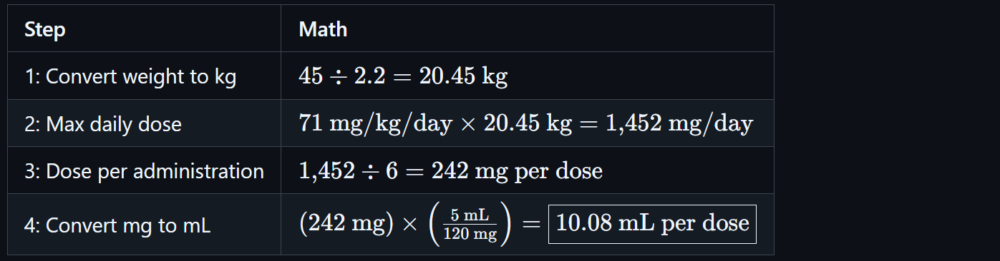

# 🧮 Dosage Calculations Based on Body Weight & Age

<!-- 
## Reference

Pharmacy Calculations, 6e; Morton Publishing | Chapter 27
-->

Dosage calculations based on **body weight** are essential in pharmacy practice. They ensure safe and effective medication administration, especially in **pediatrics**, **critical care**, and **oncology**. Weight-based dosing adjusts for patient size, which significantly affects drug distribution and metabolism.

## ⚖️ Standard Body Weight Dosing

Most weight-based dosages are expressed in:

- **mg/kg** (milligrams per kilogram)
- **mcg/kg** (micrograms per kilogram)
- Less commonly: **mg/lb** (milligrams per pound)

📍 1 kilogram = **2.2 pounds** is a clinical estimate used for simplicity.

🧪 **Example**

- **Order:** 25 mg/kg/day in 2 divided doses  
- **Weight:** 154 lbs
- **Solve**: How many mL `per dose`?

| Step | Math |
|------|------|
| Convert weight to kg | 154 ÷ 2.2 = 70 kg |
| Total daily dose | 25 × 70 = 1750 mg/day |
| Dose per administration | 1750 ÷ 2 = 875 mg per dose |

## 👶 Pediatric Dosing

Children are **not miniature adults**. Their organ systems are still developing, and metabolism differs from adults. Standard adult doses can be inappropriate or unsafe.

To account for this, specific formulas were developed:

### 🧮 Clark’s Rule (Weight-Based)

**Clark’s Rule** estimates a child's dose based on **weight in pounds**, using **150 lbs as the standard adult weight**.

📐 **Formula**

<!-- $\text{Child's Dose} = \left( \frac{\text{Weight in lbs}}{150} \right) \times \text{Adult Dose}$ -->

> 📍 **Why 150 lbs?** 150 pounds was considered the **average adult weight** in the early 20th century when the rule was developed. While outdated by modern standards, the rule remains a **useful estimation method** in teaching and simple calculations.

🧪 **Example**

- **Adult dose:** 500 mg  
- **Child’s age:** 6 years
- **Child’s weight:** 50 lbs

| Step | Math |
|------|------|
| Calculate Proportion | 50 ÷ 150 = 0.333 |
| Multiply by Adult Dose | 0.333 × 500 = 166.67 mg |

### 🧮 Young’s Rule (Age-Based)

**Young’s Rule** estimates a pediatric dose based on **age**, assuming that drug metabolism improves linearly with age.

📐 **Formula**

<!-- $\text{Child's Dose} = \left( \frac{\text{Age}}{\text{Age} + 12} \right) \times \text{Adult Dose}$ -->

> 📍 **Why "+12"?** The assumption was that **adult dosing capacity** is reached at **age 12**. This is a historical generalization reflecting an age when most children were thought to have similar metabolic capacity to adults.

🧪 **Example**

- **Adult dose:** 500 mg
- **Child’s age:** 6 years  
- **Child’s weight:** 50 lbs

| Step | Math |
|------|------|
| Calculate Proportion | 6 ÷ (6 + 12) = 6 ÷ 18 = 0.333 |
| Multiply by Adult Dose | 0.333 × 500 = 166.67 mg |

> 🚨 Young’s Rule is only applicable for **children older than 1 year** and **younger than 12 years**

## ✅ Best Practices

- Always convert pounds to kilograms for modern mg/kg dosing
- Use Clark’s and Young’s Rules only when:
  - No specific pediatric dosing data is available
  - A rough estimate is acceptable
- Use **mg/kg/day** or **mg/kg/dose** formulas for clinical dosing whenever possible
- Always double-check pediatric doses with a pharmacist or prescriber

## Advanced Examples

### 🧪 Example 1: Pediatric Penicillin VK Dose

- **Medication Order**: 50,000 Units/kg/day, in 4 doses for 10 days
- **Patient Weight**: 66 lbs
- **Available Formulation**: 250 mg/5 mL (1,500 Units/mg)
- **Solve**: How many mL `per dose`?

<!-- | Step | Math |
|------|------|
| 1: Convert weight to kg | ${66 \div 2.2 = 30\ \text{kg}}$ |
| 2: Total daily dose (Units) | ${50{,}000\ \text{Units/kg/day} \times 30\ \text{kg} = 1{,}500{,}000\ \text{Units/day}}$ |
| 3: Units per dose (4 doses/day) | ${1{,}500{,}000 \div 4 = 375{,}000\ \text{Units/dose}}$ |
| 4: Convert Units to mg | ${375{,}000\ \text{Units} \div 1{,}500\ \text{Units/mg} = 250\ \text{mg}}$ |
| 5: Convert mg to mL | ${\left(250\ \text{mg}\right) \times \left(\frac{5\ \text{mL}}{250\ \text{mg}}\right) = \boxed{5\ \text{mL per dose}}}$ | -->

### 🧪 Example 2: Dopamine Infusion

- **Medication Order**: 5 mcg/kg/min
- **Patient Weight**: 176 lbs
- **Solve**: How many `mg` are administered over `20 minutes`?

<!-- | Step | Math |
|------|------|
| 1: Convert weight to kg | ${176 \div 2.2 = 80\ \text{kg}}$ |
| 2: Dose per minute | ${5\ \text{mcg/kg/min} \times 80\ \text{kg} = 400\ \text{mcg/min}}$ |
| 3: Total mcg in 20 min | ${400\ \text{mcg/min} \times 20\ \text{min} = 8{,}000\ \text{mcg}}$ |
| 4: Convert mcg to mg | ${8{,}000\ \text{mcg} \div 1{,}000 = \boxed{8\ \text{mg}}}$ | -->

### 🧪 Example 3: Pediatric Acetaminophen (Tylenol) Elixir

- **Patient Info**:
  - **Age**: 5 years
  - **Weight**: 45 lbs
- **Max dose**: 71 mg/kg/day
- **Dosing Frequency**: 6 doses per day
- **Formulation**: 120 mg/5 mL
- **Solve**: How many `mL` per `dose`?

<!-- | Step | Math |
|------|------|
| 1: Convert weight to kg | ${45 \div 2.2 = 20.45\ \text{kg}}$ |
| 2: Max daily dose | ${71\ \text{mg/kg/day} \times 20.45\ \text{kg} = 1{,}452\ \text{mg/day}}$ |
| 3: Dose per administration | ${1{,}452 \div 6 = 242\ \text{mg per dose}}$ |
| 4: Convert mg to mL | ${\left(242\ \text{mg}\right) \times \left(\frac{5\ \text{mL}}{120\ \text{mg}}\right) = \boxed{10.08\ \text{mL per dose}}}$ | -->

---

🔗 Back to [**Mathematics Concepts Directory**](./readme.md)
