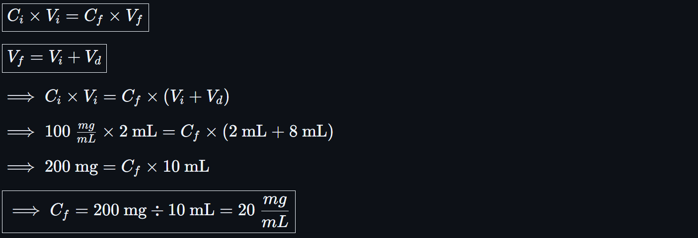
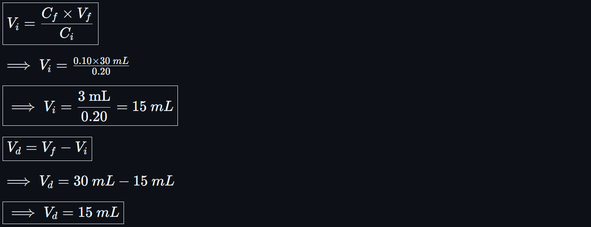

# 💧 Dilution Calculations for Pharmacy Technicians

<!-- 
## Reference

Pharmacy Calculations, 6e; Morton Publishing | Chapter 30
-->

Dilution involves **reducing the concentration** of a solution by adding a diluent (e.g. sterile water, normal saline). The **total amount of drug stays the same**, but it's dispersed in a **larger volume**.

## 🚨 Tips and Best Practices

- 📌 **Always label units**; cancel to confirm your math is valid.
- 🛡️ For safety-critical doses (e.g. neonatal), recalculate and verify final concentration.
- 🔁 Ratios (e.g. 1:5, 1:10) = "1 part drug per total parts" → Convert to percent or mg/mL if needed.
- 📦 Document all compounding: **lot numbers, dates, and expiration**.
- 🔗 Save all dilution steps for pharmacist verification.

## 🔢 Dilution Proportion Formula

<!-- 
${\boxed{C_i \times V_i = C_f \times V_f}}$

${\boxed{\implies \text{Initial, Stock Concentration for Dilution } (C_i)} = (C_f \times V_f) \div V_i}$

${\boxed{\implies \text{Initial, Stock Volume Used for Dilution } (V_i)} = (C_f \times V_f) \div C_i}$

${\boxed{\implies \text{Final Concentration After Dilution } (C_f)} = (C_i \times V_i) \div V_f}$

${\boxed{\implies \text{Final, Total Volume After Dilution } (V_f)} = (C_i \times V_i) \div V_f}$ -->

---

<!-- 
${\boxed{\text{Final, Total Volume After Dilution } (V_f)} = V_i + V_d}$

${\boxed{\implies \text{Initial, Stock Volume Used for Dilution } (V_i)} = V_f - V_d}$

${\boxed{\implies \text{Diluent Volume Used }  (V_d)} = V_f - V_i}$ -->

---

### Formula Manipulation

<!-- ${\boxed{C_i \times V_i = C_f \times (V_i + V_d)}}$

${\boxed{\implies \text{Final Concentration After Dilution } (C_f)} = (C_i \times V_i) \div (V_i + V_d)}$

${\implies C_i \times V_i = {(V_i \times C_f) + (V_d \times C_f)}}$

${\boxed{\implies \text{Diluent Volume Used } (V_d)} =  \frac{(C_i \times V_i) - (V_i \times C_f)}{C_f}}$

${\boxed{\implies \text{Initial, Stock Volume Used for Dilution } (V_i)} =  \frac{(C_i \times V_i) - (V_d \times C_f)}{C_f}}$ -->

## 📘 Examples

### 1.) Calculate Final, Diluted Concentration After Adding Diluent

- **Have**: 2 mL of Stock Solution at 100 mg/mL
- **Add**: 8 mL diluent

Option 1: **Plugging In**

<!-- ${\boxed{C_f = (C_i \times V_i) \div (V_i + V_d)}}$

${\implies C_f = ({100\ \frac{mg}{mL} \times \text{2 mL}}) \div (\text{2 mL + 8 mL})}$

${\boxed{\implies C_f = \text{200 mg} \div \text{10 mL} = 20\ \frac{mg}{mL}}}$ -->

Option 2: **Winging It**

<!-- ${\boxed{C_i \times V_i = C_f \times V_f}}$

${\boxed{V_f = V_i + V_d}}$

${\implies {C_i \times V_i = C_f \times (V_i + V_d)}}$

${\implies 100\ \frac{mg}{mL} \times \text{2 mL} = C_f \times (\text{2 mL + 8 mL})}$

${\implies \text{200 mg} = C_f \times \text{10 mL}}$

${\boxed{\implies C_f = \text{200 mg} \div \text{10 mL} = 20\ \frac{mg}{mL}}}$ -->

✅ **Final Answer**: Diluting 2 mL of 100 mg/mL solution with 8 mL makes **10mL of 20 mg/mL solution**.

---

### 2.) Calculate How Much Stock & Diluent to Add

- **Have**: Stock Solution @ 100 mg/mL (Unlimited)
- **Need**: 50 mL @ 20 mg/mL

Option 1: **Plugging In**

<!-- ${\boxed{V_i = (C_f \times V_f) \div C_i}}$

${\implies {V_i = (20\ \frac{mg}{mL} \times \text{50 mL}) \div 100\ \frac{mg}{mL}}}$

${\implies {V_i = \text{1000 mg} \div 100\ \frac{mg}{mL}}}$

${\boxed{\implies V_i = \text{1000 mg} \times \frac{\text{100 mg}}{\text{1 mL}} = \text{10 mL}}}$

${\boxed{V_d = \frac{(C_i \times V_i) - (V_i \times C_f)}{C_f}}}$

${\implies {V_d = \frac{(100\ \frac{mg}{mL} \times \text{10 mL}) - (\text{10 mL} \times 20\ \frac{mg}{mL})}{20\ \frac{mg}{mL}}}}$

${\implies {V_d = \frac{\text{1000 mg} - \text{200 mg}}{20\ \frac{mg}{mL}} = \frac{\text{800 mg}}{20\ \frac{mg}{mL}}}}$

${\boxed{\implies {V_d = {\text{800 mg}}\div{20\ \frac{mg}{mL}} = {\text{40 mL}}}}}$ -->

Option 2: **Winging It**

<!-- ${\boxed{C_i \times V_i = C_f \times V_f}}$

${\implies 100\ \frac{mg}{mL} \times V_i = 20\ \frac{mg}{mL} \times \text{50 mL}}$

${\implies 100\ \frac{mg}{mL} \times V_i = \text{1000 mg}}$

${\implies V_i = \text{1000 mg} \div 100\ \frac{mg}{mL} }$

${\boxed{\implies V_i = \text{1000 mg} \times \frac{\text{100 mg}}{\text{1 mL}} = \text{10 mL}}}$

${\boxed{V_f = V_i + V_d}}$

${\implies \text{50 mL} = \text{10 mL} + V_d}$

${\boxed{\implies V_d = \text{50 mL} - \text{10 mL} = \text{40 mL}}}$ -->

✅ **Final Answer**: Add **40 mL diluent** to **10 mL of 100 mg/mL solution**, in order to make 50 mL of 20 mg/mL solution.

---

### 3.) Convert Stock Ratio Solution to a Weaker Ratio

- **Have**: Stock solution at **1:5**
- **Need**: Final solution at **1:10**
- **Final total volume desired**: 30 mL

🧪 **Convert ratios to percentages**:

- **1:5** = 1 ÷ 5 = 0.20 **= 20%**
- **1:10** = 1 ÷ 10 = 0.10 **= 10%**

Option 1: **Plugging In**

<!-- ${\boxed{V_i = \frac{C_f \times V_f}{C_i}}}$

${\implies V_i = \frac{0.10 \times 30\ mL}{0.20}}$

${\boxed{\implies V_i = \frac{3\ \text{mL}}{0.20} = 15\ mL}}$

${\boxed{V_d = V_f - V_i}}$

${\implies {V_d = 30\ mL - 15\ mL }}$

${\boxed{\implies V_d = 15\ mL}}$ -->

Option 2: **Winging It**

<!-- ${\boxed{C_i \times V_i = C_f \times V_f}}$

${\implies 0.20 \times V_i = 0.10 \times 30\ mL}$

${\implies 0.20 \times V_i = 3\ mL}$

${\boxed{\implies V_i = \frac{3\ mL}{0.20} = 15\ mL}}$

${\boxed{V_d = V_f - V_i}}$

${\implies {V_d = 30\ mL - 15\ mL }}$

${\boxed{\implies V_d = 15\ mL}}$ -->

✅ **Final Answer**: Add **15 mL diluent** to **15 mL of 1:5 solution**, in order to make 30 mL of 1:10 solution.

---

🔗 Back to [**Mathematics Concepts Directory**](./readme.md)
