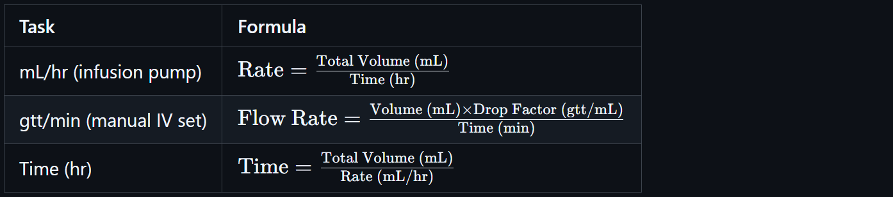
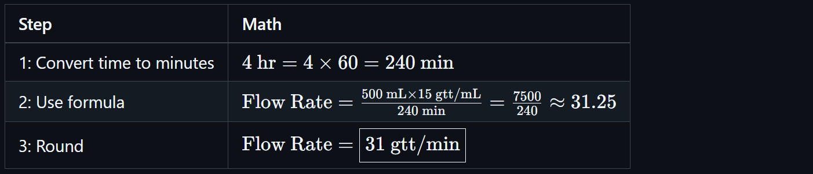
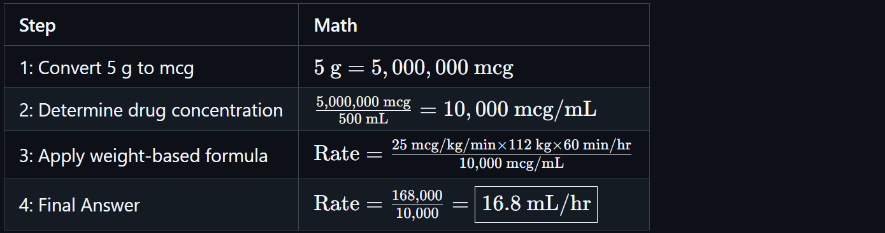
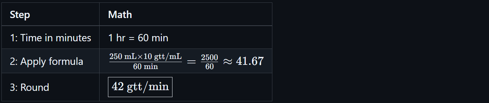
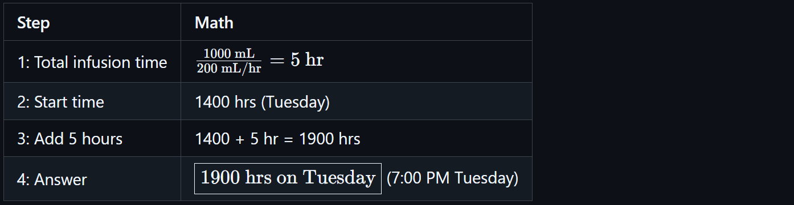

# 💧 Infusion and Drip Rate Calculations

<!-- 
## Reference

Pharmacy Calculations, 6e; Morton Publishing | Chapter 29
-->

An **IV set** is the tubing used to administer fluids and medications intravenously. It includes:

- Drip chamber
- Roller clamp
- Spike and port
- Labeled **drop factor** or **calibration** in gtt/mL

## 🕰️ Military Time

📍 Military time is a **24-hour clock system** used in clinical settings to avoid AM/PM confusion.

| Standard Time | Military Time |
|---------------|----------------|
| 1:00 AM       | 0100           |
| 7:00 AM       | 0700           |
| 12:00 PM      | 1200           |
| 1:00 PM       | 1300           |
| 6:00 PM       | 1800           |
| 11:59 PM      | 2359           |
| Midnight      | 0000           |

🚨 Military time is written as a **four-digit number without a colon**. Example: 9:45 PM = **2145**

## 🔑 Key Formula Summaries

<!-- | Task | Formula |
|------|---------|
| mL/hr (infusion pump) | ${\text{Rate} = \frac{\text{Total Volume (mL)}}{\text{Time (hr)}} }$ |
| gtt/min (manual IV set) | ${\text{Flow Rate} = \frac{\text{Volume (mL)} \times \text{Drop Factor (gtt/mL)}}{\text{Time (min)}} }$ |
| Time (hr) | ${\text{Time} = \frac{\text{Total Volume (mL)}}{\text{Rate (mL/hr)}} }$ | -->

## 📘 Calculating Rate of Infusion

`given volume & time`

### 🧪 Infusion Rate

The **infusion rate** refers to the volume of IV fluid or medication to be delivered over a specific amount of time, typically measured in **mL/hr**.

- Used when setting **infusion pumps**
- Based on prescription (e.g., "Infuse 1000 mL over 8 hours")

💧 **Example**

**Order**: 1000 mL D5W to infuse over 8 hours.

<!-- $\text{Rate} = \frac{\text{1000 mL}}{\text{8 hr}} = \text{125 mL/hr}$ -->

## 📘 Calculate IV Flow Rate in Drops Per Minute (gtt/min)

`given calibration, volume, & time`

Used for **gravity IV sets**. Requires knowing the **drop factor** (calibration) of the IV tubing.

### 📏 Calibrated Drip Rate (Drop Factor)

The **drop factor** is the number of drops (gtt) that make up 1 mL of fluid for a given IV set. It determines how fast the fluid drips into the patient when gravity is used.

| Tubing Type | Drop Factor |
|-------------|-------------|
| Macrodrip   | 10, 15, or 20 gtt/mL |
| Microdrip   | 60 gtt/mL            |

> 🚨 You must use the correct drop factor listed on the IV tubing packaging.

💧 **Example**

**Order**: 500 mL NS over 4 hours. Tubing calibration: 15 gtt/mL

Step-by-step:

<!-- | Step | Math |
|------|------|
| 1: Convert time to minutes | ${4\ \text{hr} = 4 \times 60 = 240\ \text{min}}$ |
| 2: Use formula | ${\text{Flow Rate} = \frac{500\ \text{mL} \times 15\ \text{gtt/mL}}{240\ \text{min}} = \frac{7500}{240} \approx 31.25}$ |
| 3: Round | ${\text{Flow Rate} = \boxed{31\ \text{gtt/min}}}$ | -->

## 📘 Calculating Time of Infusion

Used when the total volume and rate are known. Often needed to project when a bag will finish.

💧 **Example**

**Order**: 1000 mL LR infusing at 125 mL/hr

<!-- $\text{Time} = \frac{1000\ \text{mL}}{125\ \text{mL/hr}} = 8\ \text{hr}$ -->

## 🚨 Tips and Best Practices

- 🛡️ **Always double-check the IV set's drop factor.**
- 🛡️ **Label IV bags and tubing clearly with start time and rate.**
- 📍 Microdrip sets (60 gtt/mL) make drop rate equal to mL/hr, simplifying math.
- 📍 Use **military time** on all IV documentation to avoid time-related errors.
- 🚨 Rounding: For gtt/min, round **to the nearest whole number**. For mL/hr, round **per facility protocol**.

## Advanced Examples

### 💧 Example: Weight-based infusion rate (mcg/kg/min)

**Order**: Dopamine 5 g in 500 mL. Infuse at 25 mcg/kg/min. Patient weighs 112 kg.

<!-- | Step | Math |
|------|------|
| 1: Convert 5 g to mcg | ${\text{5 g} = 5,000,000\ \text{mcg}}$ |
| 2: Determine drug concentration | ${\frac{5,000,000\ \text{mcg}}{500\ \text{mL}} = 10,000\ \text{mcg/mL}}$ |
| 3: Apply weight-based formula | ${\text{Rate} = \frac{25\ \text{mcg/kg/min} \times 112\ \text{kg} \times 60\ \text{min/hr}}{10,000\ \text{mcg/mL}}}$ |
| 4: Final Answer | ${\text{Rate} = \frac{168,000}{10,000} = \boxed{16.8\ \text{mL/hr}}}$ | -->

### 💧 Example: Insulin gtt/min calculation

**Order**: 37 Units regular insulin over 1 hour. In 250 mL NS. IV set calibrated at 10 gtt/mL.

<!-- | Step | Math |
|------|------|
| 1: Time in minutes | 1 hr = 60 min |
| 2: Apply formula | $\frac{250\ \text{mL} \times 10\ \text{gtt/mL}}{60\ \text{min}} = \frac{2500}{60} \approx 41.67$ |
| 3: Round | $\boxed{42\ \text{gtt/min}}$ | -->

### 💧 Example: Determine time & day next liter is needed

**Order**: 1 L D5W started at 1400 hours on Tuesday. Rate = 200 mL/hr.

<!-- | Step | Math |
|------|------|
| 1: Total infusion time | ${\frac{1000\ \text{mL}}{200\ \text{mL/hr}} = 5\ \text{hr}}$ |
| 2: Start time | 1400 hrs (Tuesday) |
| 3: Add 5 hours | 1400 + 5 hr = 1900 hrs |
| 4: Answer | ${\boxed{\text{1900 hrs on Tuesday}}}$ (7:00 PM Tuesday) | -->

---

🔗 Back to [**Mathematics Concepts Directory**](./readme.md)
