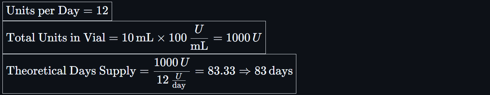
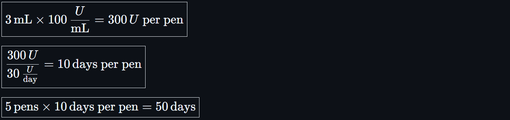
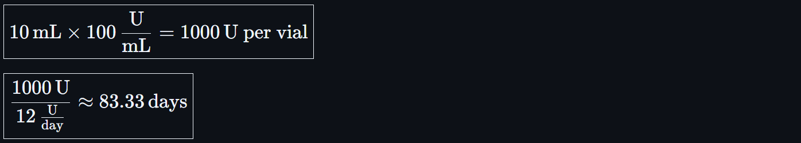
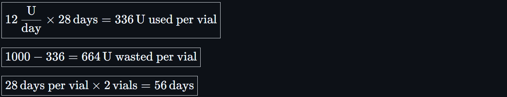

# Days Supply Calculations for Insulin

<!-- 
## Reference

Pharmacy Calculations, 6e; Morton Publishing | Chapter 13
-->

🔗 [Quick Reference Table](../ref/days_supply_table.md)

## 🔑 Key Facts

**Billable Quantity**: Volume (mL)  
**Clinical Quantity**: Total Units of insulin (U)

- **Insulin concentrations** vary by product:
  - **U-100** = 100 Units/mL *(standard for most insulins)*
  - **U-200**, **U-300**, and **U-500** = concentrated formulations for patients on higher doses
- **Vials**: 10 mL (outpatient); 3mL (inpatient)
- **Pens**: 3 mL each (typically dispensed in 5-pen cartons = 15 mL total); 2.5mL (inpatient)
- **Refrigeration**: Required before opening
- **Room Temperature Stability**:
  - Most insulins: **28 days** once opened
  - Exceptions: Some newer insulins (e.g., Tresiba, Toujeo) last longer after opening — **always check labeling**

>- 🛡️ Days supply must **not exceed usable life after opening** unless pharmacist directs otherwise  
>- 🛡️ Always check both **quantity available** and **expiration/discard dates**

## 🚨 Tips & Best Practices

- 🛡️ Document **discard after X days** when calculating Days Supply for insulin
- 🚨 Do **not** issue 90-day supply on insulin vials unless **daily dose** is high enough to use entire volume before expiration
- 🛡️ Always check **U-100 vs U-300 vs U-500** labeling
- 📌 Include discard date on patient label or counseling documentation per best practice and institutional SOPs

## 🔢 Formulas

<!-- ${\boxed{\text{Total Units Available} = \text{mL Dispensed} \times \text{Units/mL}}}$

${\boxed{\text{Days Supply} = \frac{\text{Total Units Available}}{\text{Units Per Diem}}}}$ -->

🛑 **BUT**:

<!-- ${\boxed{\text{Max Days Supply} = \text{Minimum of: Calculated Supply OR Expiration After Opening}}}$ -->

---

## 💉 Example 1: U-100 Vial with Low Daily Use

- **Product**: Lantus U-100 vial (10 mL × 100 U/mL = 1000 Units total)
- **Sig**: Inject 12 Units SC once daily #1 vial
  - **Total Daily Usage**: 12 U/day  

<!-- ${\boxed{\text{Total Units in Vial} = 10 \, \text{mL} \times 100 \, \frac{U}{\text{mL}} = 1000 \, U}}$  
${\boxed{\text{Theoretical Days Supply} = \frac{1000 \, U}{12 \, \frac{U}{\text{day}}} = 83.33 \Rightarrow 83 \, \text{days}}}$ -->

🛑 Discard after 28 days once opened

✅ **Final Days Supply** = **28 days**

> 📌 Documented because room temperature stability is limiting factor

## 💉 Example 2: U-100 Vial with High Daily Use

- **Product**: Humulin N U-100 vial  
- **Sig**: Inject 50 Units SC twice daily = 100 Units/day  
- **Qty**: 1 vial (10 mL)

<!-- ${\boxed{\text{Total Units} = 10 \, \text{mL} \times 100 \, \frac{U}{\text{mL}} = 1000 \, U}}$  
${\boxed{\text{Theoretical Days Supply} = \frac{1000 \, U}{100 \, \frac{U}{\text{day}}} = 10 \, \text{days}}}$ -->

✅ **Final Days Supply** = **10 days** *(no discard constraint reached)*

---

## 💉 Example 3: Toujeo U-300 (Concentrated)

- **Product**: Toujeo Solostar Pen (U-300, 1.5 mL per pen, 450 Units total per pen)  
- **Sig**: Inject 60 Units SC once daily  
  - **Qty**: 3 pens dispensed

<!-- ${\boxed{\text{Total Units} = 3 \times 450 = 1350 \, U}}$  
${\boxed{\text{Theoretical Days Supply} = \frac{1350 \, U}{60 \, \frac{U}{\text{day}}} = 22.5 \Rightarrow 22 \, \text{days}}}$ -->

- ✅ Toujeo pen stable **up to 56 days at room temperature**  
- ✅ Final Days Supply = **22 days**

> 🛡️ No discard conflict; full quantity usable before expiration

---

## 💉 Example 4: Insulin Pen Box — Sequential Pen Use

- **Product**: Basaglar U-100 SoloStar Pens  
  - **Concentration**: 100 Units/mL  
  - **Volume per Pen**: 3 mL  
    - **Pens per Box**: 5 pens  
- **Total Volume Dispensed**: 5 pens × 3 mL = 15 mL  
  - **Total Units Dispensed**: 15 mL × 100 Units/mL = 1500 Units

- **Sig**: Inject 30 Units subcutaneously once daily  
  - **Total Daily Usage**: 30 U/day  

<!-- ${\boxed{3 \, \text{mL} \times 100 \, \frac{U}{\text{mL}} = 300 \, U \text{ per pen}}}$

${\boxed{\frac{300 \, U}{30 \, \frac{U}{\text{day}}} = 10 \, \text{days per pen}}}$

${\boxed{5 \, \text{pens} \times 10 \, \text{days per pen} = 50 \, \text{days}}}$ -->

🛡️ **Stability Consideration: Opened Pens**
  
- Each **individual pen** is stable for **28 days** at room temperature
  - No single pen will exceed its discard limit during use
  - Each pen supports 10 days of therapy at this dose
  - ✅ **Stability-compliant**: No adjustment needed.
- 🛡️ Pens **should not** be used simultaneously unless explicitly instructed (i.e. **not all opened at once**). If simultaneous use is required (e.g., backup pen in use), calculation **must adjust** for overlapping expiration windows.
- No single pen will exceed its discard limit during use

**Final Days Supply** = `50 days`

> 📌 **Labeling Note**: Include counseling or auxiliary label: "Each pen good for 28 days after first use. Store unopened pens in refrigerator. Use opened pen within 28 days."

---

### 💉 Example 5: Sequential Vial Use Limited by Discard Date

- **Product**: Humulin N (Insulin NPH) U-100 Vials  
  - **Concentration**: 100 Units/mL  
  - **Vial Volume**: 10 mL  
- **Quantity Dispensed**: 2 vials  
  - **Total Volume Dispensed**: 2 × 10 mL = 20 mL  
    - **Total Units Dispensed**: 2000 Units

- **Sig**: Inject 12 Units subcutaneously once daily  
  - **Total Daily Usage**: 12 U/Day

<!-- ${\boxed{10 \, \text{mL} \times 100 \, \frac{\text{U}}{\text{mL}} = 1000 \, \text{U per vial}}}$

${\boxed{\frac{1000 \, \text{U}}{12 \, \frac{\text{U}}{\text{day}}} \approx 83.33 \, \text{days}}}$ -->

🚨 **BUT**: Insulin vials must be **discarded 28 days after opening**.

🛡️ This means **only 28 days of insulin can be used per vial**, regardless of remaining volume.

<!-- ${\boxed{12 \, \frac{\text{U}}{\text{day}} \times 28 \, \text{days} = 336 \, \text{U used per vial}}}$  

${\boxed{1000 - 336 = 664 \, \text{U wasted per vial}}}$

${\boxed{28 \, \text{days per vial} \times 2 \, \text{vials} = 56 \, \text{days}}}$ -->

📌 Even though each vial contains enough insulin for ~83 days, you can **only bill 28 days per vial** if used sequentially.

✅ **Final Days Supply = 56 days**

📌 **Labeling Note**: “Each vial is stable for 28 days after opening. Discard remaining insulin after that period. Store unopened vials in the refrigerator. Opened vials may be stored at room temperature for up to 28 days.”

---

- 🔙🔗 [**Mathematics Concepts Directory**](./readme.md)
- 🔙🔗 [Calculating Days' Supply](./days_supply.md)
