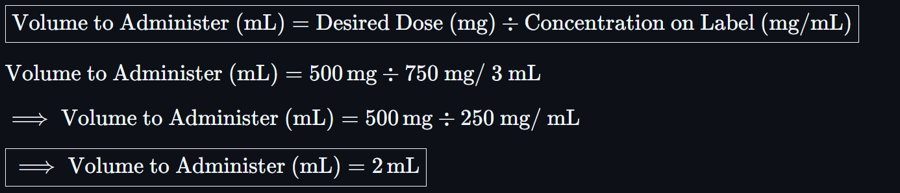
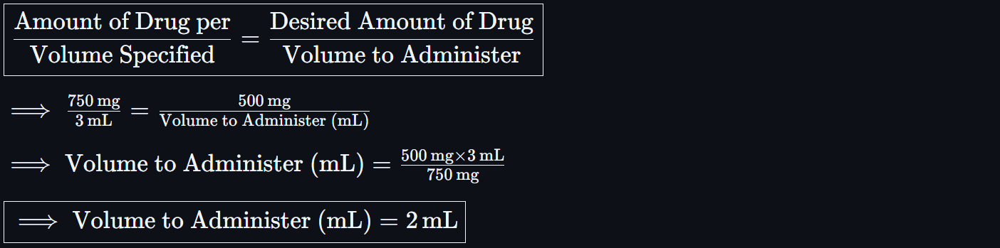

# 🧪 Parenteral Dosage Calculations from Medication Labels

<!-- 
## Reference

Pharmacy Calculations, 6e; Morton Publishing | Chapter 24
-->

## 🔑 Key Concepts

Parenteral dosage calculations are used to determine **how much volume to withdraw** from a vial to administer the **correct dose** of medication via IV, IM, or SC injection.

The **manufacturer’s label** provides essential information:

- Drug name and total quantity
- Volume (if liquid)
- Concentration (e.g. mg/mL)
- Instructions for **reconstitution** (if applicable)

### 📦 Reconstitution

**Reconstitution** is the process of adding a specific volume of **diluent** (usually sterile water or saline) to a **powdered medication** to create a **liquid solution or suspension** for administration.

> 🚨 Many injectables and oral suspensions are supplied in **powder form** to improve stability and extend shelf life.

The label will specify:

- Type & volume of **diluent**
- Final **concentration** (e.g. mg/mL)
- **Stability** & storage conditions after reconstitution
  - The product must often be **refrigerated**
  - The **expiration date** changes (often 7–14 days)

### 🛡️ Best Practices

- ✅ Always read the full manufacturer label
- ⚠️ Confirm whether drug is liquid or powder
- 🧪 Use only approved diluents and volumes when reconstituting
- 🛡️ Double-check concentration after reconstitution before dosing
- 📏 Use precise syringes to measure small volumes
- 🧊 Note expiration time post-reconstitution if applicable

### 🧮 Basic Formula

When using a **liquid medication** that is **already prepared or reconstituted**, calculate the volume to administer using a **proportion** or **formula** based on the drug label.

<!-- ${\text{Volume to Administer (mL)} = {\text{Desired Dose (mg)}} \div {\text{Concentration on Label (mg/mL)}}}$ -->

Alternatively, you can set up proportions.

<!-- ${\frac{\text{Amount of Drug per}}{\text{Volume Specified}} = \frac{\text{Desired Amount of Drug}}{\text{Volume to Administer}}}$ -->

---

### Example

**Label Reads**:

- `Cefuroxime 750 mg vial`
- `Add 8.4 mL sterile water to yield 750 mg/3 mL`

**Sig**: `500 mg IM x1`

==> `Inject 500 mg Into Muscle`

Option 1: **Plugging In**

<!-- $\boxed{\text{Volume to Administer (mL)} = {\text{Desired Dose (mg)}} \div {\text{Concentration on Label (mg/mL)}}}$

${\text{Volume to Administer (mL)} = {500 \, \text{mg}} \div {\text{750 mg/ 3 mL}}}$

${\implies \text{Volume to Administer (mL)} = {500 \, \text{mg}} \div {\text{250 mg/ mL}}}$

$\boxed{\implies \text{Volume to Administer (mL)} = 2 \, \text{mL}}$ -->

Option 2: **Proportions**

<!-- $\boxed{\frac{\text{Amount of Drug per}}{\text{Volume Specified}} = \frac{\text{Desired Amount of Drug}}{\text{Volume to Administer}}}$

${\implies \frac{750 \, \text{mg}}{3 \, \text{mL}} = \frac{500 \, \text{mg}}{\text{Volume to Administer (mL)}}}$

${\implies \text{Volume to Administer (mL)} = \frac{500 \, \text{mg} \times 3 \, \text{mL}}{750 \, \text{mg}}}$

$\boxed{\implies \text{Volume to Administer (mL)} = 2 \, \text{mL}}$ -->

✅ **Withdraw 2 mL to deliver 500 mg**

---

🔗 Back to [**Mathematics Concepts Directory**](./readme.md)
