# Ratios & Percents in Pharmacy

<!-- 
## Reference

Pharmacy Calculations, 6e; Morton Publishing | Chapter 25 & 26
-->

## 💯 Percent Strength of Solutions

In pharmacy, concentration is often expressed using percent strength. This format communicates how much solute is present in a given volume or weight of solution. Understanding percent strength is essential for preparing, diluting, and interpreting compounded medications.

The **solute** is the active ingredient or substance being dissolved. It is typically measured in grams or milliliters depending on its form. The **solvent** is the liquid vehicle in which the solute is dissolved, often water, alcohol, or another compatible liquid base. Together, the solute and solvent make up the **solution**.

**Percent strength** indicates the amount of solute in 100 parts of solution and is expressed using three common formats:

- **% w/v (weight/volume):** grams of solute per 100 mL of solution. This is the most common format for solutions of solids in liquids.
- **% v/v (volume/volume):** milliliters of solute per 100 mL of solution. This is used for liquid-in-liquid solutions.
- **% w/w (weight/weight):** grams of solute per 100 grams of total product. This format is typically used for creams, ointments, and other semisolids.

> 🚨 By convention, if a percent strength is listed without specifying the format, it is assumed to be **% w/v**.

### 🧪 Example 1: Determine Percent Strength from Ingredients and Volume

**Question**: What is the % strength of a solution made by dissolving 12 g of NaCl in enough water to make 400 mL of solution?

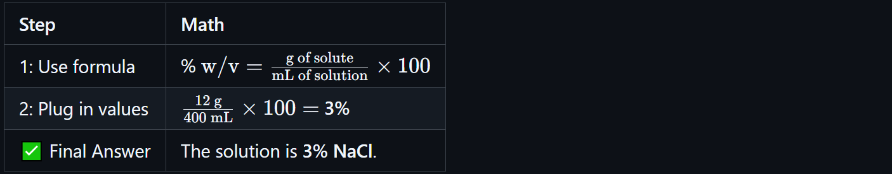
<!-- | Step | Math |
|------|------|
| 1: Use formula | % ${\text{w/v} = \frac{\text{g of solute}}{\text{mL of solution}} \times 100}$ |
| 2: Plug in values | ${\frac{\text{12 g}}{\text{400 mL}} \times 100 =}$ **3%** |
| ✅ Final Answer | The solution is **3% NaCl**. | -->

### 🧪 Example 2: Calculate Volume from Weight and Percent Strength

**Question**: How much solution can be prepared from 10 g of salicylic acid to make a 2% solution?

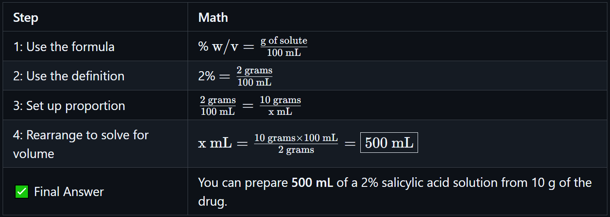
<!-- | Step | Math |
|------|------|
| 1: Use the formula | % ${\text{w/v} = \frac{\text{g of solute}}{100\ \text{mL}}}$ |
| 2: Use the definition | 2% ${= \frac{\text{2 grams}}{\text{100 mL}}}$ |
| 3: Set up proportion | ${\frac{\text{2 grams}}{\text{100 mL}} = \frac{\text{10 grams}}{\text{x mL}}}$ |
| 4: Rearrange to solve for volume | ${\text{x mL} = \frac{\text{10 grams} \times \text{100 mL}}{\text{2 grams}} = \boxed{500\ \text{mL}}}$  |
| ✅ Final Answer | You can prepare **500 mL** of a 2% salicylic acid solution from 10 g of the drug. | -->

### 🧪 Example 3: Calculate Amount of Drug in Volume of Solution

**Question**: How many grams of boric acid are in 180 mL of a 4% solution?

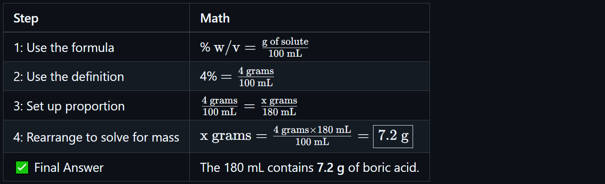
<!-- | Step | Math |
|------|------|
| 1: Use the formula | % ${\text{w/v} = \frac{\text{g of solute}}{100\ \text{mL}}}$ |
| 2: Use the definition | 4% ${= \frac{\text{4 grams}}{\text{100 mL}}}$ |
| 3: Set up proportion | ${\frac{\text{4 grams}}{\text{100 mL}} = \frac{\text{x grams}}{\text{180 mL}}}$ |
| 4: Rearrange to solve for mass | ${\text{x grams} = \frac{\text{4 grams} \times \text{180 mL}}{\text{100 mL}} = \boxed{7.2\ \text{g}}}$ |
| ✅ Final Answer | The 180 mL contains **7.2 g** of boric acid. | -->

### Example 4: Calculate How Much of a Concentrated Solution is Needed

Question: How much of a 25% stock solution is required to prepare 200 mL of a 5% solution?

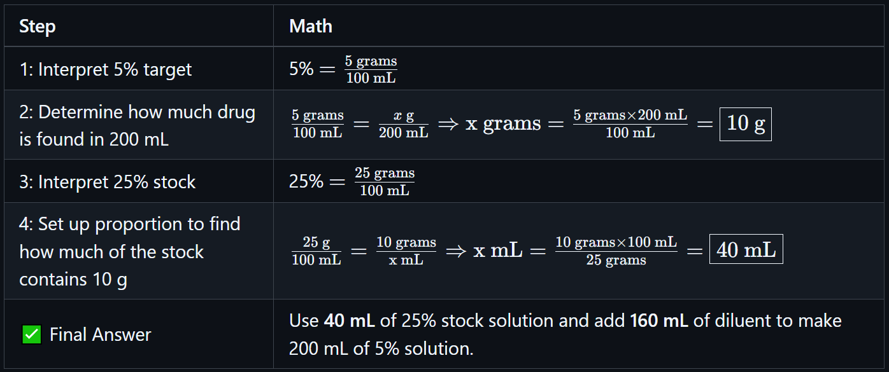
<!-- | Step | Math |
|------|------|
| 1: Interpret 5% target | 5% ${= \frac{\text{5 grams}}{\text{100 mL}}}$ |
| 2: Determine how much drug is found in 200 mL | ${\frac{\text{5 grams}}{\text{100 mL}} = \frac{x\ \text{g}}{200\ \text{mL}} \Rightarrow \text{x grams} = \frac{\text{5 grams} \times \text{200 mL}}{\text{100 mL}} = \boxed{10\ \text{g}}}$  |
| 3: Interpret 25% stock | 25% ${= \frac{\text{25 grams}}{\text{100 mL}}}$ |
| 4: Set up proportion to find how much of the stock contains 10 g | ${\frac{25\ \text{g}}{100\ \text{mL}} = \frac{\text{10 grams}}{\text{x mL}} \Rightarrow \text{x mL} = \frac{\text{10 grams} \times \text{100 mL}}{\text{25 grams}} = \boxed{40\ \text{mL}}}$ |
| ✅ Final Answer | Use **40 mL** of 25% stock solution and add **160 mL** of diluent to make 200 mL of 5% solution. | -->

## ⚖️ Ratios and Proportions for Parenteral Solutions

In pharmacy calculations, a **ratio** is another way of expressing concentration or proportional relationships between components of a mixture or solution. A **ratio strength** uses the format **1:x**, which means **1 part solute per x parts total solution**. These values are usually interpreted as grams per milliliters (g/mL) unless another unit is specified.

The **first term of the ratio** always represents the quantity of solute. The **second term** represents the total quantity of solution, not just the solvent. For example, a 1:1000 ratio means there is 1 gram of solute dissolved in 1000 mL of solution.

Ratios can be converted to percent strength by dividing the solute by the solution volume and multiplying by 100. For example:

<!-- ${1:1000 = \frac{1\, \text{g}}{1000\, \text{mL}} = 0.1\%}$ -->

This system is frequently used for medications that require very small amounts of drug, such as epinephrine or ophthalmic solutions. Ratio strengths are also useful in preparing dilutions and performing inverse calculations when reducing or concentrating a formulation.

Understanding how to move between percent strength and ratio strength, and knowing which units apply, is a foundational skill in pharmacy practice.

### 📌 General Rules

- **Ratio Strength (1:x)**  

<!-- $\text{Ratio Strength } (1:x) = \frac{1\ \text{g}}{x\ \text{mL}}$ -->

- **Convert ratio to percent (w/v):**  

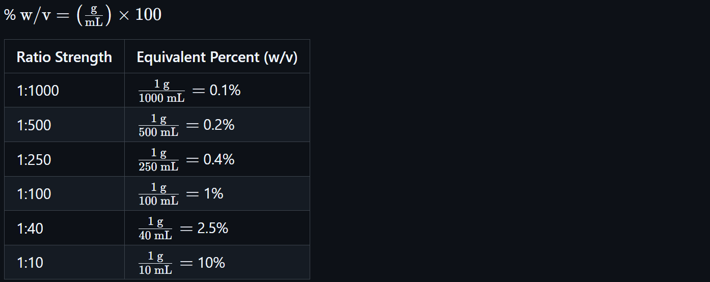
<!-- % $\text{w/v} = \left(\frac{\text{g}}{\text{mL}}\right) \times 100$

| Ratio Strength | Equivalent Percent (w/v) |
|----------------|--------------------------|
| 1:1000         | ${\frac{1\ \text{g}}{1000\ \text{mL}} =}$ 0.1% |
| 1:500          | ${\frac{1\ \text{g}}{500\ \text{mL}} =}$ 0.2% |
| 1:250          | ${\frac{1\ \text{g}}{250\ \text{mL}} =}$ 0.4% |
| 1:100          | ${\frac{1\ \text{g}}{100\ \text{mL}} =}$ 1% |
| 1:40           | ${\frac{1\ \text{g}}{40\ \text{mL}} =}$ 2.5% |
| 1:10           | ${\frac{1\ \text{g}}{10\ \text{mL}} =}$ 10% | -->

### 🧪 Example 1: Convert Ratio to Percent Strength

**Question**: Convert a 1:250 ratio strength to percent strength.

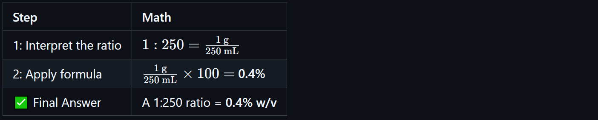
<!-- | Step | Math |
|------|------|
| 1: Interpret the ratio | ${1:250 = \frac{1\ \text{g}}{250\ \text{mL}}}$ |
| 2: Apply formula | ${\frac{1\ \text{g}}{250\ \text{mL}} \times 100 =}$ **0.4%** |
| ✅ Final Answer | A 1:250 ratio = **0.4% w/v** | -->

### 🧪 Example 2: Convert Percent to Ratio Strength

**Question**: Convert 0.9% strength to a ratio strength.

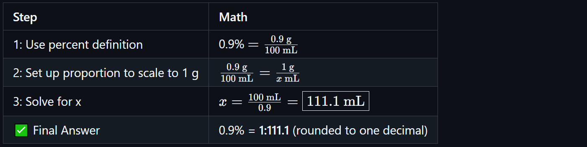
<!-- | Step | Math |
|------|------|
| 1: Use percent definition | 0.9% ${= \frac{0.9\ \text{g}}{100\ \text{mL}}}$ |
| 2: Set up proportion to scale to 1 g | ${\frac{0.9\ \text{g}}{100\ \text{mL}} = \frac{1\ \text{g}}{x\ \text{mL}}}$ |
| 3: Solve for x | ${x = \frac{100\ \text{mL}}{0.9} = \boxed{111.1\ \text{mL}}}$ |
| ✅ Final Answer | 0.9% = **1:111.1** (rounded to one decimal) | -->

### 🧪 Example 3: Use Ratio Strength to Calculate Required Ingredient

**Question**: How many grams of epinephrine are in 120 mL of a 1:1000 solution?

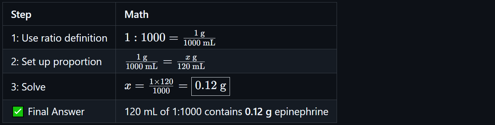
<!-- | Step | Math |
|------|------|
| 1: Use ratio definition | ${1:1000 = \frac{1\ \text{g}}{1000\ \text{mL}}}$ |
| 2: Set up proportion | ${\frac{1\ \text{g}}{1000\ \text{mL}} = \frac{x\ \text{g}}{120\ \text{mL}}}$ |
| 3: Solve | ${x = \frac{1 \times 120}{1000} = \boxed{0.12\ \text{g}}}$ |
| ✅ Final Answer | 120 mL of 1:1000 contains **0.12 g** epinephrine | -->

### 🧪 Example 4: Use Ratio to Determine Volume Needed

**Question**: How many mL of a 1:500 solution are needed to obtain 0.5 g of the drug?

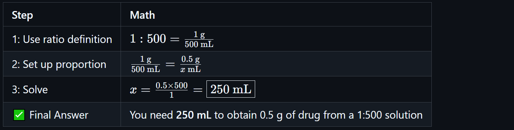
<!-- | Step | Math |
|------|------|
| 1: Use ratio definition | ${1:500 = \frac{1\ \text{g}}{500\ \text{mL}}}$ |
| 2: Set up proportion | ${\frac{1\ \text{g}}{500\ \text{mL}} = \frac{0.5\ \text{g}}{x\ \text{mL}}}$ |
| 3: Solve | ${x = \frac{0.5 \times 500}{1} = \boxed{250\ \text{mL}}}$ |
| ✅ Final Answer | You need **250 mL** to obtain 0.5 g of drug from a 1:500 solution | -->

### 🧪 Example 5: Reduce Ratios to Simplest Form

**Question**: Reduce 150:600 to lowest terms.

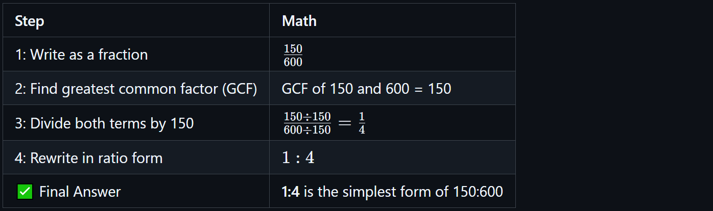
<!-- | Step | Math |
|------|------|
| 1: Write as a fraction | ${\frac{150}{600}}$ |
| 2: Find greatest common factor (GCF) | GCF of 150 and 600 = 150 |
| 3: Divide both terms by 150 | ${\frac{150 \div 150}{600 \div 150} = \frac{1}{4}}$ |
| 4: Rewrite in ratio form | ${1:4}$ |
| ✅ Final Answer | **1:4** is the simplest form of 150:600 | -->

### 🧪 Advanced Example: Dose from a 1:1000 Solution

Medication Order:

- **Drug concentration**: 1:1000 w/v
- **Required dose**: 100 mcg
- **Final volume**: to be diluted in 50 mL NS

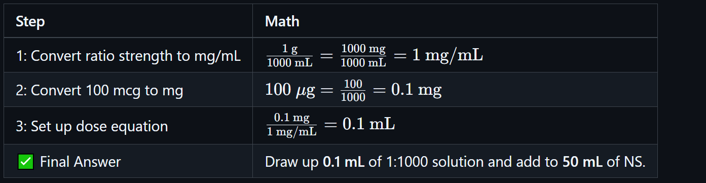
<!-- | Step | Math |
|------|------|
| 1: Convert ratio strength to mg/mL | ${\frac{1\ \text{g}}{1000\ \text{mL}} = \frac{1000\ \text{mg}}{1000\ \text{mL}} = 1\ \text{mg/mL}}$ |
| 2: Convert 100 mcg to mg | ${100\ \mu\text{g} = \frac{100}{1000} = 0.1\ \text{mg}}$ |
| 3: Set up dose equation | ${\frac{0.1\ \text{mg}}{1\ \text{mg/mL}} = 0.1\ \text{mL}}$ |
| ✅ Final Answer | Draw up **0.1 mL** of 1:1000 solution and add to **50 mL** of NS. | -->

---

🔗 Back to [**Mathematics Concepts Directory**](./readme.md)
