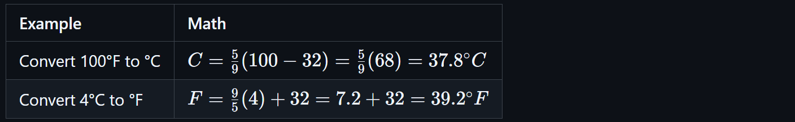

# 🌡️⚓ Extended Pharmacy Conversions: Temperature & Specific Gravity

<!-- 
## Reference

Pharmacy Calculations, 6e; Morton Publishing | Chapter 10
-->

## 🔑 Key Concepts

Understanding **temperature**, **density**, and **specific gravity** is critical in pharmacy calculations.

**Conversion**, in this context, refers to the mathematical process of changing a value from one unit or scale to another. These conversions are necessary to ensure correct interpretation of labels, formulation accuracy, and safe dosing.

These fundamental concepts are frequently used in both sterile and non-sterile compounding and must be understood thoroughly to prevent critical errors in preparation and administration.

## 🌡️ Temperature Scale

**Temperature** refers to the measure of thermal energy. It affects chemical stability, solubility, and proper storage of medications. Pharmacy professionals must be able to convert between the two most commonly used temperature scales: Fahrenheit (°F), primarily used in the United States, and Celsius (°C), used internationally and in most clinical documentation.

### Conversions

<!-- | Conversion | Formula |
|------------|---------|
| Fahrenheit (°F) to Celsius (°C) | ${C = \frac{5}{9}(F - 32)}$ |
| Celsius (°C) to Fahrenheit (°F) | ${F = \frac{9}{5}C + 32}$ | -->

> 📍 Tip: Subtract/add 32, then scale by 5/9 or 9/5 depending on direction.

🔁 **Practice Conversions**

<!-- | Example | Math |
|---------|------|
| Convert 100°F to °C | ${C = \frac{5}{9}(100 - 32) = \frac{5}{9}(68) = 37.8^\circ C}$ |
| Convert 4°C to °F | ${F = \frac{9}{5}(4) + 32 = 7.2 + 32 = 39.2^\circ F}$ | -->

✅ **Common Benchmarks to Memorize**

| °C | Description              | °F   |
|----|--------------------------|------|
| 0  | Freezing point of water  | 32   |
| 37 | Human body temperature   | 98.6 |
| 100| Boiling point of water   | 212  |

| Storage Type           | Temperature Range                   |
|------------------------|-------------------------------------|
| **Freezer** | –25°C to –10°C (–13°F to 14°F) |
| **Refrigerated** | 2°C to 8°C (36°F to 46°F) |
| **Controlled Room Temp** | 20°C to 25°C (68°F to 77°F) |
| **Excessive Heat** | > 40°C (> 104°F) |

> 📍 Pharmacy refrigerators are typically set between **2°C and 8°C** (36°F–46°F)

### 🛡️ Best Practices

- Always include units (°F or °C) to avoid dangerous confusion
- Use exact formulas in clinical settings, especially for:
  - Vaccine storage
  - Drug compounding
  - Fever thresholds
- Know the Celsius equivalents for **normal body temp (37°C)** and **fever (>38°C)**

### 🧠 Mental Math

`Not precise but useful for estimates`

<!-- | Conversion | Formula |
|------------|---------|
| °F → °C | ${(F - 30) \div 2}$ |
| °C → °F | ${(C \times 2) + 30}$ | -->

> 🚨 Shortcuts are for estimation only. Always use full formula for clinical accuracy.

## ⚓ Density & Specific Gravity

**Density** is defined as the mass of a substance per unit volume, typically expressed as grams per milliliter (g/mL) in pharmacy settings. It provides a way to relate how much a substance weighs relative to its size and is essential for converting between weight and volume, especially in liquid compounding.

**Specific Gravity (SG)** is the ratio of a substance’s density to the density of water at a given temperature. Since the density of water is 1 g/mL at standard conditions, the SG of water is 1.000 by definition. SG is a dimensionless number because it is a ratio, not a measurement with units. In pharmacy, SG is often used as a stand-in for density when the comparison is made to water, allowing for straightforward conversions between grams and milliliters for non-aqueous substances like glycerin or ethanol.

Understanding **density** and **specific gravity (SG)** is essential for pharmacy technicians when converting between **weight (grams)** and **volume (milliliters)**. These concepts are especially relevant for compounding, labeling, and interpreting formulas involving **liquids that are not water** because:

- Many drugs are dosed or dispensed in **volume** but labeled in **weight**
- **Non-aqueous solutions** (like ethanol or glycerin) don’t follow the 1 g = 1 mL "rule"
- Knowing the **density** or **SG** allows accurate conversions between **g ↔ mL**

| Term | Definition | Units |
|------|------------|-------|
| **Density** | Mass per unit volume. | Commonly expressed as **g/mL** in pharmacy. |
| **Specific Gravity (SG)** | Ratio of a substance’s density to the density of water. | **No units** (it's a ratio). |

📍 **Used when**:

- Measuring solvents in compounding
- Calculating dosages from weight-based orders
- Understanding concentration of liquid formulations

> 🚨 **SG is a dimensionless number** because it's a ratio. Since water’s density is 1 g/mL at standard conditions, the SG is **numerically equal** to the density for most pharmacy applications—but not always interchangeable when units are required.

⚓ **Common Liquid Densities and Specific Gravities**

| Substance | Density (g/mL) | Specific Gravity (SG) |
|-----------|----------------|------------------------|
| **Water** | 1.00           | 1.00                   |
| **Ethanol** | 0.79         | 0.79                   |
| **Glycerin** | 1.26        | 1.26                   |

>- ✅ These values are typical at room temperature (20°C to 25°C)
>- 🔁 SG can substitute for density (in g/mL) when comparing to water.

🧪 **Example: What is the weight in grams of 15 mL of ethanol?**

| Step | Value |
|------|-------|
| Given volume | 15 mL |
| Density of ethanol | 0.79 g/mL |
| Multiply | 15 × 0.79 = 11.85 g |

🧪 **Example: What volume in mL is 5 g of glycerin?**

| Step | Value |
|------|-------|
| Given mass | 5 g |
| Density of glycerin | 1.26 g/mL |
| Divide | 5 ÷ 1.26 ≈ 3.97 mL |

### 🛡️ Make Sure to

- Always check whether the substance is **water** or something else
- If SG is given instead of density, you can treat it as **g/mL** for pharmacy conversions
- Round **only at the final step**
- Clearly label your **units** in all work

---

🔗 Back to [**Mathematics Concepts Directory**](./readme.md)
