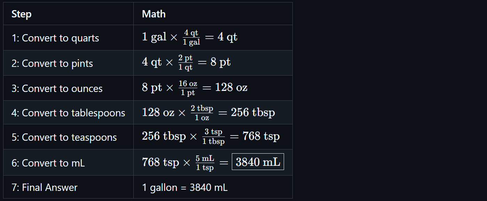
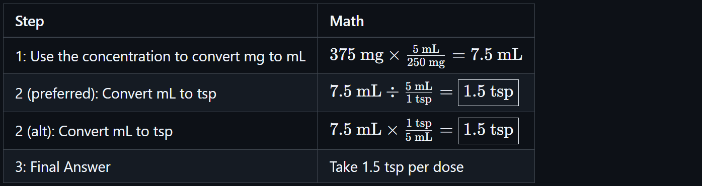
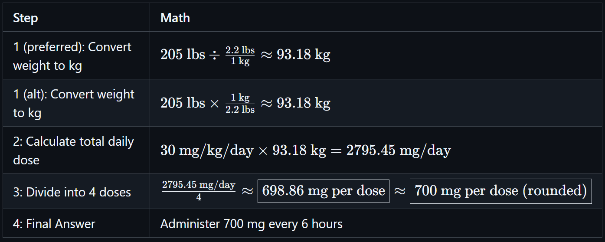

# 📐 Unit Conversions for Pharmacy Technicians

<!-- 
## Reference

Pharmacy Calculations, 6e; Morton Publishing | Chapter 8
-->

## 🔄 Basic Conversion Concept: Canceling Units

Unit conversions in pharmacy are grounded in **dimensional analysis**; a technique where you multiply by conversion factors to cancel units systematically. This helps convert between any two units in a structured, error-resistant way.

🔑 **Key Ideas**:

- Set up your units so **the unit you want to cancel is opposite (numerator vs. denominator)**
- Multiply straight across numerators and denominators
- Cancel and simplify

> 📌 This principle applies broadly—across volume, weight, dosage, rate, and more.

<!-- | Example: Miles per Hour × Time = Distance |
|---------|
| If a vehicle travels at **60 miles/hour** for **2 hours** |
| $\frac{60\ \text{miles}}{1\ \text{hour}} \times \frac{2\ \text{hours}}{1} = \frac{60 \times 2\ \text{miles}}{1} = 120\ \text{miles}$ | -->

> 📌 Hours cancel out because they appear once in the numerator and once in the denominator.

## 🥄 Household and Metric Conversions

Conversions commonly used in pharmacy can be broken down into **volume** and **weight**.

### 🧪 Volume Conversions

| Conversion (Household) | Equals |
|------------------------|--------|
| 1 gallon (gal)     | 4 quarts (qt) |
| 1 quart (qt)       | 2 pints (pt) |
| 1 pint (pt)        | 16 ounces (oz) |
| 1 ounce (oz)       | 2 tablespoons (tbsp) |
| 1 tablespoon (tbsp)| 3 teaspoons (tsp) |

| Conversion (Metric) | Equals |
|---------------------|--------|
| 1 liter (L)         | 1000 milliliters (mL) |

| Conversion (Household-Metric) | Equals |
|-------------------------------|--------|
| 1 pint (pt)                   | 480 mL |
| 1 ounce (oz)                  | 30 mL |
| 1 tbsp                        | 15 mL |
| 1 tsp                         | 5 mL |

### ⚖️ Weight Conversions

| Conversion (Household) | Equals |
|------------------------|--------|
| 1 pound (lb)           | 16 ounces (oz) |

| Conversion (Metric) | Equals |
|---------------------|--------|
| 1 kilogram (kg)     | 1000 grams (g) |
| 1 gram (g)          | 1000 milligrams (mg) |
| 1 milligram (mg)    | 1000 micrograms (mcg) |
| 1 kg                | 1,000,000 mcg |

| Conversion (Household-Metric) | Equals |
|-------------------------------|--------|
| 1 kg                          | 2.2 lbs |
| 1 lb                          | 0.454 kg |
| 1 lb                          | 454 g |
| 1 **gr**                      | 64.8 mg |

> - 📌 Know both household → metric and metric → household conversions.
> - 📌 Metric conversions are base-10: just move the decimal point.

### ✅ Best Practices

- Write out all units and cancel as you go
- Round **only at the end**
- Use only verified, standard conversion values
- Understand both directions: household → metric and metric → household

### 🧪 Example: Convert 1 gallon to mL (step-by-step)

We will convert 1 gallon to milliliters by **chaining units**, canceling each one along the way.

<!-- | Step | Math |
|------|------|
| 1: Convert to quarts | ${1\ \text{gal} \times \frac{4\ \text{qt}}{1\ \text{gal}} = 4\ \text{qt}}$ |
| 2: Convert to pints | ${4\ \text{qt} \times \frac{2\ \text{pt}}{1\ \text{qt}} = 8\ \text{pt}}$ |
| 3: Convert to ounces | ${8\ \text{pt} \times \frac{16\ \text{oz}}{1\ \text{pt}} = 128\ \text{oz}}$ |
| 4: Convert to tablespoons | ${128\ \text{oz} \times \frac{2\ \text{tbsp}}{1\ \text{oz}} = 256\ \text{tbsp}}$ |
| 5: Convert to teaspoons | ${256\ \text{tbsp} \times \frac{3\ \text{tsp}}{1\ \text{tbsp}} = 768\ \text{tsp}}$ |
| 6: Convert to mL | ${768\ \text{tsp} \times \frac{5\ \text{mL}}{1\ \text{tsp}} = \boxed{3840\ \text{mL}}}$ |
| 7: Final Answer | 1 gallon = 3840 mL | -->

## 🏷️ Inscription & Signa: Reading and Translating Prescriptions

Understanding how to read prescriptions requires familiarity with the **Inscription** and **Signa** sections—two core components of written or electronic prescription orders.

### 📃 Prescription Structure

| Section | Purpose |
|---------|---------|
| **Inscription** | Lists the **drug name**, **strength**, and **dosage form** |
| **Signa (Sig)** | Provides **directions for the patient** |

> 🛡️ "Signa" is Latin for "let it be labeled." It tells the patient how to take the medication.

### 🔄 Translating Signa Abbreviations

Sig codes are often written in abbreviated Latin phrases. Pharmacy technicians must be able to **translate these into patient-friendly instructions**.

🔗 See [Translating the Signa](../ref/sig_translation.md)

### 🧪 Example: Oral Suspension Dosage in Household Units

- **Prescription:**
  - `Cefaclor 250 mg/5 mL, dispense 150 mL`  
  - `Take 375 mg twice daily for 10 days`
- **Question:** How many teaspoons should I take per dose?

<!-- | Step | Math |
|------|------|
| 1: Use the concentration to convert mg to mL| ${375\ \text{mg} \times \frac{5\ \text{mL}}{250\ \text{mg}} = 7.5\ \text{mL}}$ |
| 2 (preferred): Convert mL to tsp | ${7.5\ \text{mL} \div \frac{5\ \text{mL}}{1\ \text{tsp}} = \boxed{1.5\ \text{tsp}}}$ |
| 2 (alt): Convert mL to tsp | ${7.5\ \text{mL} \times \frac{1\ \text{tsp}}{5\ \text{mL}} = \boxed{1.5\ \text{tsp}}}$ |
| 3: Final Answer | Take 1.5 tsp per dose | -->

### 🧪 Example: Body Weight Dosing

- **Medication Order:**
  - `Dose: 30 mg/kg/day, divided into 4 doses`
  - `Patient Weight: 205 lbs`
- **Question:** What is the patient's dosing schedule and amount?

<!-- | Step | Math |
|------|------|
| 1 (preferred): Convert weight to kg | ${205\ \text{lbs} \div \frac{2.2\ \text{lbs}}{1\ \text{kg}} \approx 93.18\ \text{kg}}$ |
| 1 (alt): Convert weight to kg | ${205\ \text{lbs} \times \frac{1\ \text{kg}}{2.2\ \text{lbs}} \approx 93.18\ \text{kg}}$ |
| 2: Calculate total daily dose | ${30\ \text{mg/kg/day} \times 93.18\ \text{kg} = 2795.45\ \text{mg/day}}$ |
| 3: Divide into 4 doses | ${\frac{2795.45\ \text{mg/day}}{4} \approx \boxed{698.86\ \text{mg per dose}} \approx \boxed{700\ \text{mg per dose\ (rounded)}}}$ |
| 4: Final Answer | Administer 700 mg every 6 hours | -->

---

🔗 Back to [Mathematics Concepts Directory](./readme.md)
