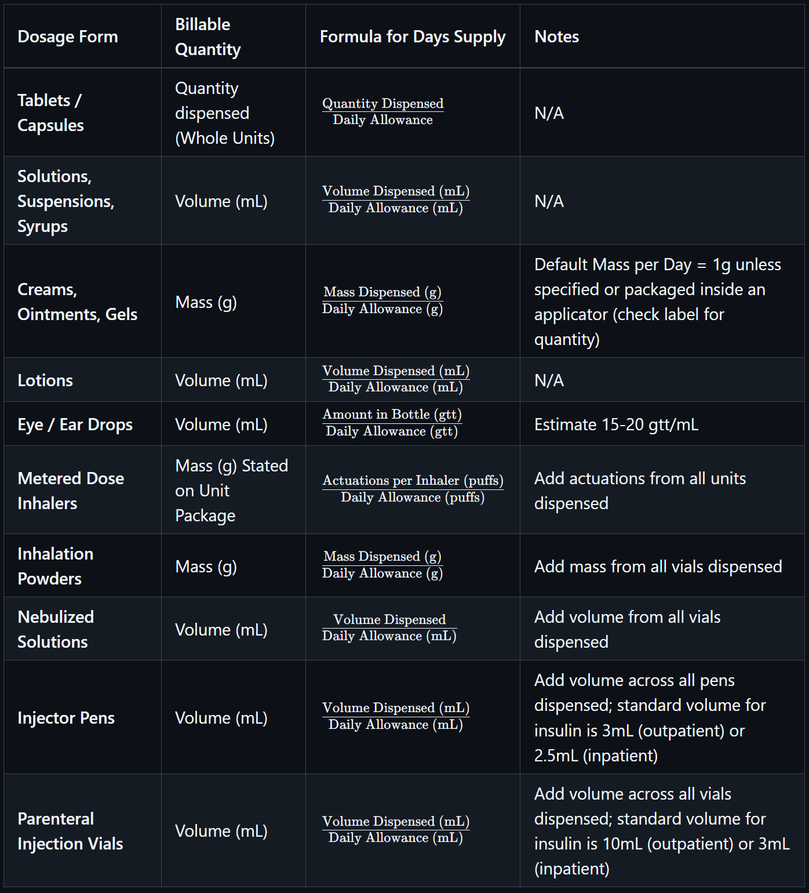

# Days Supply Reference Table

<!-- | **Dosage Form** | **Billable Quantity** | **Formula for Days Supply** | **Notes** |
| --- | --- | --- | --- |
| **Tablets / Capsules** | Quantity dispensed (Whole Units) | $\frac{\text{Quantity Dispensed}}{\text{Daily Allowance}}$ | N/A |
| **Solutions, Suspensions, Syrups** | Volume (mL) | $\frac{\text{Volume Dispensed (mL)}}{\text{Daily Allowance (mL)}}$ | N/A |
| **Creams, Ointments, Gels** | Mass (g) | $\frac{\text{Mass Dispensed (g)}}{\text{Daily Allowance (g)}}$ | Default Mass per Day = 1g unless specified or packaged inside an applicator (check label for quantity) |
| **Lotions** | Volume (mL) | $\frac{\text{Volume Dispensed (mL)}}{\text{Daily Allowance (mL)}}$ | N/A |
| **Eye / Ear Drops** | Volume (mL) | $\frac{\text{Amount in Bottle (gtt)}}{\text{Daily Allowance (gtt)}}$ | Estimate 15-20 gtt/mL |
| **Metered Dose Inhalers** | Mass (g) Stated on Unit Package  | $\frac{\text{Actuations per Inhaler (puffs)}}{\text{Daily Allowance (puffs)}}$ | Add actuations from all units dispensed |
| **Inhalation Powders** | Mass (g) | $\frac{\text{Mass Dispensed (g)}}{\text{Daily Allowance (g)}}$ | Add mass from all vials dispensed |
| **Nebulized Solutions** | Volume (mL) | $\frac{\text{Volume Dispensed}}{\text{Daily Allowance (mL)}}$ | Add volume from all vials dispensed |
| **Injector Pens** | Volume (mL) | $\frac{\text{Volume Dispensed (mL)}}{\text{Daily Allowance (mL)}}$ | Add volume across all pens dispensed; standard volume for insulin is 3mL (outpatient) or 2.5mL (inpatient) |
| **Parenteral Injection Vials** | Volume (mL) | $\frac{\text{Volume Dispensed (mL)}}{\text{Daily Allowance (mL)}}$ | Add volume across all vials dispensed; standard volume for insulin is 10mL (outpatient) or 3mL (inpatient) | -->

> **NOTE**: Some prescriptions may include instructions like "Take as Directed" (UD), which are for medications dispensed as whole units (e.g., ZPAK or Monistat-7). These prescriptions may have a fixed Days Supply regardless of the calculated value, and pharmacies may dispense more than required. Prescriber instructions take precedence over technical calculations.

---

🔗 Back to [Calculating Days' Supply](../math/days_supply.md)

<!-- 
## Reference

Pharmacy Calculations, 6e; Morton Publishing | Chapter 12 & 13
-->