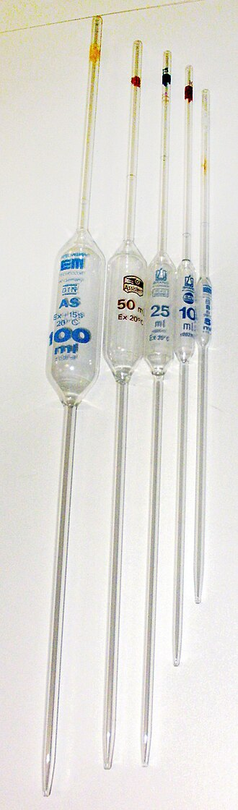

# Volumetric Equipment 🧪

**Volumetric equipment measures volume**; calibrated either **To Deliver (TD)** or **To Contain (TC)**.

## Key Definitions

### To Deliver (TD)

Equipment calibrated **to deliver an exact volume when fully emptied**.

- Must be completely emptied to dispense the labeled volume  
- Residual liquid remaining on the walls is accounted for in calibration  
- Examples: **syringes, droppers, single‑volume pipets, many calibrated pipets**

---

### To Contain (TC)

Equipment calibrated **to hold an exact volume**, but **not necessarily to deliver it**.

- Must be filled to the calibration mark  
- Not required to fully empty  
- Examples: **volumetric flasks, graduated cylinders, some calibrated pipets**

> 📌 **TD = delivers exact volume for dispensing**  
> 📌 **TC = contains exact volume for preparing solutions**

---

### Rated Capacity

**Definition:**  
The **maximum accurate volume** a device is designed to measure.

**Best Practice:**  
Always choose the **smallest device** that can measure the required volume.  
Accuracy decreases when measuring volumes **below 20%** of the device’s capacity.

---

### Meniscus

**Definition:**  
The **curved surface** formed at the top of a liquid column due to adhesive and cohesive forces.  
Most aqueous solutions form a **concave meniscus** (liquid curves upward at the edges).  
Hydrophobic liquids (e.g., mercury) form a **convex meniscus**.

**Reading the Meniscus Correctly:**

- **Concave:** read at the **bottom** of the curve  
- **Convex:** read at the **top** of the curve  
- Always read at **eye level** to avoid distortion

A meniscus is the curved top surface of a column of liquid. The meniscus can be either concave or convex.

A concave meniscus occurs when molecules are more attracted to the container than to each other. The liquid appears to ‘climb’ the sides of the container. Most liquids possess a concave meniscus.

](./meniscus.png)

#### Parallax Error

**Definition:**  
A measurement error that occurs when the observer’s eye is **not level** with the meniscus, causing the reading to appear higher or lower than the true value.

**Rule**:

- Read at **eye level**  
- Align with the **bottom of a concave** or **top of a convex** meniscus

](./parallax.png)

---

### Graduation Lines

**Definition:**  
The **etched or printed markings** on volumetric equipment that indicate measurable increments.

- **Major Line Increments**  
  - Thick, bold, often labeled  
  - Represent large, primary volume intervals (e.g., every 5 mL)

- **Minor Line Increments**  
  - Thin, unlabeled  
  - Represent subdivisions between major lines (e.g., 0.5 mL)

](./graduationLines.jpg)

#### Increment Pattern

Graduated cylinders follow standard increment patterns, but technicians must be able to **calculate increments independently**.

| Cylinder Size | Typical Increment |
| --- | --- |
| 5 mL | 0.2 mL |
| 10 mL | 0.2–0.5 mL |
| 20–60 mL | 1 mL |

**Example Calculation:**

- Major lines every **5 mL**  
- **10 spaces** between major lines  
- 5 mL ÷ 10 = **0.5 mL per minor increment**

](./countedLines.jpg)

**Example Calculation (Continued):**

- Bottom of concave meniscus is 7 minor lines above 10 mL
- Volume = 10mL + (0.5 mL/increment x 7 increments)
- ==> Volume = 13.5 mL

---

### Calibration Mark

**Definition:**  
A **single, precise line** on a volumetric device (e.g., volumetric flask, volumetric pipet) indicating the **exact calibrated volume**.

**Notes:**

- Found only on **high‑accuracy TC or TD devices**  
- Represents the **most accurate measurement** in volumetric equipment  
- Used for preparing standard solutions, dilutions, and analytical work

](./calibration_mark.png)

---

## Non-Volumetric Equipment

`Used for mixing, heating, transferring, or storage; NOT for accurate measurement.`

These items **may have markings**, but they are **not calibrated** and **must never be used to measure volume**.

### Erlenmeyer Flasks

**Definition:**  
Conical flasks used for **mixing, dissolving, heating, and storage** of solutions.

**Notes:**  

- Wide base + narrow neck reduces splashing  
- Ideal for swirling or mixing  
- Markings are **approximate only**  
- Common in compounding for dissolving powders before QS’ing in volumetric glassware

](./erlenmeyer.png)

---

### Beakers

**Definition:**  
Wide‑mouthed cylindrical vessels used for **holding, mixing, heating, or transferring** liquids.

**Notes:**  

- Markings are **rough estimates**  
- Not suitable for measurement  
- Used for bulk liquids, dissolving solids, or transferring to volumetric equipment

](./beaker.jpg)

---

### Prescription Bottles

**Definition:**  
Plastic or amber vials used for **storage and dispensing** of finished medications.

**Notes:**  

- Not calibrated  
- Markings (if present) are **not accurate**  
- Used only for **final packaging & reconstitution**, not measurement

](./rx_bottle.jpg)

---

## Volumetric Equipment Types

### Graduated Cylinders — **TC**

`Cylindrical & Conical`

Used to **measure and transfer approximate volumes** of liquids.

**Definition:**  
Tall, narrow cylinders with graduation marks for measuring **non‑critical** volumes.

**Notes:**  

- For measurements between 5mL to 4000mL
- More accurate than beakers, less accurate than pipets or volumetric flasks  
- Available in plastic or glass  
- Cylindrical is more accurate than conical
- Avoid measuring volumes under 20% of its rated capacity

](./cylindrical_cylinder.png)

A set of cylindrical cylinders

](./conical_cylinder.jpg)

A set of conical cylinders

---

### Volumetric Flasks — **TC**

Used to **prepare exact volumes of solutions** (e.g., stock solutions, dilutions).

**Definition:**  
A bulbous flask with a long neck and a single calibration line indicating **one precise volume**.

**Notes:**  

- For measurements between 5mL to 4000mL
- Extremely accurate for **solution preparation**  
- Not used for dispensing  
- Must be mixed thoroughly after filling to the mark
- Hard to use for mixing due to slender neck; predissolve solids first.

](./volumetric_flasks.jpg)

---

### Syringes — **TD**

Used to **measure and deliver exact volumes**, especially small or critical volumes.

**Definition:**  
Cylindrical devices with a plunger used to draw up and dispense liquids.

**Notes:**  

- Most accurate for **small volumes**
- Range from 0.5mL (0.01mL graduations) to 60mL (2mL graduations)
- Avoid using syringes with **lubricated plungers** for sensitive measurements  
- Do not use for viscous materials unless designed for it

#### Oral Syringes — **TD**

Used to **measure and deliver oral medications**.

**Definition:**  
Syringes without a Luer‑lock tip, designed for **non‑sterile, oral administration**.

](./colored_syringe.jpg)

**Notes:**  

- Color‑coded (often amber/orange) & larger tips to prevent IV use  
- Accurate for pediatric and geriatric dosing  
- Not used for sterile compounding

##### Oral Syringe Adapters

Bottle‑top inserts that allow an oral syringe to be inserted directly into the medication bottle for **accurate withdrawal** without spills or contamination.

**Notes:**  

- Create a **tight seal** around the syringe tip  
- Reduce **dose loss**, **spillage**, and **air bubble formation**  
- Prevent contamination by avoiding repeated bottle opening  
- Commonly used for:
  - Pediatric antibiotics  
  - Compounded oral suspensions  
  - High‑precision liquid medications

](./oral_adapter.jpg)

See 🔗 [Pharmacy Equipment Manual: Syringes & Needles](./syringes/readme.md) for full details.

---

### Pipet(te)s — **TD / TC (depends on type)**

`Recommended for volumes < 25 mL; Required for volumes < 1 mL in the absence of proper syringes`

Pipets are used for **precise measurement and transfer** of liquids.

#### Single‑Volume (Volumetric) Pipets — **TD**

`Most accurate pipet type`

**Definition:**  
Bulbous pipets, with a characteristic "belly" and calibration mark, meant to deliver **one exact volume** (e.g., 5 mL, 10 mL).

**Notes:**  

- Extremely accurate  
- Must be drained completely  
- Do not blow out remaining liquid unless specified
- Uses a detachable rubber bulb to draw and dispense liquid

#### Calibrated (Graduated/Serological) Pipets — **TD or TC**

`Used for measuring multiple volumes`

**Definition:**  
Pipets with graduation marks allowing measurement of **variable volumes**.

**Notes:**  

- **Serological pipets = TD** (blow‑out required)  
- **Mohr pipets = TC** (no blow‑out)  
- Less accurate than volumetric pipets
- Uses a detachable rubber bulb to draw & dispense liquid

](./graduated_pipette.jpg)

#### Transfer Pipets (Pasteur Pipets) — **TD**

`Used for transferring, not measuring, liquids`

**Definition:**  
Plastic or glass pipets used to **move** liquids, not to measure exact volumes.

**Notes:**  

- Not calibrated  
- Used for non‑critical transfers  
- Often disposable

](./transfer_pipette.png)

#### Micropipets — **TD**

`Used for microliter volumes`

**Definition:**  
Precision pipets used to measure **µL‑scale** volumes (e.g., 10–100 µL).

**Notes:**  

- Common in research labs, rarely in pharmacy  
- Use disposable tips  
- Highly accurate for very small volumes

](./micropipette_diagram.png)
