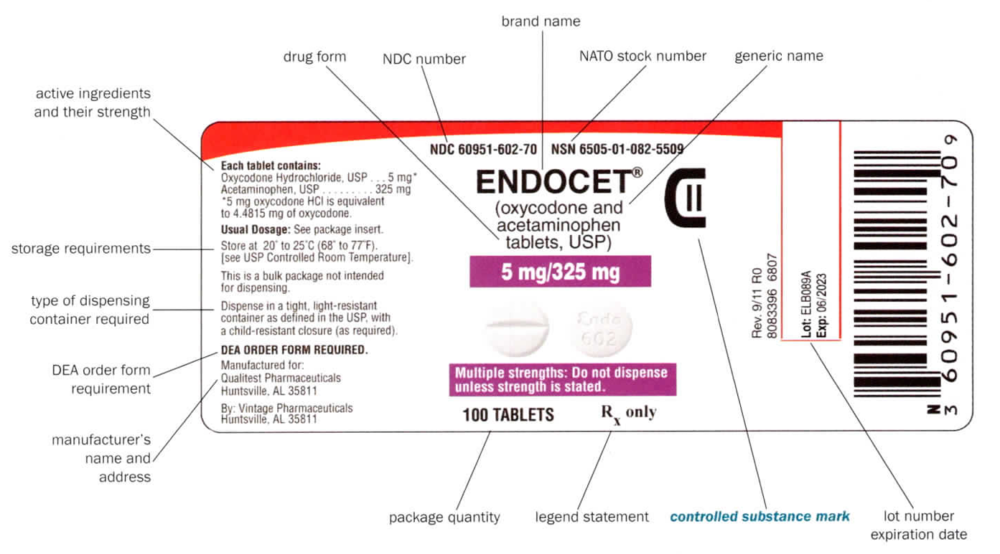
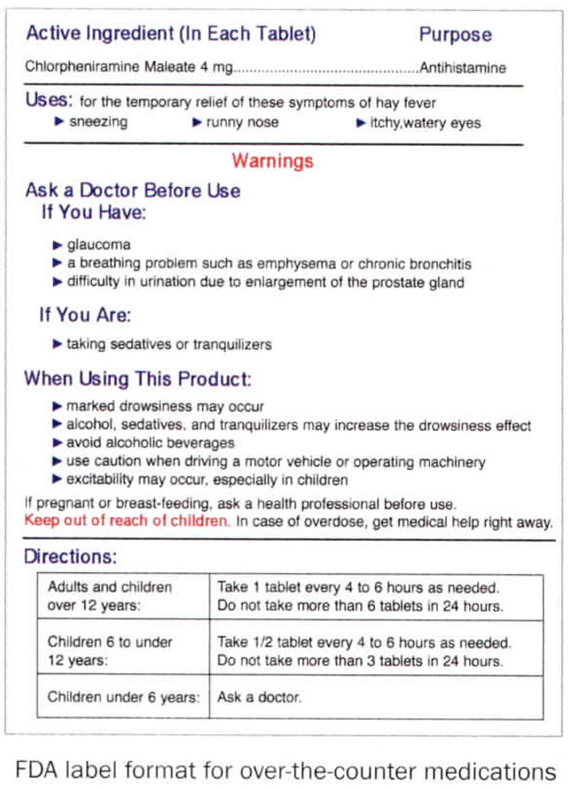

# Manufacturer Labeling Requirements for Prescription & OTC Drugs

This document synthesizes key federal statutes and regulations governing how drug manufacturers must label products in the United States. "Labeling" includes **labels, inserts, and promotional materials**. Any manufacturer-originated material is subject to FDA review. This includes rules that apply to both prescription (Rx) and over-the-counter (OTC) drugs.

🦅 **Federal Law Overview**:

- 🔗 **FDC, FDCA, & Amendments** (🔗 [Link To](../law/fda_fdca.md))
- 🔗 **Extended Packaging & Labeling Policy** (🔗 [Link To](../law/packaging_labeling.md))
- 🔗 **Controlled Substance Policy** (🔗 [Link To](../law/csa_cmea.md))

🏷️ **Labeling Requirements**

| Requirement | Description | Legal Basis |
|-------------|-------------|-------------|
| **Drug Identity** | Brand and generic name clearly stated | 🦅 21 CFR §201.10; FDCA §502(e) |
| **Strength** | Quantity of active ingredient per unit (e.g. mg per tablet) | 🦅 21 CFR §201.10(b); FDCA §502(a) |
| **Dosage Form** | Physical form (e.g. capsule, solution) and route (oral, topical, etc.) | 🦅 21 CFR §201.100(b); USP standards |
| **Intended Use & Directions** | Declaration of intended use & directions; including recommended dosage and frequency, where applicable. | 🦅 FDCA §502(f); 21 CFR §201.5 |
| **Warnings** | Required safety warnings including contraindications, adverse effects, storage, and Black Box Warnings if applicable | 🦅 FDCA §502(f); 21 CFR §201.57 (Rx); 21 CFR §201.66 (OTC) |
| **Manufacturer Info** | Name, business address, and phone number of the manufacturer, packer, or distributor | 🦅 FDCA §502(b); 21 CFR §201.1 |
| **Quantity Statement** | Net contents by weight, volume, or count | 🦅 FDCA §502(b)(2); 21 CFR §201.51 |
| **Batch/ Lot Number** | A unique identifier for the production batch to facilitate tracking and recalls if necessary | 🦅 21 CFR §211.130(e); §211.137 |
| **Manufacture & Expiration Dates** | date of manufacture and the expiration or “use by” date to ensure drug potency and safety | 🦅 21 CFR §211.130(e); §211.137 |
| **National Drug Code (NDC)** | FDA-assigned **11-digit** code identifying manufacturer, drug, and package | 🦅 FDCA §510; 21 CFR §207.35 |
| **Barcoding & Serialization Requirements** | Serial Numbers; Linear (1D) and 2D barcodes per DSCSA, encoding NDC, lot, and expiration | 🦅 DSCSA (FDCA §582); 21 CFR §201.25 |
| 🔐 **Controlled Substance Schedule** | If applicable, DEA Schedule I–V must be shown | 🦅 21 CFR §1302.04; CSA (21 USC §825) |
| **Tamper-Evident Packaging** | Required for most OTC drugs to demonstrate integrity | 🦅 21 CFR §211.132; 21 CFR §211.125 |
| **Language** | English required; other languages optional or supplemental | 🦅 21 CFR §201.15(c); FDCA §502(c) |
| **"Rx Only" Designation** (conditional) | Required on prescription-only drugs | 🦅 FDCA §503(b)(4) (as amended by FDA Modernization Act of 1997) |
| **Patient Package Insert (PPI)** (conditional) | Required for certain drug classes (e.g. oral contraceptives, estrogens) and drugs under REMS | 🦅 21 CFR §208; FDCA §505-1 (REMS) |
| 📰 **Medication Guide (MedGuide)** (conditional) | Required when FDA determines information is necessary to prevent serious adverse effects, ensure proper use, or address risks of non-adherence | 🦅 21 CFR §208.1; FDCA §505-1(e) |

> 🛡️ The ISMP recommends **Tall Man Lettering** to distinguish look-alike drug names (e.g. predniSONE vs prednisoLONE)

Manufacturer Stock Label

## Identification & Tracking

### National Drug Code (NDC) Format

The NDC is a unique 10- or **11-digit**, 3-segment number that identifies all FDA-approved drug products. It is required on prescription drug labels and often found on OTC products as well.

| Segment | Digits | Description |
|---------|--------|-------------|
| **Labeler Code** | 5 | Identifies the manufacturer or repackager (FDA-assigned) |
| **Product Code** | 3–4 | Identifies the specific strength, dosage form, and formulation (Manufacturer-assigned) |
| **Package Code** | 1–2 | Identifies package type and size (Manufacturer-assigned) |

> 📌 **Normalize to 11 digits** by adding leading zeroes to any segment that does not meet its maximum length. Required for claims submission and electronic records.

**NDC Format Example**  

- Printed NDC: `58160-823-52`  
- Normalized: `058160082352`  
  - Labeler: `058160`  
  - Product: `0823`  
  - Package: `52`

> 🛡️ Always verify the NDC on **both the primary and secondary packaging** during dispensing. Report discrepancies to a pharmacist immediately.

### Barcodes & Serialization

Barcoding and serialization are mandated under the **Drug Supply Chain Security Act (DSCSA)** to prevent counterfeit drugs and support recalls. Manufacturers must affix machine-readable codes to **each smallest saleable unit**.

| Barcode Type         | Appearance | Contents | Use Case |
|----------------------|------------|----------|----------|
| **Linear (1D)**      | Horizontal bars | NDC only | Used in shelf stock scanning or inventory |
| **GS1 DataMatrix (2D)** | Square pixel grid | GTIN + Expiration + Lot + Serial Number | Used in Rx filling & verification |

> - 🔑 **GTIN = Global Trade Item Number**, a globally unique product identifier that incorporates the NDC and labeler code.
> - 🛡️ Pharmacists and technicians must **scan and verify 2D barcodes** during prescription processing, especially for controlled substances and REMS drugs.
> - 📌 Always inspect labels for **tampering or misprints**, especially if barcodes do not resolve in your system.

## Patient Information

### 📰 Patient Package Inserts (PPIs)

PPIs are FDA-regulated documents that must accompany specific drug classes. They differ from MedGuides in that they are **drug-class specific** and are not required for every outpatient medication. They are dispensed at:

- **Retail Pharmacies** with every fill/refill of a covered product.
- **Institutions** (e.g. hospital) before first administration, and every 30 days during therapy.

☣️ **Common Drug Classes Requiring PPIs**

| Class                | Examples |
|----------------------|----------|
| Estrogens            | Conjugated estrogens (Premarin), Estradiol |
| Oral Contraceptives  | Combined hormonal products, Progestin-only pills |
| REMS-designated drugs| Isotretinoin, Mifepristone, etc |

> 🛡️ Failure to dispense a required PPI is a violation of FDCA §502(a), rendering the drug **misbranded**.

📂 **Content Breakdown**

| Section | What It Covers |
|---------|----------------|
| **Clinical Pharmacology** | How the drug works in the body, including: Mechanism of action, Pharmacokinetics (absorption, distribution, metabolism, excretion), Demographic considerations (e.g., effects in children, pregnancy) |
| **Approved Indications** | Lists the **FDA-approved uses** of the drug (*Note:* Drugs are sometimes used “off-label” for other conditions, based on provider discretion.) |
| **Contraindications** | Situations where the drug **should not be used**, such as certain medical conditions, allergies, or interactions. |
| **Boxed Warnings** | Serious or life-threatening risks associated with the drug (e.g., Black Box Warnings). |
| **Precautions** | Instructions to help avoid harm, including guidance that informs **auxiliary labels**. |
| **Side effects** | Lists all known **adverse reactions**, including those reported during clinical trials or post-marketing. |
| **Dosage & Administration Guide** | How to take the medication, including dose, timing, route, and adjustments. |
| **Overdose Protocol** | Symptoms of overdose & instructions on how to handle. |
| **Abuse Potential & Dependence** | Details on the drug’s potential for **abuse, tolerance, or dependence** (especially important for controlled substances). |
| **How Supplied / Storage**  | Describes the drug’s appearance (shape, color, imprint) and **storage conditions** (e.g., keep refrigerated, protect from light). |

> 📌 Many PPIs contain diagrams or step-by-step **patient instructions**, especially for complex dosage forms (e.g., vaginal rings, inhalers, patches).

### 📋 Medication Guides (MedGuides)

MedGuides are **FDA-required patient labeling** for outpatient prescription drugs that present serious and specific public health concerns. These are distinct from PPIs and are **drug-specific**, not class-based. A MedGuide **must be dispensed** if any of the following conditions apply:

| Trigger | Description |
|--------|-------------|
| **Patient labeling could prevent serious adverse effects** | The drug has significant risks that could be avoided or reduced by patient understanding |
| **Serious risks that could affect decision to use** | The drug has known dangers that might change a patient's willingness to begin or continue therapy |
| **Adherence is crucial to effectiveness** | Incorrect use of the medication would result in ineffective treatment or increased risk |

> - 📌 If a MedGuide is required for a product, it must be dispensed **with each fill and refill** in the **outpatient setting**. They are not required for **inpatient settings** unless patient requests or drug is part of a REMS program.
> - 🚨 Failure to provide a required MedGuide renders the drug **misbranded under federal law**, even if all other labeling is correct.

📂 **Content Breakdown**

| Section | What It Explains |
|---------|------------------|
| **What is the most important information I should know?** | Key risks and dangers |
| **What is [Drug Name]?** | Description and indication |
| **Who should not take [Drug]?** | Contraindications |
| **How should I take [Drug]?** | Dosing, missed doses |
| **What should I avoid?** | Drug/food/alcohol interactions |
| **Possible side effects** | Sorted by severity |
| **How do I store [Drug]?** | Storage and handling |
| **General information** | Encourages patients to ask their pharmacist or doctor for more details |

> - 🛡️ Always verify MedGuide availability in your pharmacy system. Most eRx platforms and label software include print flags for drugs that require them.
> - 🛡️ Always verify the most recent MedGuide version with the FDA [Medication Guide database](https://www.accessdata.fda.gov/scripts/cder/mg/index.cfm).
