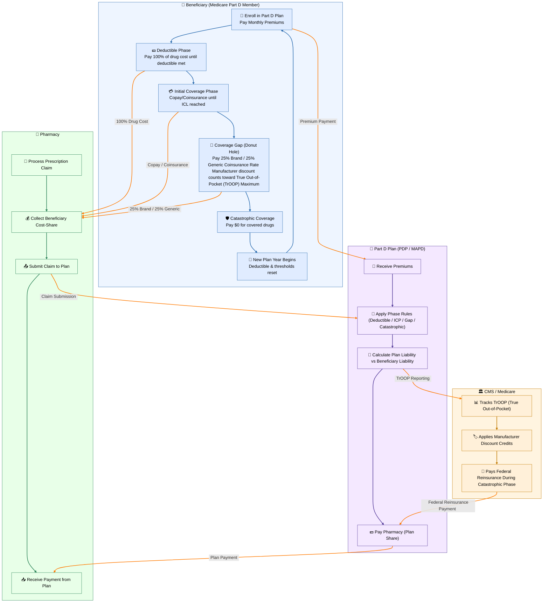

# Public Health Coverage & Assistance

## Medicare & Medicaid

The ***Social Security Act Amendments (1965)*** created the Medicare and Medicaid programs:

- **Medicaid**: A joint federal-state program providing health coverage to low-income individuals; operating as HMOs.
- **Medicare**: A federal health insurance program for people aged 65+, individuals with certain disabilities, and patients with End-Stage Renal Disease (ESRD); operating as HMOs unless the customer elects to enroll in Medicare Part C where it may act as an HMO or PPO offered by private insurers.

`Both administered by the Centers for Medicare & Medicaid Services (CMS)`

These programs laid the foundation for future pharmacy regulations that affect how medications are dispensed and monitored, especially for public health insurance recipients.

| Part | Nickname | 📝 What It Covers | 💰 Costs | 💊 Notes |
| ------ | ---------- | ------------------- | ---------- | ---------- |
| 🅰️ | Hospital Insurance | Inpatient hospital care, skilled nursing, hospice, home health | Usually "free" if worked 10+ years (payroll taxes) | Deductibles & coinsurance apply |
| 🅱️ | Medical Insurance | Doctor visits, outpatient services, preventive care, DME | Monthly premium, deductible,  20% coinsurance after deductible, unless supplemental coverage (e.g., Medigap) applies | Optional; Penalty applies if not enrolled when first eligible and not covered by other creditable drug coverage. |
| 🅲 | Medicare Advantage | Combines A & B (and usually D), run by private insurers | Varies by plan | May offer dental, vision, hearing, gym |
| 🅳 | Medicare Prescription Drug Plan | Outpatient prescription drugs & Medication Therapy Management (MTM) services | Monthly premium, deductible, copays | Private plans available; penalty for late enrollment; Established by the MMA (2003) |

> 🤯 The ***Patient Protection & Affordable Care Act (Obamacare, 2010)*** was signed into law with the overall goals of improving patient care, quality, and outcomes while reducing cost.

### 🍩 The Medicare Part D “Donut Hole” (Coverage Gap)

The “donut hole” is a temporary limit on what Medicare Part D will pay for prescription drugs.

| Phase | Description |
| ------- | ------------- |
| ✅ **Deductible Phase** | You pay 100% until your deductible is met (if plan has one). |
| 💸 **Initial Coverage** | You pay a **copay/coinsurance**; plan pays the rest. Ends when total drug costs (you + plan) hit a threshold (e.g., \~\$5,030). |
| 🍩 **Coverage Gap ("Donut Hole")** | You pay no more than 25% of the cost for brand-name and generic drugs during the gap (discounts are applied due to manufacturer contributions). |
| 💯 **Catastrophic Coverage** | After your out-of-pocket costs hit the cap (\~\$8,000), you pay **nothing** or a small coinsurance per prescription. |

> 💊 For techs: Patients in the donut hole may suddenly pay more; watch for confusion or frustration and refer to the pharmacist.

### 🏥 State Medicaid Programs

Each Medicaid program is administered by individual state welfare departments, with their own formularies, that answer to CMS.

Medi-Cal is California's Medicaid program, providing free or low-cost health coverage for:

- Low-income families and individuals
- Seniors (65+)
- People with disabilities
- Certain adults under 138% of the Federal Poverty Level (FPL)

It covers a wide range of services like doctor visits, hospital care, mental health, vision, dental, and prescriptions.

> 💊 Pharmacy Tech Tip: Medi-Cal often uses a state drug formulary and may require Treatment Authorization Requests (TARs) for non-preferred or high-cost medications, especially those not on the state's formulary.

#### 🩺 Medi-Medi (Dual Eligibility)

A “Medi-Medi” patient is eligible for both Medicare and Medi-Cal.

Medicare is the primary payer; Medi-Cal acts as secondary, covering:

- Co-pays
- Deductibles
- Coinsurance
- These patients often qualify for extra help with Part D prescription drug costs.

> 🧠 Watch for “Medi-Medi” flags in patient profiles. These patients usually have no out-of-pocket cost for covered meds and medical care.

---

## Workers' Compensation

Workers' compensation is a **state‑mandated insurance system** that provides medical care and wage replacement for employees who are **injured or become ill due to their job**. Each state runs its own program, but the core pharmacy workflow is consistent across the country.

### 🧩 What Workers' Comp Covers

- **Work‑related injuries** (acute injuries, accidents)
- **Occupational illnesses** (e.g., chemical exposure, repetitive‑strain injuries)
- **Medications** related to the accepted injury or condition  
  > Claims must match the **diagnosis code** tied to the injury.

### 📝 How Claims Are Processed

`PBMs may administer workers' compensation prescription drug benefits`

- Claims must be **reported to a state workers' compensation board**, which authorizes benefits.
- Prescriptions are billed to:
  - The **state bureau of workers' compensation**, or  
  - The **employer**, if they are **self‑insured**
- Many states use **PBMs that specialize in workers' comp**, such as Optum or Mitchell, to manage drug benefits.
- Billing may be:
  - **Online adjudication** (most common), or  
  - **Paper claims** when electronic systems aren't available

### 💊 Pharmacy Tech Responsibilities

- Verify:
  - **Claim number**
  - **Date of injury (DOI)**
  - **Employer information**
  - **Adjuster or case manager contact**
- Ensure the medication is **related to the injury**; unrelated meds will reject.
- Follow state‑specific **formularies** and **fee schedules**.
- Document everything clearly—workers' comp audits are strict.

### ⚠️ Tech Tip

Workers' comp claims often reject for **mismatched injury codes**, **expired authorizations**, or **incorrect employer information**. Always double‑check claim details before processing.

---

## 🦾 Military Health Coverage: VA, TRICARE, & CHAMPVA

In addition to private and public insurance plans, some patients receive prescription drug coverage through programs specifically for military personnel, veterans, and their families. These programs include VA, TRICARE, and CHAMPVA. Each has unique eligibility rules, formularies, and pharmacy networks.

| Program | Who It Covers | Where Prescriptions Are Filled | Notes |
| ------- | ------------- | ------------------------------ | ----- |
| **VA** | Enrolled veterans | VA pharmacies or mail-order | Must use VA providers; no outside retail coverage without preapproval |
| **TRICARE** | Military (active, retired), dependents | Military pharmacies, retail network, mail-order | Express Scripts manages pharmacy benefits |
| **CHAMPVA** | Dependents of disabled/deceased veterans | Retail pharmacies, Medicare Part D (if eligible) | May require manual claim submission; differs from TRICARE |

> ⚠️ Always verify insurance details for military and veteran patients—coverage rules and pharmacy networks vary significantly between VA, TRICARE, and CHAMPVA.

### 🇺🇸 VA (U.S. Department of Veterans Affairs)

The VA provides healthcare (including prescriptions) to eligible veterans through VA medical facilities.

- Prescriptions are typically filled at **VA pharmacies** or via VA Consolidated Mail Outpatient Pharmacy (CMOP) Programs
- The VA has its own **national formulary**, and medications must be prescribed by a **VA provider** to be covered.
- Outside pharmacies generally cannot bill the VA unless under special arrangements.
- Copayments are based on priority group, income level, and whether the condition is service-connected.

> 💊 **Tech Tip**: If a patient brings a VA prescription to a retail pharmacy, it likely won't be covered; refer them back to the VA system unless there's a special authorization.

### 🔺 TRICARE

TRICARE is the healthcare program for:

- Active-duty military members
- Retirees
- National Guard/Reserve members
- Their dependents

TRICARE is managed by the **Department of Defense (DoD)** and offers several plan types, including **TRICARE Prime, TRICARE Select, and TRICARE for Life** (for Medicare-eligible retirees).

Pharmacy Benefits:

- Managed by Express Scripts.
- Covers prescriptions from:
  - Military treatment facility pharmacies (no copay)
  - TRICARE retail network pharmacies (small copay)
  - Mail-order pharmacy through **Express Scripts Home Delivery** is usually the cheapest for maintenance medications.
  - Formularies are tiered, and prior authorizations may be required for certain drugs.

> 📋 **Tech Tip**: Always check if the pharmacy is in-network for TRICARE. Verify eligibility using the patient's military ID or DoD Benefits Number (DBN).

### 🩺 CHAMPVA (Civilian Health and Medical Program of the Department of Veterans Affairs)

CHAMPVA provides coverage for spouses and dependent children of veterans who:

- Are permanently and totally disabled due to a service-connected condition, or
- Died as a result of a service-connected condition.

CHAMPVA is not the same as TRICARE, but similar in how it functions.

Key Points:

- CHAMPVA covers prescriptions filled at rtail pharmacies; patients who are Medicare-eligible must enroll in Part D to receive outpatient prescription coverage through CHAMPVA.
- Claims may need to be **submitted manually** if the pharmacy isn't set up for electronic CHAMPVA billing.
- CHAMPVA may act as **secondary insurance** if the patient has another plan.
- **Meds by Mail** is a CHAMPVA program

> 🧠 **Tech Tip**: CHAMPVA patients may carry a special ID card. Verify the plan and check reimbursement procedures. CHAMPVA doesn't always process like standard insurance.

---

## Public Assistance & Affordability Pathways

When patients are unable to afford their prescriptions due to lack of insurance coverage, high out-of-pocket costs, or formulary exclusions, pharmacies can support access through a variety of public assistance resources and non-standard funding channels. These programs operate **outside the typical billing and adjudication system** and can provide significant financial relief.

Eligibility varies by program but generally includes:

- **Uninsured** or **underinsured** patients
- Patients who cannot afford **copays**, **coinsurance**, or **deductibles**
- Patients who **meet income-based financial criteria**, often aligned with federal poverty levels
- Patients prescribed **high-cost or specialty medications**

Pharmacy staff should **screen** for assistance when insurance billing fails, a claim is rejected for cost-related reasons, or the patient expresses inability to pay.

Technicians can help by:

- **Identifying patients** who may benefit from assistance
- **Explaining options** clearly and without judgment
- **Gathering required documentation**, including prescriptions, income proof, and insurance info
- **Coordinating with pharmacists**, case managers, or social workers
- **Tracking application status** and following up with patients and programs

<!-- TODO: Public Assistance SOP -->

### 🤝 Patient Assistance Programs (PAPs)

PAPs are typically funded by **drug manufacturers**, **nonprofits**, or **charitable foundations**. They provide **free or low-cost medication** to eligible patients.

- May provide **free medication** shipped directly to the patient or pharmacy
- Some offer **temporary coverage** while insurance is pending or under appeal
- Most require application with **prescriber signature**, **proof of income**, and **insurance status**

> 📌 PAPs bypass insurance billing. Approved drugs often come through separate distribution channels. Follow all handling and documentation instructions carefully.

### 💳 Copay Cards & Manufacturer Coupons

These are **savings cards** issued by drug manufacturers to reduce the patient's **out-of-pocket cost** at the point of sale.

- Only available to patients with **commercial insurance**
- Cannot be used with **Medicare**, **Medi-Cal**, or **other federal health programs**
- Automatically apply at point of sale if card info is entered correctly

> 🛡️ These programs are marketing tools. Always check for restrictions or expirations. Pharmacies may need to enroll through manufacturer portals.

### 🎗️ Disease-Specific Foundations & Grants

Charitable foundations provide grants or free access to medications for patients with specific **chronic or high-cost diseases**, such as:

- Cancer (e.g., Leukemia & Lymphoma Society)
- HIV/AIDS (e.g., Patient Advocate Foundation)
- Multiple Sclerosis (e.g., MSAA)

Assistance may include:

- **Full medication coverage**
- Help with **copays**, **premiums**, or **transportation**
- Reimbursement for already purchased meds (in some cases)

> 📌 These programs may be used by **Medicare** or **Medi-Cal** patients when manufacturer copay cards are not allowed.

### 🧾 Cash Discounts or Sliding Scale Pricing

Some pharmacies, especially **independent** or **clinic-affiliated**, offer cash discounts or **sliding scale pricing** based on income.

- Price is reduced based on verified income level
- Often used when no other assistance is available or during insurance gaps
- Requires **internal authorization** or enrollment in discount program

> 📌 Always document when a patient receives discounted pricing. It may affect future eligibility for other assistance programs.

---

## Navlinks

🔙🔗 Back to [**Healthcare Coverage, Services, & Billing**](../healthcare_coverage.md#public-health-coverage--assistance)
