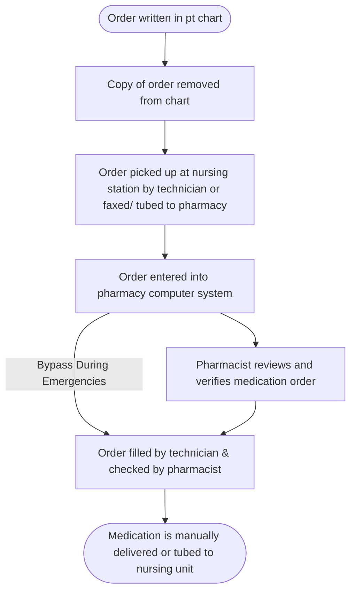
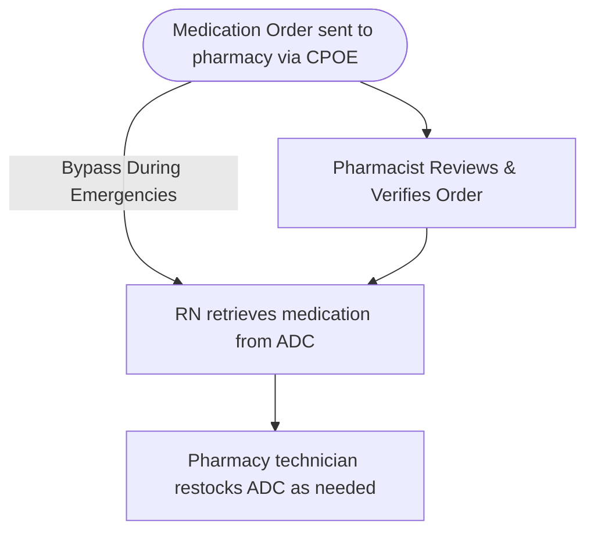

# Hospital Pharmacies

Hospitals are healthcare institutions that provide medical treatment, surgical services, and nursing care for patients suffering from acute illness, injury, or disease. Certified pharmacy technicians are commonly preferred in these settings due to the complexity and high standards of institutional operations.

## 🧑‍⚕️ Hospital Staff Overview

- **Physicians**
  - **MD (Medical Doctor)**: Diagnoses, treats, and prescribes; writes the majority of medication orders.
  - **DO (Doctor of Osteopathy)**: Similar to MD with emphasis on holistic care.
- **Nursing Staff**
  - **APN (Advanced Practice Nurse)**: provide advanced care & may specialize
    - **NP (Nurse Practitioner)**: A type of APN that can prescribe in most states
  - **RN (Registered Nurse)**: Administers meds, assists procedures, performs assessments.
  - **LPN (Licensed Practical Nurse)** & **LVN (Licensed Vocational Nurse)**: Provide bedside care under RN supervision; med administration scope varies by state.
- **Other Healthcare Professionals**
  - **PA (Physician Assistant)**: Can prescribe, performs exams, and treatment under supervision of MD or DO
  - **RT (Respiratory Therapist)**: Manages respiratory treatments; may administer meds.
  - **PCT (Patient Care Technician)**: Assists nursing; often sent to retrieve medications between deliveries.
  - **MSW (Master of Social Work)**: Addresses social, legal, or financial patient issues.
- **Pharmacy Staff**
  - **RPh (Registered Pharmacist)**: Reviews orders, dispenses medications, consults on therapy. Can order medications if allowed by hospital protocol.
  - **Clinical Pharmacist**: Advanced training; participates in patient care rounds, optimizes therapy & monitoring. May or may not dispense. Can order medications if allowed by hospital protocol.

## 🏥 Hospital Pharmacy Layout

Hospital pharmacies must coordinate with multiple departments across the facility to ensure timely and accurate medication distribution. Understanding the layout and terminology used for different clinical units helps pharmacy technicians navigate workflow efficiently.

- **Auxiliary Units** are clinical patient care areas where medications are stored and administered. The **nurses' station** is the unit hub for communications and stores meds, charts, and supplies.
- **Ancillary Departments** such as radiology, respiratory therapy, dialysis, and central supply also receive support from the pharmacy.
- **Central Supply** stocks items not provided by the pharmacy (e.g. lotions, mouthwash, pill cutters) and sometimes IV solutions.

| Abbreviation | Auxiliary Unit Name | Description |
| -------------- | --------------------- | ------------- |
| ASC | Ambulatory Surgery Center | Outpatient surgical procedures |
| BMTU | Bone Marrow Transplant Unit | Specialized oncology care |
| CCU | Cardiac/ Coronary Care Unit | Intensive cardiac care |
| ED | Emergency Department | Emergency and trauma services |
| ER | Emergency Room | Synonym for ED |
| ICU | Intensive Care Unit | Critical care for unstable patients |
| CT ICU | Cardiothoracic Intensive Care Unit | Cardiac and thoracic post-op care |
| NICU | Neonatal/ Neurological Intensive Care Unit | Critical care for newborns or neurology patients |
| PICU | Pediatric Intensive Care Unit | Critical care for children |
| SICU | Surgical Intensive Care Unit | Post-surgical intensive care |
| OB | Obstetrics | Maternal care and delivery |
| OR | Operating Room | Surgical procedures |
| PAR | Post-Anesthesia Recovery | Immediate post-op care |
| PACU | Post-Anesthesia Care Unit | Same as PAR |
| PEDS | Pediatrics | Inpatient care for children |

Hospital pharmacies are compartmentalized into specialized areas that support inpatient, outpatient, and ancillary medical services. These areas include the Central Pharmacy and its Satellites.

🧭 **Central Pharmacy**

The central pharmacy is the main hub of medication operations within a hospital.

- 🕒 **Typically operates 24/7** to ensure continuity of care across all patient units.
- 📦 **Primary responsibilities:**
  - Houses the **bulk of the hospital's medication inventory**
  - Prepares **batched doses** for scheduled administration (e.g. 24-hour doses for med carts); including those not covered by satellites.
  - Supports **ancillary departments** (e.g. dialysis, radiology, endoscopy) with needed medications
  - Performs **unit-dose repackaging** and barcode labeling
  - Conducts **restocking of crash carts**, Automated Dispensing Cabinets (ADCs), and floor stock
  - Oversees **sterile compounding (IV room)** including chemotherapy, parenteral nutrition, and emergency meds

> 📌 If any **pharmacy satellite is closed**, the central pharmacy assumes coverage responsibilities.

🛰️ **Pharmacy Satellites**

Pharmacy satellites are smaller, strategically located pharmacies within the hospital, often near specialized patient care units.

- 🏥 Common examples:
  - **OR Satellite**: near surgical suites, maintains anesthetics, emergency drugs, and procedure-specific meds
  - **Pediatric Satellite**: near NICU or pediatric units; focuses on weight-based or concentration-specific formulations
  - **Oncology Satellite**: for chemotherapy mixing or delivery coordination
- 💊 Responsibilities:
  - Provide **first doses** of newly ordered medications
  - Supply **emergency medications** as needed
  - Replace **lost or missing doses**
  - Maintain **limited, specialized inventory** tailored to the needs of the serviced unit

> 📌 Satellites are typically **open 24 hours**. When closed, central pharmacy assumes their duties.

🏪 **Outpatient & Clinic Pharmacies**

Hospitals may also have **outpatient pharmacies** or **clinic-affiliated pharmacies** within or near the main hospital campus.

- 🔄 Operate like **retail/community pharmacies** but staffed by the hospital
- 💳 Serve:
  - Patients being discharged
  - Hospital staff
  - Walk-in clinic patients
- 🛑 They **do not dispense medications** for **inpatient use**
- 📃 Process outpatient prescriptions under the supervision of hospital pharmacists

## 🔑 Hospital Pharmacy Technician Roles

- 🧑‍💼 **Pharmacy Technician Supervisor**
  - Manages workflow and technician schedules
  - Trains and evaluates technician staff
    - **Performance Reviews** are regularly scheduled events to monitor and document technician competency.
  - Coordinates operations with pharmacists and hospital leadership
- 🧾 **Front Counter/Main Pharmacy Technician**
  - Answers phones and triages calls
  - Processes first-dose fills of oral medications
  - Assists clinical staff and other techs
- 🔐 **Narcotics/Controlled Substances Technician**
  - Coordinates receipt, preparation, and delivery of controlled substances to nurses' stations or ADCs
  - Maintains security, documentation, and logs for scheduled drugs
  - Reviews inventory and discrepancy reports; performs audits
  - Ensures compliance with 🦅 DEA and 🐻 California BOP regulations
  - 📌 Must maintain exact counts and chain-of-custody procedures
- 📦 **Delivery Technician**
  - Transports medications to nursing units and outpatient clinics
  - Retrieves stat orders and new prescriptions
- 🤖 **Automation Technician**
  - Manages pharmacy robotics and ADC systems
  - Troubleshoots errors and login issues
  - Trains staff on system use
  - Acts as department SME (Subject Matter Expert) for automation
  - 🔄 Inpatient version integrates ADC operations and BCMA support
  - 🧾 Outpatient version manages prescription robots and pickup systems
- 📋 **Medication Reconciliation Technician**
  - Gathers and verifies patient medication history
  - Interviews patients and caregivers
  - Contacts outpatient providers
  - Compares data with hospital orders and flags discrepancies for pharmacist review
- 📦 **Inventory Control Technician**
  - Orders, receives, and stocks medications
  - Handles shortages, recalls, and emergency procurement
  - Refills crash carts and ADCs in ancillary areas
- 💉 **IV Room Technician (Sterile Compounding)**
  - Compounds sterile products per USP <797>
  - May handle chemotherapy (USP <800>) and nutrition therapy (USP <795>)
  - Requires aseptic technique and PPE
  - Must complete regular training and competency validation
- 🛡️ **Medication Safety & Compliance Technician**
  - Ensures adherence to SOPs and regulatory protocols
  - Tracks medication errors and near misses
  - Performs unit inspections for compliance with labeling, storage, and expiration policies
    - Coordinates inspections to remove expired stock
  - Documents refrigerator and freezer temperatures daily
    - Ensures cold chain compliance
  - Monitors recalls from 🐻 CA BOP, 🦅 FDA, manufacturers, and wholesalers
  - Assists the Medication Safety Pharmacist
  - Trains staff on safety procedures
  - May serve on medication safety and QA committees
  - Maintains compliance documentation, inspection readiness, & internal medication safety website to support adherence to Joint Commission, USP, and internal audit standards
- 🧪 **Investigational Drug Services (IDS) Technician**
  - Supports clinical trials under IRB-approved protocols
  - Prepares and labels study drugs
  - Manages investigational inventory and QA procedures
  - Conducts sponsor audits, tracks billing, and maintains documentation
  - Assists with staff training on study protocols
- 🔄 **Inpatient Transitions of Care Technician**
  - Conducts Medication Reconciliation during admissions, transfers, and discharges
  - Assists in DUR processes
  - Aims to reduce errors during patient transitions
- 🚶 **Outpatient Transitions of Care Technician**
  - Ensures accurate prescription continuity post-discharge
  - Collaborates with nurses, pharmacists, PCTs, physicians, and social workers
  - Aims to reduce 30-day readmission rates (typically around 20%)

> 🛡️ All pharmacy technicians must document their actions in the pharmacy system in real-time to ensure traceability and compliance.

## Hospital Communication

Effective communication between hospital departments is essential to ensure timely, accurate, and coordinated patient care. Pharmacy technicians are frequently involved in both direct and indirect communication related to medication management.

### ☎️ Phone Calls

Pharmacy technicians are often the first point of contact for incoming calls to the pharmacy. It is essential to:

- Answer promptly using professional **telephone etiquette**
- **Identify yourself** and the department ("Pharmacy, this is [name], how can I help you?")
- Triage the nature of the call:
  - **Forward clinical or drug information questions** to a pharmacist
  - Handle routine requests such as **medication status**, **delivery confirmation**, or **stock availability**

> 🚨 Calls from critical care units or the Emergency Department (ED) may involve urgent needs. Always prioritize according to urgency and policy.

### 📧 Email & SMS Communication

Many hospitals use **secure communication platforms** that include:

- **Hospital-issued smartphones or pagers** assigned at the start of a shift and returned at the end
- **Internal email and secure messaging apps** (e.g., TigerConnect, Vocera, or Epic Secure Chat)
- These tools are used for:
  - Direct messaging between staff
  - Reporting missing doses or requesting restocks
  - Notifying pharmacy of urgent needs

> 📌 These devices are **for hospital use only** and must comply with HIPAA regulations.

### 📝 Handwritten Requests

Though less common in fully electronic facilities, handwritten communication may still be used in:

- **Ancillary departments** (e.g., radiology, respiratory therapy) for **medication requests**
- Notes left at the **nurses' station** or in medication rooms
- **Physician orders** in settings without full Computerized Physician Order Entry (CPOE)
  - transcribed by unit clerk, pharmacy tech, rph, or nurse

> 🛡️ Pharmacy technicians must check these locations frequently and follow up on any incomplete, unclear, or outdated requests.

> 📌 Verification by pharmacist may be skipped if delay in administration would harm the patient.

### 📦 Pneumatic Tube Systems

Pneumatic tube systems are used to **rapidly transport medications, lab samples, and documents** between the pharmacy and various departments.

- Medications are placed in **sealed plastic canisters**
- Tube stations are usually located at:
  - Nursing stations
  - Lab departments
  - Pharmacy
- ⚠️ **Do not use pneumatic tubes for:**
  - **Unstable or light-sensitive medications**
  - **Refrigerated drugs**, **controlled substances**, or **hazardous medications**
  - **IV bags that exceed size or weight limits**
  - Items restricted by **hospital policy**

> 📌 Always follow proper **labeling and tracking procedures** when sending items.

### 💻 Informatics Systems

Hospital pharmacies rely on **integrated electronic health records (EHRs)** and **order entry systems** to manage medication processes. Technicians should be proficient with:

- **CPOE (Computerized Provider Order Entry):** Allows prescribers to directly enter orders into the system prior to pharmacist review; prevents errors due to illegible handwriting
- **Automated Dispensing Cabinets (ADCs):** Interfaced with the pharmacy system to track inventory and medication use
- **Medication Administration Records (MARs):** a form that tracks what medications were administered to a patient, when, and by whom
  - some computer systems can track continuous infusion rates from IV pumps to report when a medication is potentially due for refill
- **Electronic Messaging:** Used by staff to report missing medications, request restocks, or clarify orders

> Medication may be manually delivered or tubed to the nursing station if there isn't an ADC.

Hospital IT systems often include:

- Patient medication history
- Laboratory data
- Allergies and contraindications
- Billing and insurance
- Reports for drug usage and compliance

Pharmacy technicians may be tasked with:

- **Monitoring alerts and refill requests**
- **Processing incoming orders**
- **Reconciling inventory electronically**
- **Escalating clinical issues to the pharmacist**

#### 🧠 Pharmacy Informatics

In advanced settings, pharmacy technicians may work on the **pharmacy informatics team**, assisting with:

- **Programming, testing, and maintaining order entry systems**
- **Troubleshooting communication issues** between EHR and ADCs (e.g., Pyxis, Omnicell)
- **Running reports** on drug utilization, inventory, or compliance
- **Improving workflow efficiency** through system customization

### 📚 Access to Drug Information

Pharmacists are responsible for **providing accurate drug information** to other healthcare professionals and patients. Most hospitals subscribe to **clinical reference databases**, which may include:

- **Lexicomp**
- **Micromedex**
- **Clinical Pharmacology**
- **UpToDate**

These references can be accessed through:

- The hospital’s EHR or intranet
- Mobile devices
- Dedicated workstations

> 🛡️ Pharmacy technicians must know which resources are available and how to assist in retrieving non-clinical information when requested.

---

## 🗺️🔗 Nav Links

🔙🔗 Back to [Pharmacy Settings](../../settings.md)
