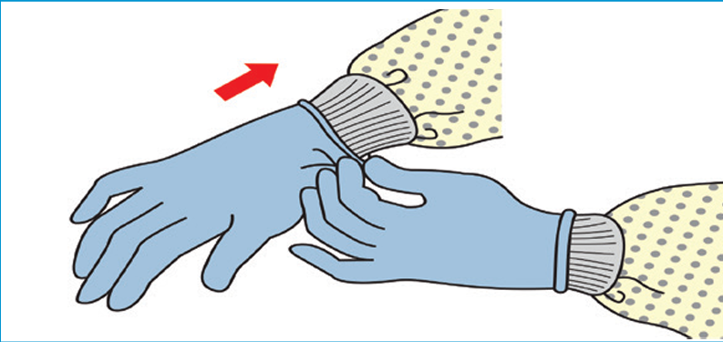

# 🛠️ SOP – Aseptic Gowning

## 🔑 Purpose

To prevent contamination of sterile compounding environments by establishing a standardized gowning process, which is critical to ensuring product safety. Contaminants such as microorganisms, particles, and chemicals from the environment or personnel can compromise compounded medications, posing serious risks to patient health. Adhering to strict gowning procedures helps maintain sterility, comply with regulatory standards (e.g., USP <797>), and uphold the integrity of pharmaceutical preparations.

## 🔗 Scope

This SOP applies to all personnel entering an ISO-classified cleanroom for sterile compounding. Gowning must be performed **before** entering the buffer area and **after** performing aseptic handwashing.

## 🧱 Facility Design and Engineering Controls

### ➕ Antechamber / Gowning Room

A **segregated space between the cleanroom and uncontrolled areas** used for:

- Gowning and degowning procedures
- Staging of materials entering the cleanroom
- Pressure control between cleanroom zones

Maintains positive pressure toward the buffer area to reduce contamination inflow. Classified as an **ISO 7 or ISO 8 environment**, depending on cleanroom design.

### 🔧 Engineering Controls

Includes the following components used to maintain air quality:

- **HEPA filters**: Remove ≥99.97% of 0.3 μm particles
- **Laminar airflow workbenches (LAFWs)**: Maintain unidirectional airflow in compounding areas
- **Positive pressure differentials**: Prevent entry of lower-class air
- **Airlocks or pass-throughs**: Used for material transfers without disturbing pressure zones

## 🧼 Pre-Gowning Requirements

Before entering the antechamber:

- Remove **jewelry, makeup, and watches**
- Keep **fingernails short**; no fake nails or extensions
- Tie back long hair and secure loose clothing
- Store personal items in designated lockers

## ✅ Gowning Procedure

**⚠️ NOTICE**: Perform hand sanitization with 70% isopropyl alcohol **before applying any garment**, unless otherwise indicated.

### Step 1: Initial Hand Hygiene

- Perform a 🔗 [quick aseptic hand rub](../handwashing/readme.md) down to the wrists with 70% IPA.
- Dry with a clean disposable towel.
- This step reduces initial microbial burden before donning PPE.

### Step 2: Shoe Covers

- Don **shoe covers** over both feet.
- Use antechamber bench or dedicated hands-free shoe cover dispenser.
- Avoid stepping on exposed flooring with uncovered feet.

### Step 3: Hair Cover and Face Mask

- Cover entire head and ears with a **bouffant cap**.
- Use a separate **beard cover** if needed.
- Don a **face mask** covering both nose and mouth.
- Secure straps at the **crown and base of the head** to prevent slippage.

### Step 4: Full Aseptic Hand Washing

- Use **surgical scrub brush** with nail cleaner and antimicrobial soap.
- Clean all nail beds, palms, fingers, **and forearms up to elbows**.
- Rinse thoroughly with **sterile water**, not tap water.
- Use a disposable towel to dry hands completely.

> 🛡️ Aseptic handwashing prevents contamination of sterile gloves and garments.

### Step 5: Aseptic Gowning

- Open sterile gown packaging without contaminating the interior.
- Insert arms and secure ties at the **back**.
- Avoid touching the exterior surface of the gown.

> 📍 Gown should fully cover all street clothing and arms down to the wrists.

### Step 6: Sterile Gloves

- Open sterile glove packaging using aseptic technique.
- Don gloves carefully, ensuring they cover gown cuffs completely.
- Spray gloved hands with **70% IPA** and allow to air dry.

> 🛡️ Sterile gloves protect the critical zone during compounding.

## 🔁 Degowning Procedure

**Treat PPE as contaminated. Remove in this exact order to minimize exposure risk:**

### Step 1: Gloves

- Peel off one glove inside-out.
- Use the gloved hand to remove the other glove without touching the outside.

### Step 2: Gown

- Untie gown from the back.
- Fold inward so the **clean side faces out**.
- Discard appropriately.

### Step 3: Remaining PPE

- Remove **face mask, beard cover, hair cover**, and **shoe covers**.
- Discard all items unless facility policy requires reuse of specific PPE (e.g., reusable gowns in segregated compounding areas).

## 🧴 Aseptic Hand Washing Reference

Refer to **Section 1.3** of this SOP for detailed instructions on:

- Standard six-step scrubbing technique
- Use of nail picks and surgical brushes
- Minimum scrub duration (≥30 seconds)
- Skin care and aftercare recommendations

## 🛡️ Notes & Best Practices

- Never re-enter the cleanroom after exiting without repeating full gowning.
- If any part of your gown or gloves becomes contaminated, **exit and regown**.
- Perform gowning from **dirtiest to cleanest** (feet → head → hands).
- Gowning must occur in the antechamber or designated ISO-classified area.

---
