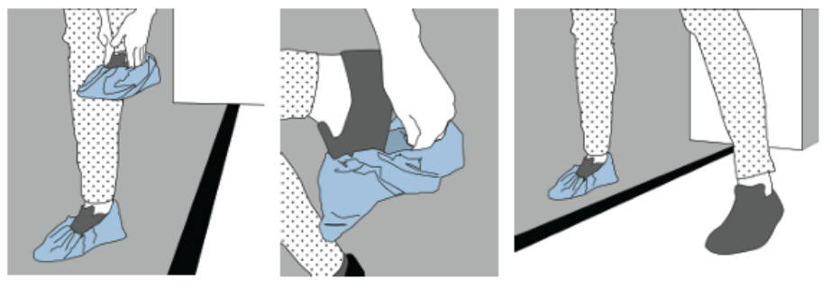

# 🛠️ SOP – Aseptic Gowning

## 🔑 Purpose

To prevent contamination of sterile compounding environments by establishing a standardized gowning process, which is critical to ensuring product safety. Contaminants such as microorganisms, particles, and chemicals from the environment or personnel can compromise compounded medications, posing serious risks to patient health. Adhering to strict gowning procedures helps maintain sterility, comply with regulatory standards (e.g., USP <797>), and uphold the integrity of pharmaceutical preparations.

## 🔗 Scope

This SOP applies to all personnel entering an ISO-classified cleanroom for sterile compounding. Gowning must be performed **before** entering the buffer area and **after** performing aseptic handwashing.

## 🧱 Facility Design and Engineering Controls

### 🟢 Unrestricted Zone (Workspace)

The outermost area where personnel and materials enter before gowning. Not subject to air quality classification. General public and pharmacy workflow intersect here.

- **Key Function**: Staging and administrative work
- **Engineering Controls**: None required
- **Examples**: Office, receiving, general storage

### ➕ Antechamber / Gowning Room / Transition Zone

A **segregated space between the cleanroom (buffer rooms) and uncontrolled areas** used for:

- Gowning and hand hygiene
- Staging of materials entering the cleanroom
- Pressure control between cleanroom zones

🧪 **Typical Classification**: ISO Class 7 (if leading to hazardous compounding) or ISO Class 8 (for non-hazardous)

🔧 **Engineering Controls (Secondary)**:

- **Pressure gradients**  
  - Positive toward USP <797> buffer room  
  - Negative or neutral toward USP <800> buffer room  
- **HEPA-filtered HVAC supply**  
- **Sealed ceilings, walls, and floors**  
- **Hands-free sinks** (outside the buffer zone)

### 🧪 USP <797> Restricted Zone (Non-Hazardous Sterile Compounding)

Sterile compounding area for non-hazardous drugs. Must meet **ISO Class 7** conditions.

🔹 **Primary Engineering Controls (PECs)**:

- **Laminar Airflow Workbenches (LAFWs)**  
- **Compounding Aseptic Isolators (CAIs)**  
- Provide ISO 5 environment where sterile work occurs

🔸 **Secondary Engineering Controls (SECs)**:

- **Positive pressure** buffer room  
- **HEPA-filtered air from ceiling with low-wall returns**  
- **Continuous or logged differential pressure monitors**  
- **Impervious, seamless surfaces**

### ☣️ USP <800> Restricted Zone (Hazardous Drug Buffer Room)

Dedicated for sterile compounding of hazardous drugs under **negative pressure** and **ISO Class 7**.

🔹 **Primary Engineering Controls**:

- **Biological Safety Cabinets (BSCs)** – Class II, Type B2 preferred  
- **Compounding Aseptic Containment Isolators (CACIs)**  
- Maintain ISO 5 conditions internally

🔸 **Secondary Engineering Controls**:

- **Negative pressure** relative to the ante-room  
  - Minimum: −0.01 inch water column  
- **Externally vented exhaust**  
- **Sealed, chemical-resistant surfaces**  
- **HEPA-filtered ISO 7 environment**

### 🔑 Summary of Engineering Control Roles

| Control Type | Description | Examples | Purpose |
|--------------|-------------|----------|---------|
| **Primary (PEC)**| Direct compounding environment (ISO 5) | LAFW, BSC, CAI, CACI | Protect product sterility |
| **Secondary (SEC)**| Architectural/airflow support systems | Buffer room HVAC, HEPA, pressure diffs| Maintain classified environment|

## 🧼 Pre-Gowning Requirements

Before entering the antechamber:

- Remove **jewelry, makeup, and watches**
- Keep **fingernails short**; no fake nails or extensions
- Tie back long hair and secure loose clothing
- Store personal items in designated lockers

## ✅ Donning Procedure

**⚠️ NOTICE**: Perform hand sanitization with 70% isopropyl alcohol **before applying any garment**, unless otherwise indicated.

### Step 1: Initial Hand Hygiene

- Perform a 🔗 [quick aseptic hand rub](../handwashing/readme.md) down to the wrists with 70% IPA.
- Dry with a clean disposable towel.
- This step reduces initial microbial burden before donning PPE.

### Step 2: Shoe Covers

- Don **shoe covers** over both feet.
- Use antechamber bench or dedicated hands-free shoe cover dispenser.
- Avoid stepping on exposed flooring with uncovered feet.

### Step 3: Hair Cover and Face Mask

- Cover entire head and ears with a **bouffant cap**.
- Use a separate **beard cover** if needed.
- Don a **face mask** covering both nose and mouth.
- Secure straps at the **crown and base of the head** to prevent slippage.

### Step 4: Full Aseptic Hand Washing

- Use **surgical scrub brush/ sponge** with nail cleaner and antimicrobial soap.
- Clean all nail beds, palms, fingers, **and forearms up to elbows**.
- Rinse thoroughly with **sterile water**, not tap water.
- Use a disposable towel to dry hands completely.

> 🛡️ Aseptic handwashing prevents contamination of sterile gloves and garments.

### Step 5: Aseptic Gowning

- Open sterile gown packaging without contaminating the interior.
- Insert arms and secure ties at the **back**.
- Avoid touching the exterior surface of the gown.

> 📍 Gown should fully cover all street clothing and arms down to the wrists.

### Step 6: Sterile Gloves

- Open sterile glove packaging using aseptic technique.
- Don gloves carefully, ensuring they cover gown cuffs completely.
- Spray gloved hands with **70% IPA** and allow to air dry.

> 🛡️ Sterile gloves protect the critical zone during compounding.

## 🔁 Doffing Procedure

Personal Protective Equipment **(PPE) must be treated as a potential biohazard**. When removing each item, avoid touching external surfaces. Fold garments inward so the internal surfaces remain exposed during disposal. Perform hand hygiene after removing each item to maintain aseptic conditions.

### Step 1: Gloves

- Peel off one glove inside-out.
- Use the gloved hand to remove the other glove without touching the outside.

### Step 2: Gown

- Untie gown from the back.
- Fold inward so the **clean side faces out**.
- Discard appropriately.

### Step 3: Remaining PPE

- Remove **face mask, beard cover, hair cover**, and **shoe covers**.
- Discard all items unless facility policy requires reuse of specific PPE (e.g., reusable gowns in segregated compounding areas).

---

## 🛡️ Notes & Best Practices

- Never re-enter the cleanroom after exiting without repeating full gowning.
- If any part of your gown or gloves becomes contaminated, **exit and regown**.
- Perform gowning from **dirtiest to cleanest** (feet → head → hands).
- Gowning must occur in the antechamber or designated ISO-classified area.

---
