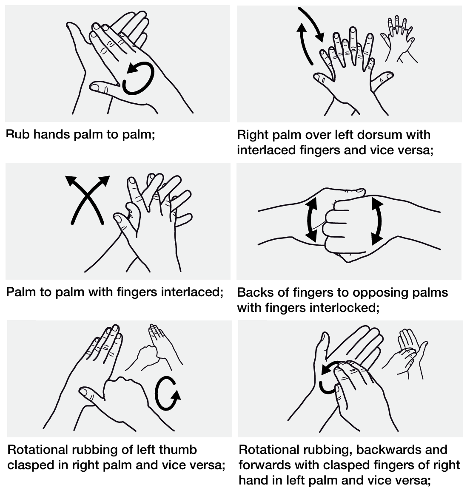

# 🛠️ SOP – Aseptic Handwashing

This SOP outlines the required procedure for aseptic hand hygiene in environments requiring sterile technique, such as cleanrooms and IV preparation areas.

## Step 1: Preparation

- Tuck in loose clothing (e.g., ties or scarves).
- Secure long hair tightly; use hairnets if required.
- Remove all hand and wrist jewelry:
  - Includes watches, bracelets, rings, and fitness trackers.
  - Rings may be worn on a secured necklace if needed.
- Trim fingernails natural, short, and filed smooth.
  - Do **not** wear fake nails or extensions.
  - Avoid chipped nail polish or nail art.

## Step 2a: Alcohol-Based Handrub

- Apply **a generous amount** of alcohol-based handrub.
- Perform all **6 standard hand hygiene motions** for **40 to 60 seconds**, or until hands are dry.
  - If hands dry **before completing all motions**, apply more sanitizer and continue.

> 🚨 **Mandatory**: Use soap and water **when hands are visibly dirty**. Otherwise, use alcohol-based handrub.
  

## Step 2b: Soap and Water

- Wet hands with **warm** (not hot) water.
- Dispense ~1 teaspoon of liquid soap.
- Perform all **6 standard hand hygiene motions** for **40 to 60 seconds**.
- Rinse thoroughly and dry with disposable paper towels.

> 📌 **Note**: Avoid recontaminating hands after washing by touching surfaces. Always use barriers like paper towels where needed (e.g. turning off faucets or opening doors).

## Step 3: Gloving

- Do **not** glove until hands are **completely dry**.
- Apply gloves using proper donning technique to avoid contamination.

## Step 4: Aftercare

- Use hand lotion or barrier creams **daily** to maintain skin integrity.
  - Choose products compatible with gloves and alcohol-based rubs.
- **Do not** use hot water to wash hands.
- **Do not** wash with soap and water **immediately before or after** using alcohol-based rubs unless necessary.

---

## 🗺️🔗 Nav Links

- 🔙 [Aseptic Gowning](../gowning/readme.md#-pre-gowning-requirements)
- 🥚 [Original WHO Document](./who_guidelines.pdf)
