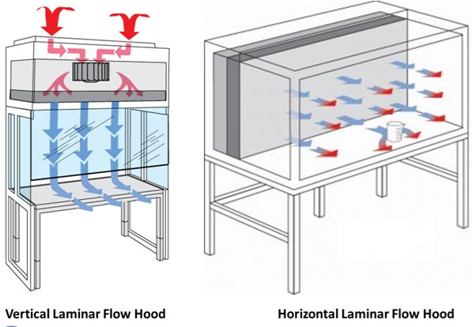
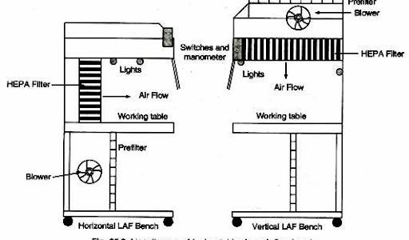

# 🛠️ SOP - Cleaning a Laminar Flow Hood

## 🔑 Purpose

Maintain aseptic conditions in any laminar flow hood, **horizontal** or **vertical**, by following a consistent, contamination-minimizing cleaning procedure using sterile water and 70% isopropyl alcohol (IPA).

## 🔗 Scope

Applies to all personnel responsible for sterile product preparation in a cleanroom or sterile compounding environment using either type of laminar flow hood.

## 🧾 Vertical vs Horizontal Hoods

| Feature | Vertical Laminar Hood | Horizontal Laminar Hood |
|---------|-----------------------|-------------------------|
| **Airflow direction** | Top to bottom | Back to front |
| **HEPA filter location** | Ceiling (top interior panel) | Rear wall |
| **Critical zone** | Directly under the top HEPA panel | In front of the rear HEPA panel |
| **User position** | Work below airflow | Work beside airflow |

> 📍 Airflow must not be obstructed by hands, supplies, or body parts. Filters must remain visible and unobstructed at all times.

## 📋 Materials Required

- Sterile, lint-free wipes (sufficient quantity)
- Sterile water for irrigation or sterile water for injection (as applicable)
- 70% isopropyl alcohol (USP grade)
- Personal protective equipment (PPE) per facility policy

## ✅ Procedure

### Step 1: Prepare Cleaning Wipes

1. Place a stack of sterile, lint-free wipes under the hood on the work surface (at least 6 inches deep).
2. Pour **sterile water** over the wipes until fully saturated.
3. Recap the **sterile water** container **under the hood** to minimize particulate introduction.

### Step 2: Clean Surfaces Using Sterile Water

Clean **from cleanest to dirtiest** and **with the direction of airflow**. Toss the wipes between each step!

➡️ **Horizontal Flow (back-to-front airflow)**:

- Wipe **top to bottom**, then **back to front**

⬇️ **Vertical Flow (top-down airflow)**:

- Wipe **top to bottom**, then **side to side**, working **back to front**

> 🚨 Do not use circular motions. Use straight, overlapping strokes to avoid recontaminating cleaned areas.

Clean in this exact order:

1. **Hang Bar and Hooks** (if present)
  A **stainless steel bar** near the top interior used to hang IV bags and tubing. Hooks are movable attachments. These must be cleaned first since they are high-touch but out of the direct airflow.
2. **Ceiling Panel**  
  <!-- **Ceiling Panel / HEPA Prefilter Area** -->
  Includes the ceiling (vertical hood) or top panel (horizontal hood) and surrounding areas near the HEPA filter. **Do not touch or wipe the filter itself.** This is the source of ISO Class 5 air.
3. **Back Wall**  
  For horizontal hoods, this wall contains the HEPA filter. For vertical hoods, it is a flat surface. Clean vertically, from top to bottom.
4. **Side Walls**  
  Wipe each side from top to bottom. These areas are less contaminated than the work surface but more exposed than upper areas.
5. **Work Surface**  
  This is the flat **stainless steel base** of the hood where compounding takes place. Clean last. Wipe from **back to front**.
  
> 🚨 Include **Outer Edges & Corners**! The front lip and outer edges are high-contact zones. These are commonly touched and can collect particles. Clean thoroughly.

### Step 3: Repeat with 70% Isopropyl Alcohol (IPA)

1. Place a fresh stack of sterile wipes under the hood.
2. Pour 70% IPA onto the wipes until saturated.
3. Recap the **IPA** container **under the hood**.
4. Repeat the entire cleaning sequence from Step 2 using IPA.

## 🛡️ Notes & Best Practices

- Clean the hood:
  - **At the beginning of each shift**
  - **Before each batch**
  - **After spills**
  - **After 4+ hours of inactivity**
- Never spray sterile water or alcohol directly into the hood. Always pour onto sterile wipes.
- Do not block laminar airflow with supplies, hands, or equipment.
- Keep all parts of your body outside of the critical airflow zone during operation.

---

## 🗺️🔗 Nav Links

<!-- - 🥚 [Original SOP](./hood_cleaning.jpg) -->
