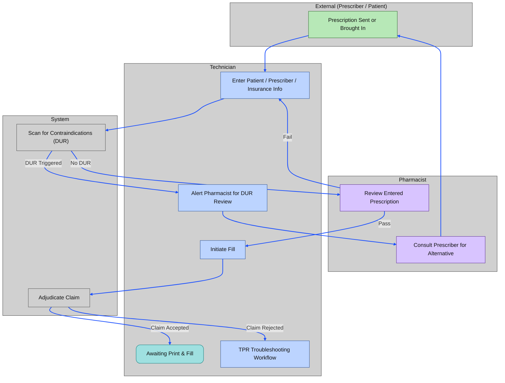
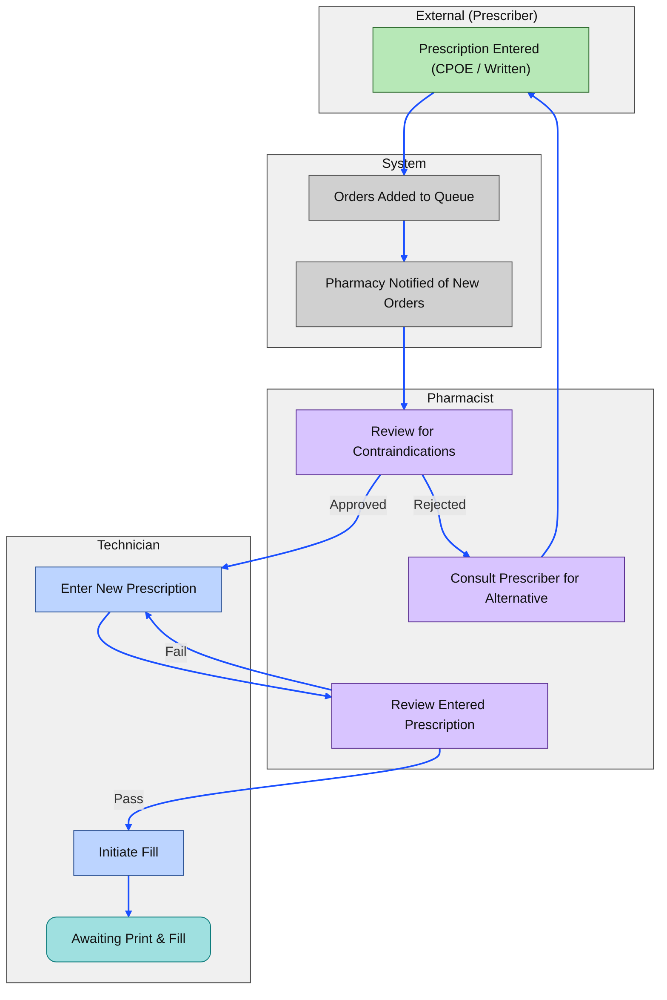
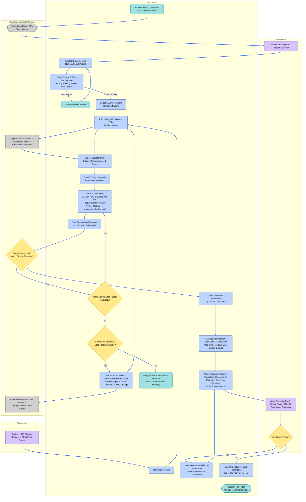
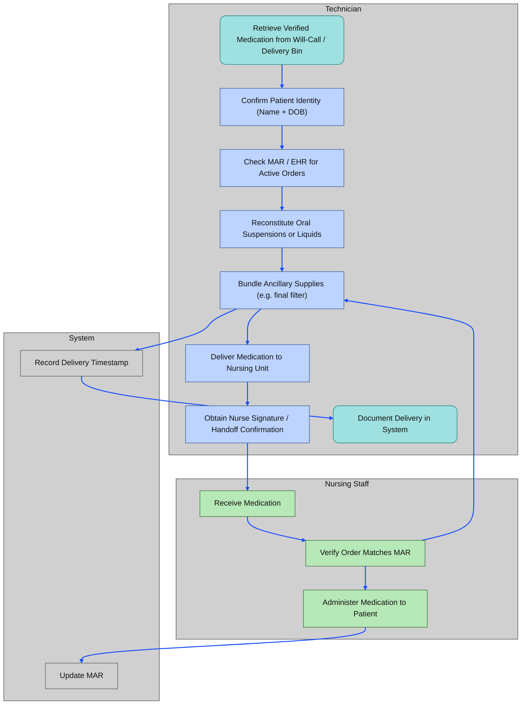

# Prescription Processing Workflows

## Medication Safety

Medication errors include, but are not limited to, dispensing:

- the wrong medication
- the wrong strength, dosage form, or quantity
- a prescription with the wrong directions
- the medication to the wrong patient

Visit the 🔗 [ISMP's Website for General Guidance & Tools](https://home.ecri.org/blogs/ismp-resources)

> **⚠️ Pay Attention to DUR Warnings**
>
> If a DUR warning appears at any time, **the pharmacist must be notified immediately**.  
>
> - Some pharmacies allow DURs to be reviewed during the final check  
> - Others require **immediate** pharmacist review  
>
> When in doubt, escalate.

---

## Processing Steps & Queues

Most community and outpatient pharmacies organize their workload into distinct operational queues. Each queue represents a safety checkpoint and a handoff between roles, ensuring prescriptions move efficiently while maintaining regulatory and clinical accuracy.

### 1. Typing / Data Entry Queue

Incoming prescriptions—electronic, written, or transferred—must be entered into the pharmacy management system.

- A technician enters patient, prescriber, and medication details with high accuracy.
- An **NDC** is selected based on inventory and contract requirements.
- The technician attempts **real‑time adjudication** with the patient's insurance.
  - Successful adjudication indicates the **fill is initiated**.
  - Rejections may require troubleshooting (e.g., PA required, refill too soon, plan limitations).

### 2. Pharmacist Data‑Entry Check (RPh Check)

Before a prescription can be filled, a pharmacist verifies the technician's work.

- Confirms the prescription is **clinically appropriate** and legally valid.
- Ensures the **NDC** selected matches the prescribed product and is safe for the patient.
- Reviews DUR alerts, interactions, allergies, and dosing appropriateness.

### 3. Fill Queue

Prescriptions that have passed pharmacist check move into the fill queue.

- A technician selects a batch of approved prescriptions to fill.
- The technician prints labels and gathers stock bottles.
  - Some pharmacies allow **staging**, where one technician prints and pulls bottles for others.
  - If the selected NDC is out of stock, the claim may need to be **re‑adjudicated**, requiring another pharmacist check. Depending on workflow, the technician may:
    - Bring the stock bottle and label to the pharmacist before submitting an NDC change, or
    - Submit the change and allow the pharmacist to review it in the system.
- The technician counts, pours, or packages the correct quantity.
  - Newer technicians must include the stock bottle with the filled medication for verification.
  - Experienced technicians may only need to provide the filled container.

### 4. Verification Queue (Final Check)

A pharmacist performs the final verification before the medication can be dispensed.

- Confirms the medication, NDC, quantity, and labeling are correct.
- Ensures auxiliary labels, Medication Guides, and patient education materials are included.
- Verifies that any clinical issues identified earlier have been resolved.

### 5. Will‑Call / Outgoing

Once verified, prescriptions are placed in the will‑call system for patient pickup.

- A technician retrieves the correct bag using barcode scanning or manual lookup.
- The technician completes the transaction, including:
  - Collecting payment
  - Reviewing basic information (e.g., storage, pickup reminders)
- A pharmacist may need to counsel the patient, especially for:
  - New prescriptions
  - High‑risk medications
  - Patient questions or concerns

---

## Prescription Intake & Billing

**Prescriptions** are instructions from a medical practitioner that authorize the provision of a drug or device to a patient.

### 🚶‍➡️ Outpatient Prescriptions

In *outpatient/ ambulatory* settings, new prescriptions may be submitted as:

- 📝 Handwritten forms (often for controlled substances) on prescription blanks
  - For accuracy and improved record keeping, many pharmacies scan the hard copy of prescriptions into the pharmacy dispensing system on top of filing them
- 📠 Faxed prescriptions  
- ☎️ Verbal orders (received directly by the pharmacist; entered by technicians after being transcribed into hard copy)  
- 🧾 E-scripts through HIPAA-compliant Electronic Data Interchange (EDI); must be printed

> 🔐 Schedule II prescriptions generally require a written or e-prescription, except in emergencies. A verbal or faxed order may be accepted temporarily, but **a written/electronic Rx must follow within 7 days**.

### 🏥 Inpatient Medication Orders

**Medication orders** are a single, unified document intended for multiple departments at once. It is written as a historical document for tracking treatment through a patient's stay.

- Usually contains more than one order
- Read from the top, down (most recent order first)
- Dated and timed
- Contains additional requests for labwork, physical therapy, or items stocked in the nursing station; not just **prescriptions**

> Nursing staff may compare entered information to most recent medication orders to decide how to administer

Medication orders in hospitals vary by urgency and purpose.

#### 🛑 **Stop Orders**

A command to discontinue an active order.

- 🚨 **Not a prescription**, but highest priority.
- Prevents further dispensing until reviewed.

`first, do no harm`

##### 🤖 Automatic Stop Orders

System‑generated restrictions on specific medications requiring reassessment & situation monitoring

- **Temporary**: Require approval by designated services (e.g., Infectious Disease approval for broad‑spectrum antibiotics)
  - 🚨 New prescription on medication orders required to proceed with treatment
- **Permanent**: Prevent prescribing outside scope (e.g., chemotherapy restricted to oncology)

#### 🚑 **STAT Orders**

For medications needed **immediately**.

- 📌 Pharmacist verification may be bypassed if delay would harm the patient **PER HOSPITAL PROTOCOL**.
- Technicians may be asked to quickly gather weight, allergies, or home meds.

#### 🎟️ **Admission Orders**

Initial orders upon hospital admission.

- Include some or all home meds + new meds for current illness.

#### 😵‍💫 **PRN Orders**

“As needed” medications.

- Must include **indication** and **maximum daily dose**.

#### ⏰ **Standing (Scheduled) Orders**

Medications administered at fixed intervals.

- Example: “Metoprolol 50 mg PO BID”

<!-- DO NOT DELETE
### ➕ Additional Common Order Types

- **One‑Time Orders**: Single administration only.
- **Taper Orders**: Gradual dose reduction (e.g., steroid tapers).
- **Titration Orders**: Dose adjusted based on parameters (e.g., pain scale).
- **Range Orders**: Dose range allowed; requires pharmacist review for safety. -->

> Make sure to gather relevant data for quick reference by pharmacist for verification
> e.g. Prescriptions for Magnesium should be acompanied by blood levels for Magnesium

### SOP: Intake & Billing

Link to 🔗 [**Standard Operating Procedure**](./rx_intake.md)

### SOP: Prior Authorizations

Link to 🔗 [**Standard Operating Procedure**](./rx_prior_authorization.md)

---

## Filling & Preparing Prescriptions

After prescriptions are accurately entered and verified in the system, technicians must follow standardized protocols to ensure safe, legal, and efficient dispensing of medications.

### SOP: Filling Prescriptions

Link to 🔗 [**Standard Operating Procedure**](./rx_fill.md)

---

## 🔔 Prescription Pickup & Handoff

Pharmacy technicians play a key role at the final stage of the dispensing process. This involves:

- 📇 Verifying patient identity using at least two identifiers  
- 🔐 Complying with federal and state regulations for controlled substances  
- 🧑‍⚕️ Offering pharmacist counseling when required or appropriate  
- ✍️ Documenting the pickup for insurance and audit trails  
- ✅ Ensuring the prescription is handed off to the correct individual with proper tracking

> 🧾 Pickup is a regulated point-of-contact and must be handled with accuracy and professionalism

### Outpatient Medication Pickup

In *outpatient/ ambulatory* settings (e.g. Community Pharmacy), medicine is dispensed directly to the patient who is expected to self-administer.

```mermaid
graph TD

linkStyle default stroke:#1a4fff,stroke-width:2px

classDef lane fill:#d0d0d0,stroke:#444,stroke-width:1px,color:#111
classDef external fill:#b7e8b7,stroke:#2d6b2d,stroke-width:1px,color:#111
classDef tech fill:#bcd4ff,stroke:#2f5597,stroke-width:1px,color:#111
classDef pharm fill:#d8c4ff,stroke:#7a3ea5,stroke-width:1px,color:#111
classDef system fill:#d0d0d0,stroke:#555,stroke-width:1px,color:#111
classDef terminator fill:#9fe0e0,stroke:#0a7a7a,stroke-width:1px,rx:12,ry:12,color:#111
classDef bar fill:#111,stroke:#111,stroke-width:2px,color:#111

subgraph PATIENT["Patient or Representative"]
    ARRIVE["Arrives at Pickup Window"]:::external
    PROVIDEBILLING["Provide Billing Information"]:::external
    VERIFYSITREP["Verify All is as Expected"]:::external
    PROVIDECLINICAL["Provide Clinical Information"]:::external
    GIVEID["Provide ID"]:::external
    SIGNNPP["Sign NPP & Receive Copy"]:::external
    CONSIDERCONSULT["Consider Offer"]:::external
    SIGNPICKUP["Sign Pickup Log"]:::external
    GIVEPAYMENT["Provide Payment"]:::external
    RECEIVEMEDICATION["Receive Medication & Payment Receipt"]:::terminator
end
class PATIENT lane

subgraph TECH["Technician"]
    LOOKUP["Greet and Look Up Patient by Last Name & Date of Birth"]:::tech
    POSITIVEID["Verify First Name & Narrow by Address if Multiple Entries"]:::tech
    INTAKE["Patient Intake Workflow"]:::terminator

    BILLING["Ask if there were any changes to Address or Insurance"]:::tech
    ENTERBILLING["Data Entry"]:::tech

    SITREP["Inform Patient of Prescriptions (Number Ready, Copay Total, & Number Pending)"]:::tech
    CHECKINCOMING["Check 'typing' queue for incoming prescriptions"]:::tech
    FOUNDINCOMING["Notify Patient & Give Estimated Fill Time (Begin Rx Intake & Fill)"]:::terminator
    PROMPTCONTACT["Prompt Patient to Contact Prescriber"]:::tech
    END["End Interaction"]:::terminator
    EXPLAINBILLING["Double-Check Billing Information & Explain Copays + Deductibles as Needed"]:::tech

    CLINICAL["Final Clinical Screening: Updates to Allergies, OTCs, Rx Changes?"]:::tech
    ENTERCLINICAL["Data Entry"]:::tech

    RETRIEVE["Retrieve Bag from Alphabetized Shelf"]:::tech
    CTRLS["Pickup Includes Controlled Medication?"]:::tech
    GETID["Ask Patient for Government-Issued Identification Document"]:::tech
    CHECKID["Verify Authenticity & Log Receiver"]:::tech
    GETRPH["Claim Something Went Wrong & Notify RPh; Await Further Instruction"]:::terminator

    SEAL["Seal Prescription Pickup Bag"]:::tech
    GETNPP["Prompt Patient to sign Notification of Privacy Practices (if new or updated) for HIPAA Compliance"]:::tech
    GETNPPSIG["Receive Signature"]:::tech

    NEWRXCHECK["OBRA-90 Mandate: Ask Medication is New to Patient"]:::tech
    RPHCONSULT["Provide Counsel & Verify Medication is Correct; RPh Typically Finishes Checkout"]:::terminator
    MANDATORYCONSULT["Pharmacy Protocol Mandates Consultation?"]:::tech
    OFFERCONSULT["Offer Pharmacist Counsel"]:::tech
    PROMPTRPH["Notify Pharmacist"]:::tech

    PROMPTSIG["Have the Patient Sign for Pickup"]:::tech
    GETSIG["Receive Signature"]:::tech
    PROMPTPAYMENT["Prompt Patient for Payment"]:::tech
    PROCESSPAYMENT["Process Payment"]:::tech
    HANDOFFMEDICATION["Bundle Medication & Payment Recipt for Handoff to Patient or Representative"]:::tech
end
class TECH lane

subgraph SYS["System"]
    UPDATEDBILLING["Patient Billing Information Up-to-Date"]:::system
    UPDATEDCLINICAL["Patient Clinical Information Up-to-Date"]:::system
    LOGID["Identity Logged"]:::system
    LOGNPP["Signature Logged"]:::system
    LOGSIG["Signature Logged"]:::system
    LOGPAYMENT["Payment Logged"]:::system
end
class SYS lane


ARRIVE --> LOOKUP --> POSITIVEID
POSITIVEID --> |"Patient Not Found"| INTAKE
POSITIVEID --> |"Identity Confirmed"| BILLING

BILLING --> |"No"| UPDATEDBILLING
BILLING --> |"Yes, Ask for Details"| PROVIDEBILLING --> ENTERBILLING --> UPDATEDBILLING

UPDATEDBILLING --> SITREP --> VERIFYSITREP
VERIFYSITREP --> |"Missing Prescriptions"| CHECKINCOMING
CHECKINCOMING --> |"Found New Rx"| FOUNDINCOMING
CHECKINCOMING --> |"No New Rx Found"| PROMPTCONTACT
PROMPTCONTACT --> |"No Other Rx"| END
PROMPTCONTACT --> |"Picking Up Other Rx"| CLINICAL
VERIFYSITREP --> |"Unexpected Copay Amount"| EXPLAINBILLING
VERIFYSITREP --> |"Confirmed"| CLINICAL

CLINICAL --> |"No"| UPDATEDCLINICAL
CLINICAL --> |"Yes, Ask for Details"| PROVIDECLINICAL --> ENTERCLINICAL --> UPDATEDCLINICAL

UPDATEDCLINICAL --> RETRIEVE --> CTRLS
CTRLS --> |"No"| GETNPP
CTRLS --> |"Yes"| GETID --> GIVEID --> CHECKID

CHECKID --> |"Invalid"| GETRPH
CHECKID --> |"Valid"| LOGID --> GETNPP --> SIGNNPP --> GETNPPSIG --> LOGNPP
GETNPPSIG --> NEWRXCHECK

NEWRXCHECK --> |"Yes"| RPHCONSULT
NEWRXCHECK --> |"No"| MANDATORYCONSULT

MANDATORYCONSULT --> |"Yes"| RPHCONSULT
MANDATORYCONSULT --> |"No"| OFFERCONSULT --> CONSIDERCONSULT

CONSIDERCONSULT --> |"Accepted"| PROMPTRPH --> RPHCONSULT
CONSIDERCONSULT --> |"Declined"| PROMPTSIG --> SIGNPICKUP --> GETSIG --> LOGSIG
GETSIG --> PROMPTPAYMENT --> GIVEPAYMENT --> PROCESSPAYMENT --> LOGPAYMENT
PROCESSPAYMENT --> HANDOFFMEDICATION --> RECEIVEMEDICATION 
```

### Inpatient Medication Delivery

In *institutional* settings (e.g. hospitals), nursing staff generally administer medications to patients.

> disclaimer: author has not worked in an institutional setting yet, only outpatient clinics

### SOP: Prescription Pickup & Handoff

Link to 🔗 [**Standard Operating Procedure**](./rx_pickup.md)

---

## Edge Cases

### 🔄 Refills & Renewal Requests

Each prescription is assigned a **prescription number**, which stays the same for all refills. The number of authorized refills is written by the prescriber and usually printed on the **prescription label**. If a doctor authorizes multiple refills (often written as ‘Refills: 3' or ‘Refills: PRN'), they are valid for **up to 1 year** from the date the prescription was written, **except for controlled substances**, which have stricter limits.

Refills can be requested:

- 📱 Via smartphone apps  
- 💻 Through pharmacy websites  
- 🤝 In person  
- ☎️ Over the phone

> 📌 Involve the pharmacist immediately if the patient is requesting an early refill for controlled substances.

When a prescription has no refills or is expired, the technician is requesting a new prescription, not a ‘refill' in the legal sense. **Pharmacy technicians** may be authorized to contact the prescriber **on behalf of the patient** to request a new prescription.

Link to 🔗 [**Standard Operating Procedure**](./rx_renewal.md)

### Prescription Transfers

Prescriptions may be transferred to another pharmacy at the request of a patient. State laws vary when it comes to different classes of drugs. Technicians may pull up the relevant records for transfer, however the pharmacist is responsible for the actual act of sending or receiving prescriptions.

Link to 🔗 [**Standard Operating Procedure**](./rx_xfer.md)

### 🧩 Partial Fills

A **partial fill** occurs when a pharmacy dispenses **less than the total prescribed quantity** of a medication. This is commonly due to:

- ⛔ **Inventory shortages**
- ⏳ **Prescriber instructions** (e.g. titration schedules)
- 🔐 **Controlled substance regulations** under **21 CFR §1306.13** (🦅) and **CCR §1745** (🐻)

> ✅ Documentation of quantity dispensed, quantity remaining, and follow-up date is required  
> 🧑‍⚕️ Controlled partial fills may have stricter limits and expiration windows depending on the schedule

Link to 🔗 [**Standard Operating Procedure**](./rx_pfl.md)

---

## Navlinks

🔙🔗 Back to [**Core Pharmacy Workflows & Standard Operating Procedures (SOP)**](../core_operations.md#prescription-processing)
