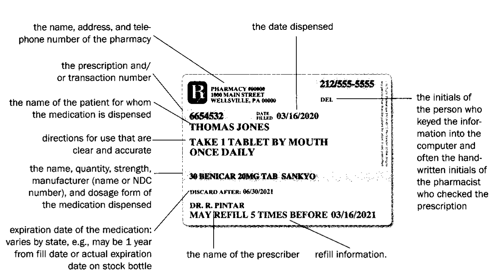
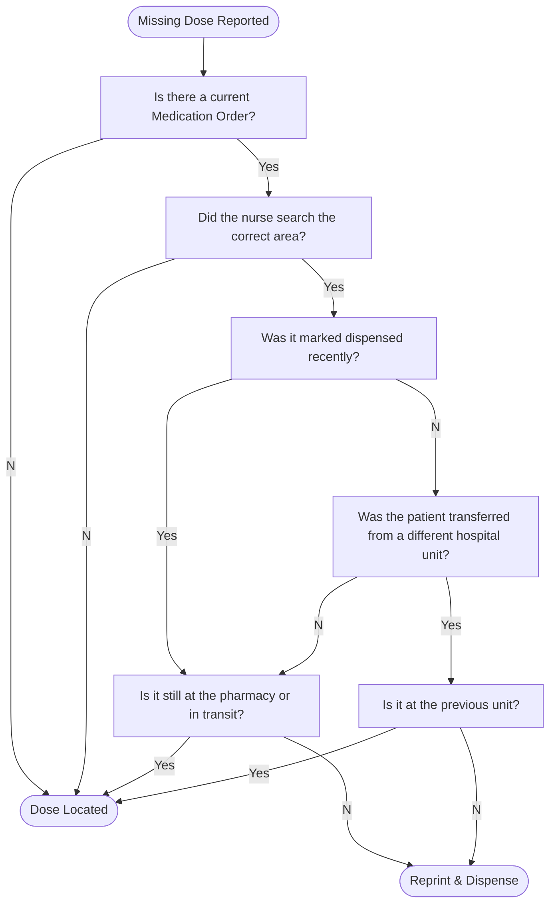

# 🛠️ SOP - Filling Prescriptions & Orders

## 🔑 Objectives

- Ensure accuracy of medication selection, labeling, and documentation  
- Minimize waste by prioritizing inventory with the shortest remaining shelf life  
- Maintain compliance with labeling and packaging standards  
- Support safe dispensing through barcode scanning and pharmacist oversight

> 🧑‍⚕️ All prescriptions must undergo a **final verification by a licensed pharmacist** prior to being released to the patient. This SOP applies to routine prescription fills in a **retail setting**, excluding compounding, liquids, unit-dose packaging, and hazardous drug handling.

## 🛠️ Procedure

### 1. 📋 Pre-Fill Preparation

<!-- todo add triage step from rx_intake.md-->

#### 1.1 Prescription Intake

- Verify that the prescription has been:
  - Entered correctly into the dispensing software
  - Reviewed for legibility, completeness, and legal validity
  - 📌 Intake verification by pharmacist may be skipped if delay in administration would harm the patient (i.e. emergency STAT orders).
- Print the **prescription pamphlet** containing patient and drug details

> 📌 Whenever the system flags drug interactions or allergy conflicts, alert the pharmacist so that they may make a clinical decision on it.

#### 1.2 Product Retrieval

- Match the medication by the **11-Digit NDC** as listed in the software
  - 🔗 [Further Explanation of NDC system](../law/packaging_labeling.md#drug-listing-act-1972)
- Follow this inventory prioritization sequence:
  1. ✅ **Returned-to-stock** vials (oldest first)
  2. ✅ **Opened** stock bottles that are unexpired
  3. ✅ **Unopened** stock bottles closest to expiration
- Mark newly opened stock containers appropriately (e.g. stickered as "OPENED" or crossed with a marker)

> 📌 Double-check the 11-Digit NDC (drug name, strength, and dosage form) during selection. Mistakes here cascade forward.

### 2. 🧪 Verification and Labeling

#### 2.1 System Scanning

- Scan the barcode on:
  - The **prescription pamphlet**
  - The **stock bottle** (2D barcode) or **vial** (1D barcode)
- Confirm that the scanned item matches the system’s selected 11-Digit NDC
  - the computer system will alert you if an error has occurred

#### 2.2 Label Printing

- Generate and print:
  - Prescription label
  - **Auxiliary labels** (per system prompts)
    - 📌 these identify important usage information; including specific warnings or alerts on administration, storage, side effects, and food or drug interactions
- Ensure label includes:
  - Patient name
  - Medication name and strength
  - Directions for use
  - **Prescriber name**
  - Quantity and refill count
  - Prescription number and pharmacy details

> 📌 If the patient’s language preference is on file, ensure language-appropriate labeling where available.

### 3. ⚖️ Portioning & Packaging

Medications must be dispensed in patient-ready form. The exact procedure depends on the product type.

> 🛡️ If multiple packages or pill bottles are used to fill a prescription, make sure to mark the quantity per bottle and the amount of bottles per set (e.g. #90 2/3).

#### 3.A Repackaged Medications

Most bulk medications must be counted or measured and **repackaged** from stock bottles into labeled vials or bottles.

🔢 **Counting Solid Dosage Forms**:

- Identify and retrieve an **appropriately sized vial**
- Match the count precisely to the prescription via:
  - ⚖️ Pill counting scales  
  - 🤖 Automated pill counters
  - ✋ Manual counting
    - Pour medication onto a **clean counting tray**
    - Use **count-by-5** unless the quantity is small or requires verification

🔢 **Measuring Liquid Dosage Forms**:

- Use a bottle **larger than the volume to be dispensed**
- Pour an accurate volume from the stock container  
  - 📌 Slight overfill is acceptable but should not be wasteful

📦 **Bottling & Sealing**:

- Use a **child-resistant safety cap** unless:
  - An easy-open cap is **requested and documented**
  - The drug is **exempt from child-resistant packaging**
  - 🔗 See [PPPA (1970)](../law/packaging_labeling.md#poison-prevention-packaging-act-pppa-1970) for details
- Immediately return surplus to the **original stock container**
- 📎 Affix:
  - Prescription label
  - Auxiliary & warning stickers

> 🛡️ **Never combine** medications from different lots or manufacturers in one container.

#### 3.B Automated Filling Machines

Some prescriptions are filled and packaged automatically using high-speed dispensing machines.

⚙️ **Operation & Maintenance**

- Technicians are responsible for:
  - Restocking inventory into machine cells
  - Refilling vials, caps, and labels
  - Cleaning and maintaining the machine regularly
- Machines typically count and label medications into patient-ready vials

> 📌 All machine-filled prescriptions must still be **checked by the pharmacist** before moving to the pickup bin.

#### 3.C Prepackaged Medications

Prepackaged items such as **unit doses** or **dry suspensions** must typically be dispensed in their **original containers**.

🏷️ **Labeling Guidelines**

- Do **not obstruct** critical identifiers:
  - QR codes
  - 11-Digit NDC
  - Lot number
  - Expiration date
  - 📌 Boxes may have designated sticker zones
- Prepare the label:
  - **Fold the sticker** at ~2/3 its length to create a pull tab in case it needs to return to stock  
  - If folding is not feasible (package too small):
    - Place the item in a **labelled bag**
    - The bag may be discarded if returned to stock
- 📎 **Apply to Packaging**
  - Prescription label
  - All required auxiliary and warning stickers

🥤 **For Suspensions**

<!-- - Place labeled bottle into a "Mix" bag -->
- Use the volume of distilled water indicated on the stock bottle
  - Measure using a **graduated cylinder**
  - Pour into the bottle and **shake well**
- Delay reconstitution until **pickup**, when possible
  - 📌 Water shortens the product's shelf life
- Some pharmacies use automated units (e.g. **Fillmaster**) to:
  - Dispense exact water volume
  - Add flavoring if desired

> For IV medications, provide a final filter for the nursing staff to use upon administration

### 4. 🧑‍⚕️ Final Review & Documentation

#### 4.1 Product Verification

- Place prepared prescription and pamphlet in the **verification queue**
- **Pharmacists typically verify** the final product & paperwork:
  - original prescription
  - No potential interactions or contraindications on patient profile
  - Product matches the label and 11-Digit NDC
  - Proper quantity and packaging
  - Clarity and correctness of directions
- **Telepharmacy:** In some states, a technician may send an image or video of the prepared medication to the pharmacist for remote verification
- **Tech-Check-Tech:** At least 9 states allow specially trained pharmacy technicians to check medication prepared by another technician **in a hospital setting**
  - Each state has specific training and auditing requirements

#### 4.2 REMS Compliance

- 📰 If the drug requires a **Patient Package Insert (PPI)**, requires a **MedGuide**, or is subject to a **REMS program**:
  - Pharmacist prints the PPI/ MedGuide and attaches it to the bag
  - Document compliance with REMS (e.g. isotretinoin, mifepristone)

> 🧾 These materials must be included **every time** the medication is dispensed, including refills.

### 5. ✅ Stage for Pickup or Handoff

- Bag the completed, verified prescription
- Label the bag with patient information for easy retrieval
- File alphabetically by **patient last name** on the pickup shelf
- Return the prescription pamphlet to its proper storage area or filing system per site policy

### 6. 📦 Making Rounds (Inpatient)

Technicians make hourly roundtrips to all nursing stations

During these rounds, technicians may:

- deliver prepared medications
- pick up medication returns and credit them to a patient

> 🔐 Receipt of controlled substances must be witnessed by someone on the nursing unit

#### Missing Doses

Missing Doses are medications that should have already been delivered to the nursing unit, but cannot be located.

> Make sure to notify the pharmacist that a dose went missing

## 🛡️ Best Practices

- Always verify expiration dates and lot integrity  
- Never substitute manufacturers without pharmacist approval  
- Use only **current auxiliary label templates**  
- If a mismatch or system error is suspected: **STOP** and alert the pharmacist  
- Document anomalies or overrides thoroughly for audit readiness  
