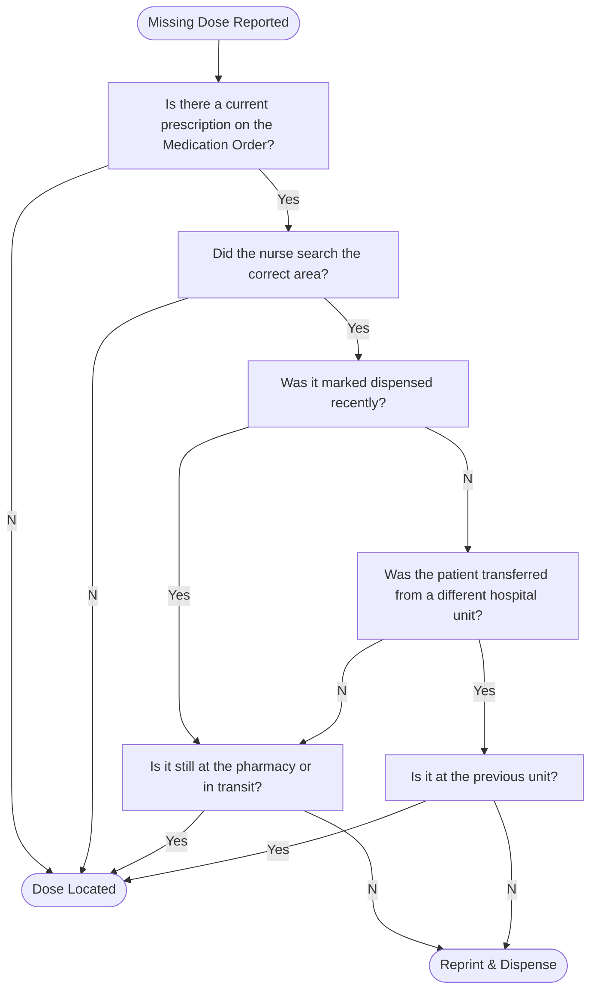

# 🛠️ SOP — Filling Prescriptions

## 🔑 Objectives

- Ensure **accurate** medication selection, labeling, and documentation  
- Minimize **waste** by prioritizing inventory with the shortest remaining shelf life  
- Maintain compliance with **state, federal, and internal labeling standards**  
- Support safe dispensing through **barcode scanning** and **pharmacist oversight**  
- Standardize workflow for **retail outpatient** and **inpatient** settings  

> 🩺 All prescriptions must undergo **final pharmacist verification** before release to the patient. This SOP excludes compounding, hazardous drugs, and unit‑dose packaging.

---

<!-- todo: go about explaining the logic of queues - typing, check, fill, verification, will call/ delivery -->

## 1. 📋 Pre‑Fill Preparation

### 1.1 Prioritization

#### 🏥 Outpatient Prescriptions

- **Waiters:** Patient is present in the pharmacy.  
  - Advise a **15‑minute wait** unless otherwise directed.  
- **Scheduled Deliveries:** Prioritize based on **cutoff times** and **route schedules**.  
  - Ask supervisor for daily high‑priority items.  
- **Pickup Queue:** Standard priority; process in order received unless safety concerns arise.

#### 🏨 Inpatient Medication Orders

Patient situations evolve rapidly in these environments. Before proceeding, check to see if any treatments have been discontinued with **STOP** orders. Otherwise, prioritize fills in this order.

1. 🚑 **STAT Orders**: Medications needed **right now**; to be treated like waiters
2. 🎟️ **Admission Orders**: Initial orders for new admissions.  
3. 😵‍💫 **PRN Orders**: “As needed” medications.  
4. ⏰ **Standing Orders**: Scheduled, routine doses.

### 1.2 Prescription Inspection

- Confirm the prescription is:
  - Entered correctly in the dispensing system  
  - Legible, complete, and legally valid  
  - Reviewed for clinical flags
    - 📌 **DUR Warnings** are an alert notifying the pharmacist of a potential drug safety (**interactions or allergies**) or billing concern
    - Notify the pharmacist immediately and do not skip

> 🩺 Pharmacist intake may be skipped **only** when delay would harm the patient (e.g., emergency STAT orders).

### 1.3 The Printing Process

1. Select **ALL** Prescriptions for the same patient
   - Check Typing & "RPh Check" Queue for any unprocessed prescriptions
   - Wait for all prescriptions to be ready before printing
   - tip: use shift+click to select multiple items
2. Inspect the Printed Label for the following
   - Pharmacy Contact:
     - [ ] Pharmacy Name
     - [ ] Address
     - [ ] Telephone Number
   - Patient Identifiers:
     - [ ] Patient name
     - [ ] Address
   - Prescriber Identifiers:
     - [ ] **Prescriber name**
   - Adjudication Details:
     - [ ] Prescription Number
       - [ ] (optional) Transaction Number
       - note: Appears on the same line as [RxNumber]-[TxNumber]
     - [ ] National Drug Code (NDC)/ Drug Identification Number (DIN)
     - [ ] Refill Information
   - Dispensing Details:
     - [ ] Data Entry Tech Initials
     - [ ] Filling Tech Initials
     - [ ] Fill Date (also called "Date Dispensed")
     - [ ] Expiration Date
       - Date on Stock Bottle or 1 Year from Fill Date
     - [ ] Space for Pharmacist Initials
       - Handwritten during verification
   - Prescription Details:
     - [ ] Inscription
     - [ ] Signa
     - [ ] Quantity
3. Bundle printed materials into a color-coded bin
   - [ ] Place all printed prescriptions inside
   - [ ] Check printer tray for, automatically printed **Medication Guides & Patient Package Inserts (PPIs)**. These always have prescription numbers attached.
   - [ ] Include **Auxiliary Labels** that identify important usage information; like specific warnings or alerts on administration, storage, side effects, and food or drug interactions
     - 🔐 **Controlled Medication** requires the label "Caution: Federal law prohibits the transfer of this drug to any person other than the patient for whom it was prescribed"

---

## 2. 🧪 Selection and Labeling

### 2.1 System Scanning

- Scan:
  - Prescription pamphlet  
  - Stock bottle (2D barcode) or vial (1D barcode)  
- Confirm the scanned NDC matches the system selection
  - the computer system will alert you if an error has occurred

### 2.2 Product Retrieval

- Match the medication using the **11‑Digit NDC** in the system  
  - 🔗 [Further Explanation of NDC system](../law/packaging_labeling.md#drug-listing-act-1972)
  - 📌 Double‑check NDC, strength, and dosage form. Errors here cascade forward.
- Follow inventory priority:
  1. **Returned‑to‑stock** vials (oldest first)  
  2. **Opened** stock bottles (unexpired)  
  3. **Unopened** bottles closest to expiration  
- Mark newly opened bottles (“OPENED” sticker or marker slash)

> 📌 **Tall Man Lettering** is the use of uppercase letters to distinguish unique parts of a drug's name to help avoid errors due to look-alike names (e.g., hydr**OXY**zine vs. hydr**ALA**zine)

---

## 3. ⚖️ Portioning & Packaging

Medications must be dispensed in patient-ready form. The exact procedure depends on the product type. However, all labels must be:

- Easily Located
  - [ ] placed parallel to the container edges
  - [ ] (state-dependent) placed on the actual container rather than packaging
- Easily Read
  - [ ] (irregular packaging) placed on vials containing small droppers or injection vials
  - [ ] (optional) place transparent tape over label to prevent smudging or spills
- Labeled Appropriately
  - [ ] Including all required auxiliary labels

> 🛡️ If multiple packages or pill bottles are used to fill a prescription, make sure to mark the quantity per bottle and the amount of bottles per set (e.g. #90 2/3).

### 3.A Repackaged Medications

Most bulk medications must be counted or measured and **repackaged** from stock bottles into labeled vials or bottles.

🔢 **Counting Solid Dosage Forms**:

- Identify and retrieve an **appropriately sized vial**
- Match the count precisely to the prescription via:
  - ⚖️ Pill counting scales  
  - 🤖 Automated pill counters
  - ✋ Manual counting
    - Pour medication onto a **clean counting tray**
    - Use **count-by-5** unless the quantity is small or requires verification

🔢 **Measuring Liquid Dosage Forms**:

- oral solutions and suspensions must be shaken thoroughly before portioning
- Use a bottle **larger than the volume to be dispensed**
- Pour an accurate volume from the stock container  
  - 📌 Slight overfill is acceptable but should not be wasteful

📦 **Bottling & Sealing**:

- Use a **child-resistant safety cap** unless:
  - An easy-open cap is **requested and documented**
  - The drug is **exempt from child-resistant packaging**
  - 🔗 See [PPPA (1970)](../law/packaging_labeling.md#poison-prevention-packaging-act-pppa-1970) for details
- Immediately return surplus to the **original stock container**
- Affix:
  - Prescription label
  - Auxiliary & warning stickers

> 🛡️ **Never combine** medications from different lots or manufacturers in one container.

### 3.B Automated Filling Machines

Some prescriptions are filled and packaged automatically using high-speed dispensing machines.

⚙️ **Operation & Maintenance**

- Technicians are responsible for:
  - Restocking inventory into machine cells
  - Refilling vials, caps, and labels
  - Cleaning and maintaining the machine regularly
- Machines typically count and label medications into patient-ready vials

> 🩺 All machine-filled prescriptions must still be **checked by the pharmacist** before moving to the pickup bin.

### 3.C Prepackaged Medications

Prepackaged items such as **unit doses** or **dry suspensions** must typically be dispensed in their **original containers**.

🏷️ **Labeling Guidelines**

- Do **not obstruct** critical identifiers:
  - QR codes
  - 11-Digit NDC
  - Lot number
  - Expiration date
  - 📌 Boxes may have designated sticker zones
- Prepare the label:
  - **Fold the sticker** at ~2/3 its length to create a pull tab in case it needs to return to stock  
  - If folding is not feasible (package too small):
    - Place the item in a **labelled bag**
    - The bag may be discarded if returned to stock
- **Apply to Packaging**
  - Prescription label
  - All required auxiliary and warning stickers

> 📌 Expensive, Brand Name medications should be protected with transparent tape over the sticker zone to allow it to be returned to stock

---

## 4. 📎 Bundled Items

### 4.1 Ancillary Supplies

Ensure all required ancillary supplies are included per pharmacy policy and based on medication type:

- **Education Materials:** medication guides, VIS sheets, device quick‑start instructions
  - 📌 usually printed **automatically** along side patient prescription labels
- **Oral Medications:** dosing cups, oral syringes, adapter caps, child‑resistant or non‑CR caps  
- **Topical/Otic/Ophthalmic:** applicator tips, cotton pads, dropper guides
- **Respiratory:** spacers, pediatric mask attachments, inhaler instruction cards  
- **Temperature‑Sensitive Medications:** insulated bags, ice packs, storage instructions  
- **Wound Care Adjuncts:** non‑stick pads, medical tape, antiseptic wipes  
- **Injectable/Parenteral:** alcohol pads, gauze, bandages, sharps containers, syringe caps

> 📌 **Intravenous Medications**: Make sure to include a **final filter** for nursing staff to use during administration

---

## 5. 🧑‍⚕️ Product Verification

- Place prepared prescription and pamphlet in the **verification queue**
- **Pharmacists typically verify** the final product & paperwork:
  - original prescription
  - No potential interactions or contraindications on patient profile
  - Product matches the label and 11-Digit NDC
  - Proper quantity and packaging
  - Clarity and correctness of directions

### Telepharmacy

In some states, a technician may send an image or video of the prepared medication to the pharmacist for remote verification

### Tech-Check-Tech

At least 9 states allow specially trained pharmacy technicians to check medication prepared by another technician **in a hospital setting**

> Each state has specific training and auditing requirements

### REMS Compliance

These materials must be included **every time** the medication is dispensed, including refills

- 📰 If the drug requires a **Patient Package Insert (PPI)**, requires a **MedGuide**, or is subject to a **REMS program**:
  - Pharmacist prints the PPI/ MedGuide and attaches it to the bag
  - Document compliance with REMS (e.g. isotretinoin, mifepristone)

---

## 6. ✅ Stage for Pickup or Handoff

- Bag the completed, verified prescription
- Label the bag with patient information for easy retrieval
- File alphabetically by **patient last name** on the pickup shelf
- Return the prescription pamphlet to its proper storage area or filing system per site policy

### 6.1 Reconstituting Lyophilized Medication (Inpatient)

🥤 **Dry Suspensions & Solutions** must be reconstituted before the nursing unit receives them.

**Reconstitution** is addition of water or other dileuent to commercially made drug bottles or vials in order to make a solution or suspension from a premade powder form of the drug; may include oral or parenteral products

#### Reconstitution Steps

- Follow printed manufacturer instructions.  
- Measure diluent using a **graduated cylinder**.  
- Add diluent to the bottle and **shake well**.  
- Automated systems (e.g., **Fillmaster**) may be used for:  
  - Accurate water measurement  
  - Optional flavoring  

#### Dating Requirements

Water shortens the product's shelf life so they must have the following dates:

- **Reconstitution Date:** When water was added  
- **Beyond‑Use Date (BUD):** Typically **10–14 days** after reconstitution

---

## 7. 📦 Making Rounds (Inpatient)

Technicians make hourly roundtrips to all nurses' stations

During these rounds, technicians may:

- deliver prepared medications
- pick up medication returns and credit them to a patient

> 🔐 Receipt of controlled substances must be witnessed by someone on the nursing unit

### Missing Doses

Missing Doses are medications that should have already been delivered to the nursing unit, but cannot be located.

> Make sure to notify the pharmacist that a dose went missing

---

## 🛡️ Best Practices

- Always verify expiration dates and lot integrity  
- Never substitute manufacturers without pharmacist approval  
- Use only **current auxiliary label templates**  
- Document anomalies or overrides thoroughly for audit readiness  
- If a mismatch or system error is suspected: **STOP** and alert the pharmacist  
