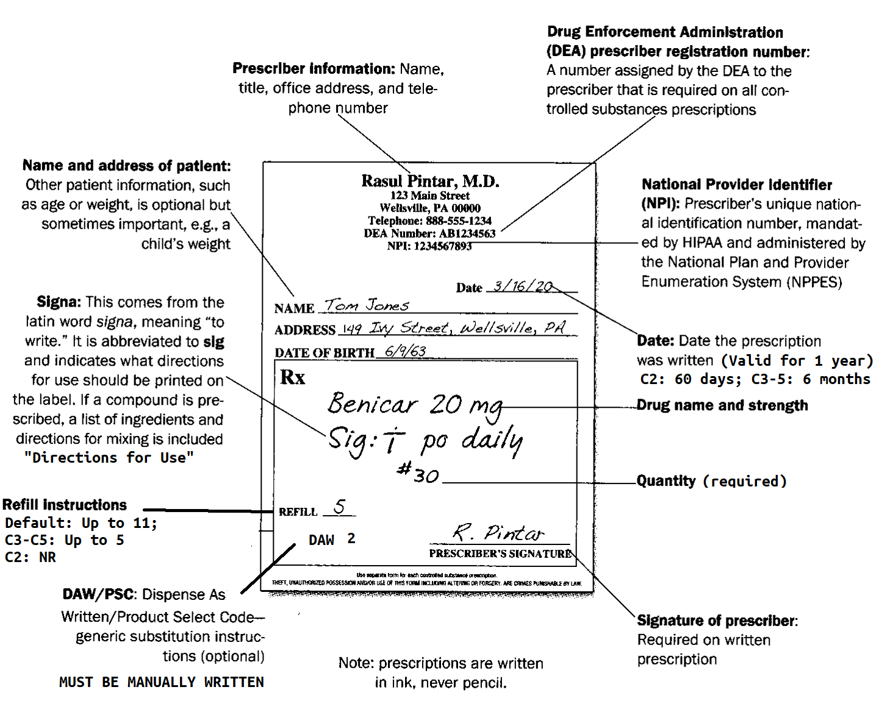
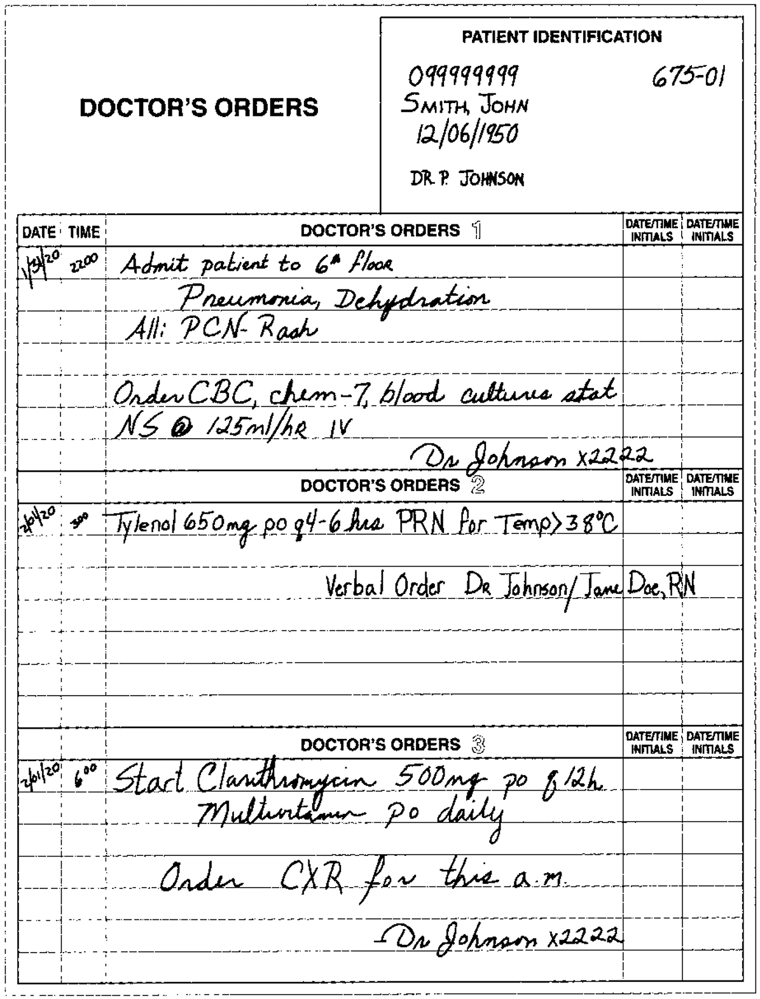

# 🛠️ SOP - Prescription Intake & Order Entry

Prescriptions and medication orders are instructions from a licensed medical practitioner that authorize the provision of a drug or device to a patient.

- **Medication Order**: A written or transcribed (verbal/telephone) order issued in an **inpatient** setting (e.g., hospital).
- **Prescription**: A medication order written on a prescription blank to be filled in an **outpatient/ambulatory** setting.

New prescriptions may be submitted by:

- 📝 Handwritten forms (often for controlled substances)  
- 📠 Faxed prescriptions  
- ☎️ Verbal orders (received directly by the pharmacist; entered by technicians after being transcribed into hard copy)  
- 🧾 E-scripts through HIPAA-compliant Electronic Data Interchange (EDI); must be printed

> 📠 For accuracy and improved record keeping, many pharmacies scan the hard copy of prescriptions into the pharmacy dispensing system on top of filing them.

## 🗂️ Step 1: Check for Required Elements

Before processing, the pharmacy technician must review prescriptions for completeness and authenticity.

### ✅ Required Elements for Prescriptions

- **Prescriber Information**
  - Full name, title, office address, phone number
  - **Prescriber NPI**: National Provider Identifier (HIPAA-mandated; managed by NPPES)
  - **DEA Number** *(Controlled Substances Only)*: Valid and required on any controlled drug prescription
  - 🐻 **California Law**
    - **Prescriber License Type** *(Controlled Substances Only)*: (e.g., MD, DO, DDS)
- **Patient Identifiers**
  - **Required**: Full name and address
  - **Optional**: Date of birth and weight (especially for pediatrics)
- **Order Details**
  - **Date Written**: The date the prescriber issued the prescription (e.g., MM/DD/YYYY)
    - 🐻 **California Law**: *must be filled within 6 months*
  - **Inscription** (drug name, strength, dosage form, quantity)
  - **Signa (Sig)**: Complete instructions for use
  - **Refill Instructions**: Number of refills permitted
  - **Product Selection Code (Optional)**: Product selection code to indicate if substitution is allowed; default 0 (generic substitution allowed)
    - 🔗 [Further Explanation](../ref/product_selection.md)
    - 🐻 **California Law**: Prescriber must write “Do Not Substitute” in their own handwriting to prohibit substitution (per BPC §4073)
- **Prescriber Signature**
  - Must be **manual (wet ink)** for paper prescriptions.
  - Must be **digitally signed and transmitted through a certified e-prescribing system** for electronic prescriptions.
    - 🐻 **California Law**: Prescriptions for controlled substances must be issued on a **California Security Prescription Form** if not e-prescribed.

> ⚠️ **Controlled Substances must be transmitted electronically** unless exempt (e.g., system outages, veterinarian, terminal illness). Refer to BPC §688 and the 21st Century Cures Act.

## ⚠️ Pre-Entry Checklist

- Patient allergies
- Current medications
- Insurance changes or eligibility issues
- Clinical red flags
- Prescription legibility and security features (for written Rxs)

> ⚠️ **Technicians must not take verbal prescriptions or clarify orders.** Always refer unclear or incomplete orders to the pharmacist.

### 🏥 Inpatient Medication Orders

In hospital settings, medication orders require additional fields:

- **Patient Hospital ID** & Room/Bed number
- **Indication for Use**: Diagnosis or symptom
- 🐻 **California Law**
  - **Prescriber Signature**
    - **Non-Controlled Verbal Orders**: Must be signed by the prescriber within **48 hours** (Title 22, §70747)
    - **Controlled Substances (CII Emergency)**: See emergency protocol below

> ⚠️ **Schedule II Controlled Substances cannot be ordered verbally**, except in **bona fide emergencies** and **only by a prescriber**. In such cases, a **follow-up prescription** must be:
>
> - **Written**
> - **Dated**
> - **Counter-signed by the prescriber**
>
> and must include:
>
> - the ***EXACT*** phrase: **"Authorization for Emergency Dispensing"**
> - the **date of the oral order**
>
> This written prescription must be received by the pharmacy **within 7 days** of the oral authorization.
>
> If the prescriber fails to provide the written prescription within this timeframe, the pharmacist must **notify the DEA** (21 CFR §1306.11(d); CCR §1745).
>
> 🐻 **Faxed Schedule II Prescriptions**: May serve as the original prescription **only if**:
>
> - The patient is a resident of a **Long-Term Care Facility (LTCF)**
> - The prescription is for a **hospice patient** (must be noted on the face of the Rx)
> - The prescription is for a **compounded product** for direct administration (e.g., IV infusion)
>
> 🐻 **Partial Fills of Schedule II Drugs**:
>
> - Permitted if requested by patient or prescriber
> - The remaining portion must be filled within **30 days** of the original prescription date (21 CFR §1306.13)

### Verification Process

1. **Positive ID**: Confirm patient identity using hospital ID and wristband.
2. **Cross-Reference**: Scan the patient’s EMR for contraindications or duplication.
   - Alert pharmacist to any red flags, allergies, or discrepancies.
3. Only proceed with entry **after pharmacist review and approval**, unless using **automated medication systems** with pre-approved protocols. Verify system scope and tech privileges per facility policy.

## 🕵️‍♀️ Step 2: Detecting Forgery & Tampering

Technicians are responsible for flagging suspicious prescriptions before processing, especially for controlled substances.

### Common Signs of Forgery

- **Tampering**: Erasure, overwriting, or altered quantities/directions
- **Theft**: Use of stolen preprinted prescription pads
- **Mismatch**: Inconsistent handwriting or ink color, unusual instructions
- **Discretion**: Quantities unusually high for diagnosis
- 🐻 **California Law**
  - Lack of CA-required security features (e.g., watermark, checkboxes, thermochromatic ink)

> ⚠️ **Always validate DEA numbers for controlled substances**. Use automated tools or manual checksum methods.

🔗 ([DEA Number Verification](../math/dea_numbers.md))

## ✍️ Step 3: Translating the Signa (Sig)

The signa (the "sig") can be best described as `instructions for use` is almost always heavily abbreviated and pharmacy techs are often required to transcribe them for computer entry.

🔗 ([Sig Translation Guide](../ref/sig_translation.md))

## 📱 Step 4: Calculating Days Supply

The Days Supply refers to how long a prescription will last based on the quantity dispensed and the prescribed dosing instructions. This is used by insurers to determine refill eligibility during adjudication.

🔗 ([Days Supply Calculation Guide](../math/days_supply.md))

## 💻 Step 5: Claim Submission & Adjudication

After prescription entry, claims must be submitted accurately to insurance.

### Patient & Insurance Information

- **Cardholder/Member ID**: Unique ID number for the patient’s insurance cardholder/member.
- **Group Number/ RXGROUP**: The group number associated with the patient's insurance plan.
- **Patient Identifiers**: Patient Name, Birth Date, Sex
- **Relationship Code**: The patient’s relationship to the cardholder (e.g., C=cardholder, S=spouse, D=dependent, O=other).

### Prescription Data

- **Date Written**: The date when the prescription was originally written by the prescriber.
- **Product Selection Code**: Dispense As Written code indicating product selection rules.
- **Days Supply**: The number of days the medication is expected to last based on the dosage.
- **Prescriber ID Number**: Unique ID number for the physician who prescribed the medication.

### Dispensing Data

- **New or Refill**: Indicates if the prescription is new or a refill.
- **Pharmacy ID/ NPI**: Unique pharmacy identifier or National Provider Identifier (NPI) for the dispensing pharmacy.
- **Date Dispensed**: The date when the prescription was dispensed to the patient.
- **Quantity Dispensed**: The amount or quantity of the medication dispensed to the patient.
- **11-Digit NDC**: National Drug Code identifying the medication dispensed.

### Pricing Information

- **Ingredient Cost**: The cost of the medication’s active ingredients.
- **Dispensing Fee**: The fee charged by the pharmacy for dispensing the medication.
- **Total Price**: Total amount charged for the prescription (ingredient cost + dispensing fee).
- **Copay/Deductible**: The portion of the cost the patient is responsible for, based on their plan.
- **Balance Due**: The remaining balance due after insurance payment and copay/deductible.

> ⚠️ **Double-check all billing fields. Incorrect DAW codes, expired refills, or wrong days supply can trigger audits or denials.**

### 🛑 Common Third-Party Rejections & Resolutions

A Third-Party Rejection (TPR) occurs when a prescription claim is denied by the PBM or insurer. These denials appear with a reject code and an associated message.

> ⚠️ **Important**: Never override rejection codes or make clinical decisions. Always escalate unresolved issues or unclear messages to the pharmacist.

| Reject Code | Reason | Resolution |
|-------------|--------|------------|
| 70 | NDC Not Covered | Use formulary alternative or request PA |
| 75 | Prior Authorization Required | Start PA process per plan requirements |
| 76 | Plan Limitations Exceeded | Verify day supply, quantity, duration |
| 79 | Refill Too Soon | Confirm last fill date; resubmit later |
| 25 | Invalid Birth Date | Recheck DOB with patient or insurer |
| 26 | Invalid Person Code | Confirm relationship to cardholder |
| 41 | Invalid Cardholder ID | Verify and update insurance information  |

> 📌 **Tech Tip**: Always verify **BIN/PCN/ID** against the latest insurance card. Incorrect values will route claims to the wrong PBM, resulting in instant rejections.

#### 📝 Prior Authorization (PA)

A **Prior Authorization (PA)** is a formal approval process required by insurance companies or PBMs before they will pay for certain prescriptions. A PA TPR is triggered when the insurer needs clinical justification for covering a drug that falls outside standard coverage rules.

> 📌 Some prescription drugs can still be purchased without insurance if the patient pays out-of-pocket.

🔑 **Common Reasons a PA Is Required**:

- **Non-formulary drugs**
- **Brand-name drugs** when generics are available
- **High-cost or specialty medications**
- **Drugs with step therapy requirements**
- **Medications flagged for safety concerns** (e.g., opioids, biologics)

> 🚨 These rules are set by PBMs and insurers—not by the pharmacy.

##### 🧾 PA Workflow

Pharmacy technicians may assist the pharmacist with the following PA tasks:

1. **Identify the rejection**
   - Look for `reject code 75` or `PA Required` messages.
   - Verify that the patient has no alternative coverage.
2. **Notify the pharmacist**
   - Pharmacist must confirm if a PA is appropriate or if a formulary alternative is preferred.
3. **Assist with documentation**
   - Gather relevant prescription data, insurance info, and rejection messages.
   - Help collect clinical data (e.g., diagnosis, trial history) from prescriber’s office.
4. **Submit PA request**
   - May use electronic PA (ePA) tools, insurer web portals, or fax forms (under pharmacist supervision).
   - Track submission and document status in the patient’s profile.
5. **Inform the patient**
   - Set clear expectations: PA approval typically takes **1–3 business days**.
   - Encourage follow-up with the prescriber for urgent requests.
   - 🛡️ Always inform the pharmacist immediately if the medication is urgently needed or if the patient is in distress.
6. **Resolving Denials**
   - The **pharmacist** may:
     - Notify the prescriber to review insurer notes and appeal if appropriate.
     - File an appeal or exception request, often requiring updated clinical documentation.
   - The **technician** may:
     - Assist in identifying the reason for denial.
     - Recheck documentation and ensure nothing was missed.
     - Track appeal submissions and timelines, but pharmacists handle clinical portions.
     - 🛡️ Appeals are time-sensitive. Always escalate denials immediately to the pharmacist or billing specialist.

> 🛡️ Note date/time of PA submission, patient notification, and any escalation.
> .
> 🚨 PAs are **not required for emergency/life-threatening prescriptions** under federal rules, but this must be determined by the pharmacist.

###### 📲 PBM Portals

Pharmacy technicians commonly access PBM portals to:

- Check real-time claim status
- Review drug coverage, formulary tier, and PA requirements
- Confirm patient eligibility and copays
- View or download PA forms and status updates
- Troubleshoot error messages or incomplete PA submissions

> 📌 Portals may vary by PBM. Examples include CoverMyMeds, SureScripts, OptumRx, Express Scripts, CVS Caremark, and Medi-Cal Rx.

---

## 🐻 Special Considerations (California)

- **CURES Reporting** (CA’s PDMP): All Schedule II–IV drugs must be reported to CURES within 1 business day of dispensing. Pharmacists are required to consult CURES before issuing or filling most Schedule II–IV prescriptions.
  - 🔗 [More Information on Controlled Substances](../law/csa_cmea.md)
- **Medi-Cal Claims**: May require **Treatment Authorization Requests (TARs)** and submission of **diagnosis codes**.
- **Technician Documentation**: Technicians must document actions in accordance with facility SOPs (e.g., initials on data entry logs, audit trails, or EMR time-stamped entries).

> 🖇 Certified e-prescribing systems must retain digital logs for auditing, especially for controlled substances.

### 🚫 Technician Limitations (BPC §4115)

Technician scope of practice is governed by **California Law (BPC §4115)**. These limitations are **state-level** and apply in all California practice settings. Federal law defers technician-specific practice rules to state boards.

Technicians **must not**:

- Take verbal orders
- Make clinical judgments
- Perform final prescription verification
- Override DUR alerts or contact prescribers

Technicians **may**:

- Enter data from valid prescriptions
- Assist with claim processing and troubleshooting
- Notify pharmacists of issues or red flags

> ⚠️ When in doubt, stop and escalate to the pharmacist.

## ✅ Technician Field Readiness Checklist

- [ ] Familiar with CA prescription security and eRx rules
- [ ] Can identify complete vs incomplete prescriptions
- [ ] Can translate and enter sigs accurately
- [ ] Understands technician scope of practice
- [ ] Can calculate days supply and flag inconsistencies
- [ ] Knows when to refer to pharmacist (DUR, forgery, unclear orders)
