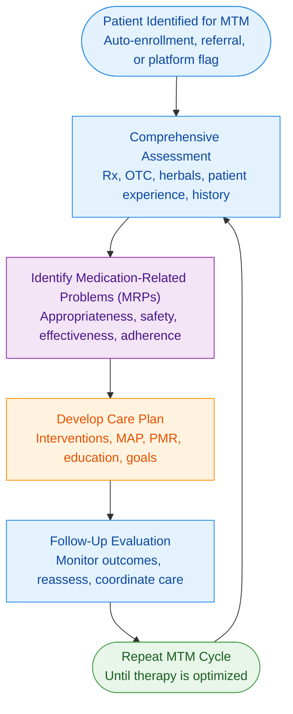

# Medication Therapy Management (MTM) Protocols

## Definitions

### Medicare Modernization Act (MMA, 2003)

The MMA established Medicare **Part D**, an optional drug benefit program. It sets guidelines for, and relies on, private **Prescription Drug Plans** (PDP) companies to provide prescription drug coverage for eligible individuals, which each have their own formularies.

It also requires pharmacists to provide **Medication Therapy Management (MTM)** services, for eligible Medicare Part D beneficiaries, to optimize therapeutic outcomes while minimizing adverse events.

### 💊 Medication Therapy Management (MTM)

**Medication Therapy Management (MTM)** is a set of **clinical, patient‑centered services** provided by pharmacists to optimize medication use, improve therapeutic outcomes, and reduce medication‑related problems (MRPs).

MTM programs are designed for patients who are at **high risk for medication‑related complications**, typically due to **multiple chronic diseases**, **polypharmacy**, and **high annual drug costs**.

> 10% of patients are responsible for 70% of healthcare spending. MTM Services save about $5 for every dollar spent.

#### 🦅 CMS‑Required MTM Eligibility Criteria

To qualify for MTM, a Medicare Part D beneficiary must meet **all three** CMS criteria. Plans may set thresholds within CMS‑approved ranges.

1. **Multiple Chronic Diseases**  
   - Plans may require **2–3 chronic diseases**. Most plans choose **3**.
   - some covered conditions include:
     1. **Hypertension (HTN)**  
     2. **Heart Failure (HF)**  
     3. **Diabetes Mellitus (DM)**  
     4. **Dyslipidemia / Hyperlipidemia**  
     5. **Respiratory Disease** (Asthma, COPD)  
     6. **Bone Disease / Arthritis** (Osteoporosis, RA)  
     7. **Mental Health Conditions** (Alzheimer's, Depression, Schizophrenia, Bipolar)  
     8. **End‑Stage Renal Disease (ESRD)**  
     9. **HIV/AIDS**

2. **Multiple Part D Medications**
   - Plans may require **2–8 Part D medications**.  
   - Most plans choose **8 or more**.

3. **Annual Drug Costs Exceeding CMS Threshold**  
   - CMS sets a new threshold each year.  
   - Historically around **$4,000–$5,000/year**.  
     - 2024: **$4,935**  
     - 2025: **$5,330**

#### 💊 MTM‑Billable Services

##### 📃 **Comprehensive Medication Reviews (CMRs)**

A **full, structured, patient‑centered review** of *all* medications a patient is taking. CMRs are the cornerstone MTM service and always require **direct patient interaction**.

Done within 60 days of enrollment in Medicare Part D & annually to passively scan for issues. If active problems are identified, reviews are quarterly.

**Core Components**:

- 🩺 **Comprehensive assessment** of all medications a patient is taking; including prescriptions, OTCs, supplements, and herbals.
- 🔍 **Identification of Medication-Related Problems & Intervention**. Such as:  
- Side effects or safety concerns  
- Non‑adherence  
- Drug–drug or drug–disease interactions  
- Therapeutic duplication  
- Cost‑saving opportunities
- 🩺 **Medication Action Plan (MAP)**: A patient‑friendly list of recommended steps to improve therapy.
- 🩺 **Personal Medication Record (PMR)** Management: Maintaining an accurate list of all medications the patient uses.
- 🛡️ **Follow‑up and monitoring**; Ensuring therapy goals are met and MRPs are resolved.
- 🩺 **Care coordination**: Communicating with prescribers to clarify, adjust, or optimize therapy.
- 🦅 **Documentation and billing** according to federal MTM program standards  

##### 🎯 **Targeted Medication Reviews (TMRs)**

A **focused, issue‑specific intervention** identified by a payer, MTM platform, or clinical rule; done quarterly. Unlike CMRs, TMRs do **not** require a full medication review.

**Key Features**:

- 🎯 **Narrow scope**: one drug, one problem, or one clinical concern  
- 🩺 **Pharmacist evaluation**: Determines whether action is needed based on the flagged issue.
- 📨 **Optional outreach**: May involve contacting the patient or prescriber, but not always required.
- 🦅 **Documentation**: Must be completed in the MTM platform with any required follow‑up.
- 🛡️ **Goal‑driven**: Improves safety, adherence, cost‑effectiveness, or therapeutic outcomes.

##### 🩺 **Prescriber Consultations**

Pharmacist‑initiated communication to resolve therapy problems or optimize treatment.

Common reasons include:

- 💸 **Cost‑effective alternatives** (e.g., formulary changes, generic substitution)  
- 🔍 **Drug therapy problems** (interactions, duplications, contraindications)  
- 🛡️ **Safety concerns** (side effects, monitoring gaps, high‑risk meds)  
- 🎯 **Therapy optimization** (dose adjustments, regimen simplification)

##### 🧑‍⚕️ **Patient Consultations**

Direct counseling sessions focused on improving medication use and understanding.

Topics often include:

- 🔁 **Adherence support**: Strategies for missed doses, timing, or complex regimens.
- 📰 **Education on new or high‑risk medications**: Especially REMS drugs requiring PPIs.
- 🧪 **Monitoring requirements**: Labs, side effects, therapeutic goals.
- ♾️ **Disease State Management (DSM) for Chronic Conditions**: Reinforcing lifestyle, monitoring, and medication expectations.

##### 🐻 California-Specific MTM Notes

- Under **BPC § 4052.2**, **Advanced Practice Pharmacists (APh)** may independently provide MTM services.  
- Pharmacists may initiate/modify therapy under a **Collaborative Practice Agreement (CPA)**.  
- CA pharmacists frequently perform CMRs/TMRs for **health plan quality measures** (e.g., CMS Star Ratings).  
- 🐻 MTM services must comply with **California Confidentiality of Medical Information Act (CMIA)** and **HIPAA** privacy standards. Document storage and communication platforms must meet both state and federal privacy standards.

#### 🩺 Disease State Management (DSM)

Pharmacists provide **Disease State Management** services to help patients with chronic conditions understand and manage their illnesses. Common conditions include:

- Diabetes
- Hypertension
- Asthma
- Hyperlipidemia

DSM programs often involve patient counseling, medication adherence support, lifestyle education, and clinical monitoring.

⚖️ DSM is **not federally mandated**, but is commonly integrated into MTM programs and state Medicaid initiatives.

> 🛡️ HIPAA Requires all patient health information (PHI) obtained during Counseling, DSM, MTM services to be kept strictly confidential.

#### 🌐 Major MTM Platforms

Medication Therapy Management (MTM) services are often delivered through **online MTM platforms** that connect pharmacies, prescribers, and health plans. These systems allow technicians and pharmacists to document interventions, complete reviews, and bill for eligible services.

- **OutcomesMTM (Outcomes®)**: One of the largest MTM networks; integrates with many pharmacy systems.
- **RxTherapyManagement**: Focuses on clinical documentation, adherence outreach, and payer‑driven MTM programs.
- **Mirixa**: A long‑standing MTM platform used by many retail chains; supports CMRs, TMRs, and prescriber outreach.

---

## Personnel

### Pharmacists

Pharmacists are responsible for **clinical MTM functions**, including:

- Conducting **CMRs** and **TMRs**  
- Identifying and resolving **medication‑related problems (MRPs)**  
- Creating and updating **MAPs** and **PMRs**  
- Performing **prescriber outreach** and documenting clinical interventions  
- Providing **patient counseling**, DSM services, and education  
- Ensuring **CMS‑compliant documentation** and billing  
- Overseeing technician workflow related to MTM support tasks

#### Pharmacist Workflow

##### 1️⃣ Patient Identification & Enrollment

- Patient is **auto‑enrolled** by the Part D plan **or** referred by a provider/pharmacist.  
- Pharmacist reviews **eligibility criteria**, MTM platform alerts, and any **risk‑stratification flags** (polypharmacy, high‑risk meds, recent hospitalization, etc.).  
- Initial outreach is made to schedule a **CMR**.

##### 2️⃣ 🩺 Comprehensive Assessment

The pharmacist conducts a **whole‑patient medication assessment**, which includes:

- Reviewing **all medications**: prescription, OTC 💸, herbals, vitamins, supplements  
- Incorporating the **patient’s lived experience** with medications:  
  - What works  
  - What doesn’t  
  - What causes side effects  
  - What is too expensive  
- Gathering a **complete medication history**  
- Reconciling the **current medication list** with prescriber records, discharge summaries, and pharmacy fill history  
- Assessing:  
  - Indication  
  - Effectiveness  
  - Safety  
  - Adherence  

##### 3️⃣ 🔍 Identification of Medication‑Related Problems (MRPs)

The pharmacist evaluates the medication regimen for:

- **Appropriateness** (Is the medication indicated?)  
- **Effectiveness** (Is the dose achieving therapeutic goals?)  
- **Safety** (Side effects, interactions, duplications, contraindications)  
- **Adherence** (Gaps in refills, barriers, cost issues)  
- **Access issues** (Formulary restrictions, prior authorizations, high copays)  

##### 4️⃣ 🧩 Care Plan Development

The pharmacist creates an **individualized care plan**, based on patient need & prescriber goals, that includes:

- **Interventions** to resolve MRPs  
  - Dose adjustments (via prescriber)  
  - Safer alternatives  
  - Cost‑saving substitutions  
  - Adherence strategies  
- **Personalized patient education**  
  - How to take medications correctly  
  - What to monitor  
  - When to seek help  
- **Medication Action Plan (MAP)**  
  - Written in **patient‑friendly language**  
  - Lists actionable steps the patient agrees to  
- **Personal Medication Record (PMR)**  
  - Updated, accurate, reconciled list of all medications  
- **Measurable outcomes**  
  - BP goals, A1c targets, symptom reduction, adherence metrics  
- **Follow‑up plan**  
  - Frequency of TMRs  
  - Next CMR date  
  - Prescriber coordination timeline  

##### 5️⃣ 🔄 Follow‑Up Evaluation

The pharmacist performs ongoing follow‑up to:

- Evaluate **clinical outcomes**  
- Confirm **resolution of MRPs**  
- Reassess **adherence and safety**  
- Update MAP and PMR as needed  
- Coordinate with prescribers for unresolved issues  
- Repeat the MTM cycle **as often as needed** until therapy is stable and optimized  

### Technicians

Pharmacy technicians play a **supportive, non‑clinical role** in MTM programs.

They assist with workflow, documentation, and patient coordination, but **may not** perform clinical judgment tasks.

#### 🗂️ Administrative & Workflow Support

- **Scheduling MTM appointments** (CMRs, TMR follow‑ups)

- **Preparing documentation** for pharmacist review  
  (e.g., pulling med lists, insurance info, lab data if available)

- **Assisting with insurance or billing tasks**  
  (e.g., verifying coverage, gathering info for CMS‑1500 submissions)

#### 📋 Medication History & Reconciliation Support

Technicians may assist with **data gathering**, but **not clinical reconciliation**.

- Collecting **medication histories** from patients, caregivers, hospitals, or PCP offices  
- Obtaining **discharge summaries**, **diagnosis lists**, or **recent medication changes**  
- Compiling medication lists for pharmacist review

#### 🧰 Adherence & Patient Support

- Assisting patients with **adherence tools** (pillboxes, calendars, reminders)  
- Teaching patients **how to use** adherence aids  
- Monitoring adherence patterns during follow‑up calls and reporting to the pharmacist

#### 🧭 Care Coordination

- Helping patients **schedule provider appointments**  
- Facilitating communication between the pharmacy and external providers  
- Assisting with **medication assistance program (MAP)** paperwork

#### 🧾 MTM Program Support

- Managing **MTM billing paperwork** and supporting documentation  
- Uploading or organizing documents required by MTM platforms  
- Tracking **intervention deadlines** assigned by MTM platforms

#### 🛑 Scope Limitations (Critical)

🛡️🐻 **California technicians may NOT document clinical interventions.**

Technicians (in any state) may NOT:  

- Conduct CMRs or TMRs  
- Interpret lab values  
- Make therapy recommendations  
- Modify medication regimens  
- Provide clinical counseling  
- Complete MAPs or PMRs  

---

## Billing Requirements

The billing process for MTM and pharmacist‑provided clinical services is **not** the same as standard prescription billing. MTM billing flows through **medical benefit pathways**, not PBMs, and requires **medical‑style documentation**, time tracking, and CPT coding.

### 🧾 Payer Types

Pharmacist‑provided MTM services may be billed to:

- **Medicare Part D PDPs** (primary MTM payers)  
- **Medicare Advantage (MA‑PD) plans**  
- **Employer group health plans**  
- **State Medicaid programs** (varies by state; CA Medi‑Cal does *not* reimburse MTM CPT codes)  
- **Other state programs** (e.g., ADAP, county health programs)  
- **Patients directly** (cash‑pay MTM or DSM services)

### 🏥 Where Billing Must Occur

Most third‑party billing for pharmacist clinical services must be submitted through:

- A **registered pharmacy**  
- A **provider’s office** (e.g., physician or clinic)  
- A **health system billing department**

Pharmacists cannot independently bill Medicare unless recognized as providers under a supervising NPI.

### 🧾 CMS‑1500 Claim Form

The **CMS‑1500** is the **standard federal medical claim form** used to bill professional services, including MTM, to:

- Medicare Part B  
- Medicaid  
- Commercial insurers  
- Medicare Advantage plans

Pharmacies use CMS‑1500 for:

- **MTM services** (CPT 99605/99606/99607)  
- **Vaccinations** (G0008, G0009, G0010)  
- **DMEPOS supplies**  
- **Clinical services not billable through NCPDP**

### 📑 Required Supporting Documentation

PDPs and medical insurers typically require:

- MTM program elements (CMR, TMR, prescriber outreach)  
- Target population criteria  
- Time documentation (start/stop or total minutes)  
  - 🤯 Pharmacists are reimbursed for MTM at rates averaging **$1–$3 per minute** of consultation.
- Clinical notes (SOAP or platform‑generated)  
- MAP and PMR copies (for CMRs)  
- Intervention frequency and follow‑up documentation  
- Reporting metrics submitted to CMS

### 💡 Billing Requirements

- MTM billing requires **accurate time tracking**  
- Clinical notes must justify billed time  
- Patient consent is often required (varies by plan)  
- Claims are billed through **medical insurance**, not PBMs  
- Pharmacists are reimbursed at **$1–$3 per minute** on average  
- Documentation must be retained for **audit purposes**  

### 🧑‍💻 CPT Codes for MTM

**CPT codes identify the MTM service delivered.**

| **CPT Code** | **Description** | **Use Case** | **Billing Notes** |
| ------------ | --------------- | ------------ | ----------------- |
| **99605** | MTM initial consult, new patient, up to 15 minutes | First MTM encounter | Billed once per patient per year |
| **99606** | MTM follow‑up visit, established patient, up to 15 minutes | Ongoing MTM care | Used after 99605 |
| **99607** | Add‑on code, each additional 15 minutes | Extended MTM sessions | Can be billed multiple times |

> 🐻 **Medi‑Cal does NOT reimburse** MTM CPT codes.  
> MTM is embedded within broader care‑management programs.

### 📄 Universal Claim Form (UCF)

The **Universal Claim Form (UCF)** is an **NCPDP paper form** used when **pharmacy‑benefit billing** cannot be completed electronically.

Used for:

- Paper submissions  
- Out‑of‑network claims  
- Disaster overrides  
- Plans requiring manual review

#### UCF Rejections

UCFs must be completed **accurately and legibly**. Incomplete or illegible forms will result in **claim rejections or delays**.

Many payers require original signatures or supporting documents as well as the **reason** for paper submission.

Rejections often do not appear for several weeks and are accompanied by justification + steps for resolution

#### 🐻 California-Specific UCF Notes

- **Medi-Cal** does **not accept handwritten UCFs**. Claims must be typed or submitted electronically unless an exception is granted.
- For **Medi-Cal Rx**, electronic claim submission through the **Magellan portal** is required for standard prescriptions. UCFs may be used in rare override or disaster scenarios.
- Medical billing through **Medi-Cal FFS** requires coordination with the **Local Education Agency (LEA)** or **county health department** for covered services.
- Pharmacies must retain **UCF copies and supporting documentation for 3 years**, per audit standards.

---

## Billing Workflow

### 1️⃣ **Patient Identified for MTM**
- Auto‑enrollment by PDP  
- Pharmacist referral  
- High‑risk patient flagged by MTM platform  

### 2️⃣ **Eligibility Verified**
- Chronic disease count  
- Medication count  
- Annual drug cost threshold  

### 3️⃣ **Service Performed**
- CMR (annual) or TMR (quarterly)  
- Time tracked  
- MAP + PMR generated (for CMRs)  

### 4️⃣ **Documentation Completed**
- SOAP note  
- Intervention details  
- Prescriber outreach (if needed)  
- Follow‑up plan  

### 5️⃣ **Billing Prepared**
- CPT codes selected  
- Time units calculated  
- CMS‑1500 completed (if required)  
- Supporting documents attached  

### 6️⃣ **Claim Submitted**
- Through pharmacy billing system  
- Through provider office  
- Through MTM platform (Outcomes, Mirixa, etc.)  

### 7️⃣ **Payer Review**
- Claim adjudication  
- Request for additional documentation (if needed)  

### 8️⃣ **Payment Issued**
- Reimbursement posted  
- Audit trail maintained  

---
