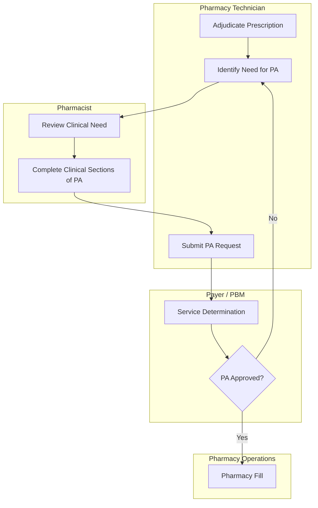

# Managing Prior Authorizations & Financial Assistance

## Definitions

### Prior Authorization (PA) / Precertifications

A **Prior Authorization (PA)** is a utilization‑management process used by **insurance payers and PBMs** to determine whether they will cover a prescribed medication. A PA is triggered when the insurer requires **clinical justification** before approving coverage for a drug that falls outside standard benefit rules.

This process helps control healthcare costs. **Pharmacy technicians** support the workflow by initiating requests, gathering documentation, tracking statuses, and communicating with insurers.

> 📌 Some medications may still be purchased out‑of‑pocket, at the pharmacist's discretion, even if a PA is denied.

🔑 **Common Reasons a PA Is Required**

- **New medication added to treatment plan**, including:
  - **Non‑formulary drugs**
  - **High‑cost (> $50k/year) or specialty medications**  
    - *Most specialty medications require PA with as much depth as off-label use*
    - Some approvals require enrollment in manufacturer **benefits investigation or patient support programs**.
  - **Step‑therapy requirements**
  - **Medications with safety or monitoring requirements** (e.g., biologics, controlled substances)
  - **Off‑label use** (*may require PA or PreD depending on payer and benefit type*)  
- **Dose changes**  
  - *Significant dose increases (e.g., >11%) may trigger PA depending on payer policy and drug‑specific criteria.*
- **New insurance plan**
- **Brand‑name drug requested when generic is available**
- **Expired PA** (typically renewed annually)
  - Some regimens (e.g., **Hepatitis C treatment**) may require **periodic reauthorization with updated labs** (e.g., every 4–8 weeks), depending on payer policy.  

> 🚨 PA rules are determined by **PBMs and insurers**, not by the pharmacy.

#### Predetermination (PreD)

A **Predetermination** is a process, primarily used by **commercial payers**, to obtain approval for **off‑label or non‑standard therapy** *before* treatment is administered.

Government payers *may* allow prior authorization for off‑label use if supported by recognized compendia (e.g., under certain **Medicare Part B** or Medicaid policies). **Medicare Part D** coverage is handled through PA and formulary exception pathways.

`Getting the government to cover off-label use is impossibly difficult`

Neither PA nor PreD guarantees payment. If denied, the patient may be responsible for the full cost.

#### 📲 Pharmacy Benefit Optimizers

PBOs are PBM‑managed portals used to submit and track PA requests.

Pharmacy technicians use these portals to:

- Check real‑time claim status
- Review formulary tiers and PA requirements
- Confirm eligibility and copay details
- Access PA forms and status updates
- Troubleshoot submission errors

> 📌 Examples: CoverMyMeds, Surescripts, OptumRx, Express Scripts, CVS Caremark, RxBenefits, Medi‑Cal Rx.

### Insurers

#### Commercial Insurance

**Commercial insurance** refers to private health insurance plans obtained through:

- Employers (group plans)
- The Health Insurance Marketplace / Exchange
- Direct purchase from private insurers

These plans typically include **private prescription drug coverage** under the pharmacy benefit.

#### Government-Funded (Public) Insurance

**Government-funded insurance** includes:

- **Medicare**
  - **Part A**: Hospital insurance  
  - **Part B**: Outpatient/medical services  
  - **Part C (Medicare Advantage)**: Private plans bundling A, B, and often D  
  - **Part D**: Prescription drug coverage  
- **Medicaid**: State-administered program for low-income individuals  
- **TRICARE**: Coverage for active-duty military, retirees, and dependents  
- **CHIP**: Children’s Health Insurance Program

Public insurance programs may have **different PA rules**, stricter coverage criteria, and limited flexibility for off-label use compared to commercial plans.

##### Federal Poverty Level (FPL)

The **Federal Poverty Level (FPL)** is an income threshold published annually by the **U.S. Department of Health & Human Services (HHS)**. It is used to determine eligibility for a wide range of benefits and assistance programs, including:

- Foundation grants  
- Pharmaceutical assistance programs (PAPs)  
- Medicaid and CHIP  
- Marketplace subsidies  
- Sliding‑scale clinic fees  

Foundations and PAPs commonly use FPL percentages to determine eligibility.

> Poverty guidelines can be found on the HHS website.

income level rubric created annually by the Department of Health & Human Services (HHS); used for determing if patients will qualify for benefits & programs. Foundations will use FPL. poverty guidelines can be found at the HHS Website.

View 🔗 [HHS Poverty Guidelines](https://aspe.hhs.gov/topics/poverty-economic-mobility/poverty-guidelines)

##### Determining Poverty Level

When a foundation states that eligibility requires **<500% FPL**, it means the patient’s **household income** must be **below 5× the poverty guideline** for their household size.

For example:

- **2026 FPL for a 3‑person household = $27,320**

To calculate a patient’s FPL percentage:

${\text{FPL} \% = \frac{\text{Household Annual Income}}{\text{FPL Guideline for Household Size}} \times 100}$

Example:

- Household income: **$60,000**
- FPL guideline (3 people): **$27,320**

${\frac{60,000}{27,320} \approx 219\% \text{ FPL}}$

to determine percentage of poverty divide annual income divided by poverty guideline for household size

Patients and staff can use online tools to simplify this process:

🔗 **[NeedyMeds FPL Calculator](https://www.needymeds.org/federal-poverty-level-calculator)**

### Financial Assistance

**Financial Assistance** is used when a patient’s out‑of‑pocket costs create financial hardship. Financial strain often leads to **non‑adherence**, such as skipping doses or splitting tablets to extend supply.

The main sources of financial assistance include:

- **Foundation Grants**
- **Pharmaceutical Assistance Programs (PAPs)**
- **Manufacturer Co‑Pay Cards / Coupons**
- **Community organizations** (churches, clinics, nonprofits)

`All of these may involve an appeal process if the initial request is denied.`

#### Foundation Grants

**Foundations** are nonprofit organizations funded by pharmaceutical companies, philanthropists, and donors.

**Grants** provide financial support for eligible patients based on disease‑specific criteria, income limits, guidelines for use, and fund availability.

- 🔗 [Patient Access Network Foundation](https://www.panfoundation.org/)
- 🔗 [Patient Advocate Foundation](https://www.patientadvocate.org/)
- 🔗 [Good Days](https://mygooddays.org/)
- 🔗 [HealthWell Foundation](https://www.healthwellfoundation.org/)

##### Important Considerations for Foundation Grants

- **Funds open and close unpredictably**  
  Foundation funds open when new donations arrive and close once fully allocated.  

- **Foundations are diagnosis‑specific**  
  Each foundation supports specific disease states.  
  Within a foundation, **subcategories** (e.g., metastatic vs. non‑metastatic) may open or close independently.
  Subcategories often have separate funding pools.

- **Grant duration is typically one year**  
  Most grants are active for **12 months from the approval date**, not calendar year.

- **Renewal requires a new application**  
  After expiration, a **new application** must be submitted on the patient’s behalf.  
  Some foundations allow early renewal if funds reopen.

- **Patients may receive multiple grants**  
  If funds are available and eligibility criteria are met, patients can hold **multiple grants** (e.g., medication + travel assistance).

- **Eligibility is based on Federal Poverty Level (FPL)**  
  Foundations typically require income below a specific FPL percentage (e.g., <300%, <500%).  

- **Random audits may occur**  
  Some foundations conduct **random audits** to verify income, diagnosis, and use of funds.  
  Keep applications, income documents, and clinical notes on file for compliance.  

#### Pharmaceutical / Patient Assistance Programs (PAPs)

PAPs are programs offered by **drug manufacturers** to assist:

- **Uninsured patients**
- **Underinsured patients**, including those with Medicare or Medicaid (rules vary by manufacturer)

PAPs may provide:

- Free medication
- Reduced‑cost medication
- Temporary bridge supply while coverage is pending  
  - common for specialty drugs

#### Co-Pay Cards & Coupons

Co‑pay cards and coupons are the most commonly used form of assistance and apply **only to commercially insured patients**.

They are typically provided by pharmaceutical companies for **brand‑name medications** and may be:

- Given at the prescriber’s office
- Downloaded online
- Activated through manufacturer portals

Patients present these cards at the pharmacy during adjudication.

Co-pay cards & coupons are the most commonly used form of assistance; only applicable to **commercially-insured** patients.

**Exception to Commercial Insurance Requirement**:  

- If the co‑pay card is for a **free trial supply**, it is billed **only to the card**, not to insurance.  
- Limited to **new starts** with strict eligibility requirements.
- Free trial cards bypass insurance.

#### Community Organizations

Community organizations may raise funds to help patients with financial burdens. These are typically used when:

- No foundation funds are available
- The patient does not qualify for PAPs
- The patient needs short‑term or emergency support

Examples include churches, local nonprofits, and provider‑affiliated charity programs.

#### Patient Assistance Guides

| Resource | Description |
| --- | --- |
| [NeedyMeds](https://www.needymeds.org) | Database of 5,000+ PAPs, coupons, and assistance programs |
| [Partnership for Prescription Assistance](https://www.pparx.org) | Connects patients to free or reduced‑cost medication programs |
| [RxAssist](https://www.rxassist.org) | Search by drug name; lists PAP availability and eligibility |

#### Brand‑Name Medication Programs

Most brand‑name manufacturers offer patient assistance programs directly through their websites.

> Example: 🔗 [AZ&Me by AstraZeneca](https://www.azandmeapp.com/)  
> This program requires prescriptions to be filled through their designated dispensing pharmacy.

---

## Personnel

`Clinics may require a dedicated PA team; large hospitals may require multiple teams, often aligned by therapeutic area.`

### Shared Training

Core competencies for staff involved in PA and reimbursement workflows include:

- **Familiarity with drug lists, payer policies, and terminology**
- **EMR navigation** for gathering clinical information and evidence
- **Basic therapeutics**, including:
  - Indications for use
  - Disease implications
  - Treatment modalities & expected outcomes

### Pharmacy Department

**Pharmacists**:

- Perform clinical review of requests
- Support or author appeals
- Participate in peer‑to‑peer discussions when required by the payer

#### Pharmacy Technicians

**Pharmacy Technicians**:

- Initiate PA paperwork
- Gather clinical and administrative data
- Track requests and communicate with payers
- Document all actions in the EMR for continuity of care
- Identifying when a patient still requires assistance, despite PA Approval, and subsequent
  - Enrollment & renewal in **Copay Assistance**, **Pharmaceutical Assistance Programs (PAPs)**
  - Applications for **Foundation Grants**

### Practitioners Department

**Physicians**:

- Provide clinical justification and documentation
- May be required to speak directly with payers for peer‑to‑peer reviews

### Shared Roles

**Nurses**:

- Assist with clinical documentation (labs, vitals, progress notes)
- Support appeals and ongoing monitoring in collaboration with pharmacy and prescribers

**Medication Assistance Coordinators** coordinate benefits investigations with manufacturer hubs, identify eligible patients, and enroll patients in:

- **Manufacturer Patient Assistance Programs (PAPs; uninsured patients)**
- **Manufacturer copay support programs (insured patients)**
  - Tracking renewal deadlines for PAPs and copay programs
- **Foundation grants** (when applicable)
- **Medicare** enrollment support
- **Medicaid and low‑income subsidy programs**
- **State programs** (e.g. ADAP)
- **Social Security disability–related benefits navigation**

**Reimbursement Specialists**:

- Perform **benefits verification** (medical & pharmacy benefit)
- Initiate and track **PA, PreD, and appeal** paperwork
- Gather clinical and administrative data from EMR and prescribers
- Communicate with payers and prepare **draft appeal letters**
- Identify **denial trends**, coverage gaps, and payer‑specific patterns
- Educate clinical staff on payer policies, documentation requirements, and coding expectations
- Attend quarterly meetings for:
  - Policy updates
  - Escalation of systemic issues
  - Relationship‑building with case managers at **Third‑Party Administrators (TPAs)**  
  - Collaboration with **pharmaceutical reimbursement account representatives**
- Hold payers accountable to contractual obligations by:
  - Requesting supervisor review
  - Escalating incorrect denials
  - Requesting reconsideration when payer actions conflict with policy

---

## 🧾 PA Workflow

The PA process must be monitored closely to ensure timely patient care and proper reimbursement.

### 1. **Identify the Rejection & Notify the Pharmacist**

- Look for **Reject Code 75**, **PA Required**, or similar messages.
- Confirm no alternative coverage exists.

The pharmacist determines whether:

- A PA is appropriate, **or**
- A formulary alternative should be used.

> 🛡️ Escalate immediately if the medication is urgent or the patient is distressed.  
> 🚨 **Emergency/life‑saving medications may bypass PA** depending on state and federal rules, but this must be determined by the pharmacist. *Federal law does not universally exempt all emergency meds from PA; exceptions vary by payer and state.*

### 2. **Determine Medication Eligibility with the Payer**

`This is technically the first step in the PA process.`

Review payer‑specific resources:

- Clinical policies, bulletins, and newsletters  
  - Includes definitions of **medically necessary** vs **experimental**; *government payers may cover off‑label use if supported by compendia (e.g., Medicare Part B)*
- Formulary listings
- PA guidelines & criteria
- Contract drug lists (restricted distribution or specialty‑pharmacy‑only medications)

### 3. **Collect Documentation**

Gather all relevant information (e.g. prescription data, insurance info, and rejection messages).

**Clinical Packet Contents**:

- Medical records:
  - ICD‑10 diagnosis codes  
  - CPT/HCPCS procedure or administration codes  
    - *HCPCS codes are often required for specialty drugs*
  - Lab results, imaging, and diagnostics
  - Past therapies, treatment failures, and progress notes
  - Letters of medical necessity
  - Treatment plan
- Compendia or literature supporting use
- Previous approval letters (if applicable)

### 4. **Submit the PA Request**

- Submit via ePA tools, payer portals, or fax (under pharmacist supervision).
- Upload a copy of the PA request to the EHR.
- Document submission date/time and status in the patient profile so all care team members can view it.

### 5. **Inform the Patient**

- Set expectations: PA review typically takes **1–3 business days**, but may take longer for specialty medications.
- Encourage the patient to follow up with the prescriber for urgent needs.

### 6. **Resolving Denials**

`Always escalate denials immediately to the pharmacist or billing/reimbursement specialist.`

**Pharmacist Responsibilities**:

- Notify prescriber of denial reason.
- Assist with appeals or formulary exception requests.
- Provide clinical justification when needed.

**Technician Responsibilities**:

- Identify the denial reason.
- Verify documentation completeness.
- Track appeal submissions and deadlines.
- Escalate time‑sensitive issues immediately.

#### Common Reasons for PA Denial

| Reason | Description | Resolution |
| --- | --- | --- |
| Lack of PA | PA not submitted | Submit PA |
| Insufficient Documentation | Medical necessity not established | Review requirements; obtain missing info; resubmit |
| Experimental / Investigational | Therapy not supported by payer policy | Review policy; consider alternative therapy |
| Out‑of‑Network Provider | Provider not contracted | Provide justification (e.g. lack of nearby contractors) & resubmit or redirect to in‑network provider |
| Timely Filing Exceeded | Submission deadline missed | May require new claim or new PA |
| Multiple Diagnoses | Conflicting or excessive ICD‑10 codes | Correct coding and resubmit |
| Incorrect Diagnosis | ICD‑10 not within PA requirements | Update diagnosis if clinically appropriate |
| Billing Error | Units or directions not billable | Correct prescription and resubmit |
| Not Covered / Contract Drug | Medication must be filled at payer‑designated specialty pharmacy | Transfer prescription and coordinate PA through contracted pharmacy |

> 🛡️ Always document submission date/time, patient notification, and any escalation to create a clear timeline of events.

---

## Navlinks

- 🔙🔗 Back to [**Prescription Intake & Order Entry**](./rx_intake.md#-prior-authorization-pa)
- 🔙🔗 Back to [**Prescription Processing Workflows**](./prescriptions.md#sop-prior-authorizations--patient-assistance)
