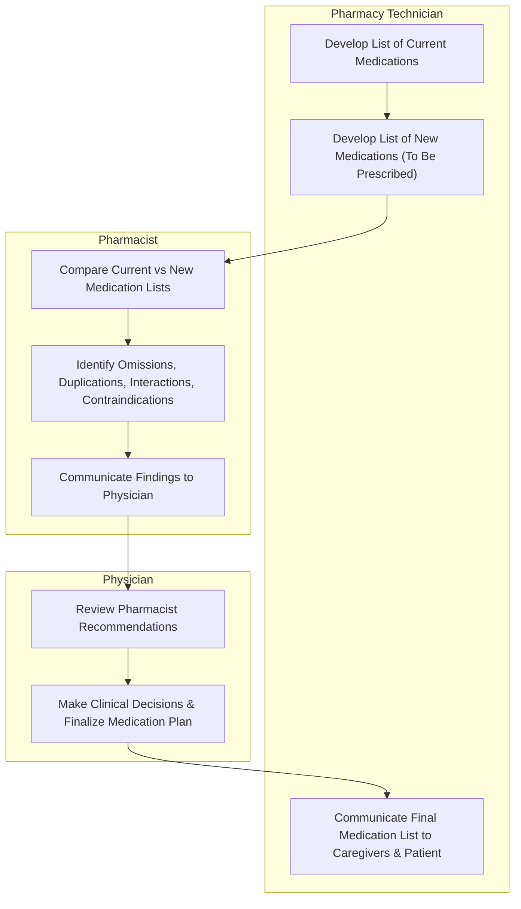

# Medication Reconciliation for Assisting with MTM Services

## Definitions

### Medication Reconciliation

**Medication Reconciliation** is the process of comparing medications a patient is taking (and should be taking) with newly ordered medication in order to resolve discrepancies or potential problems.

This process was developed to ensure clinicians do not inadvertantly add, change, or leave out medications, write duplications, or cause unwanted interactions, and to communicate accurate information to all relevant caregivers.

### NPSG.03.06.01

The Joint Commission developed National Patient Safety Goal (NPSG) **NPSG.03.06.01** to maintain & communicate accurate patient medication information.

This goal applies to:

- Ambulatory Care
- Behavioral Health Care
- Critical Access Hospitals
- Home Care
- Hospitals
- Long Term Care
- Office-based Surgery Settings

#### NPSG Performance Recommendations

- Obtain and/or update information on medications the patient is currently taking. This information is documented in a list or other format that is useful to those who manage medications.
- Compare the medication information the patient brought to the organization/ is currently taking with the medications ordered for the patient by the organization in order to identify & resolve discrepancies.
- Provide the patient (or family as needed) with written information on the medications the patient should be taking when they leave the organization's care.
- Explain the importance of managing medication information to the patient (individual).

### The Joint Commission's Definition of Medication

**Medications**, as defined by TJC, are:

- prescription medications
- sample medications
- herbal remedies
- vitamins
- nutraceuticals
- vaccines
- Over-the-Counter Drugs
  - *prescription optional*
- diagnostic & contrast agents used on or administered to diagnose, treat, or prevent disease or other abnormal conditions
- radioactive medications
- respiratory therapy treatments
- parenteral nutrition
- blood derivatives
- Intravaneous Solutions (plain, with electrolytes and/ or drugs)
- any product designated by the FDA as a drug

### For the Purpose of Reconciliation

**Medications**, for the purpose of reconciliation, include:

- Prescriptions, over-the counter drugs, herbal & dietary supplements
- Substances that may have an impact on the patient's care & treatments
- Substances that may interact with other therapies potentially used during the medical care episode

---

## Personnel

### Pharmacy Technician

Pharmacy technician's main responsibilities are to:

- Research & document patient medication histories
  - Noting omissions or unclear information
- Support physicians, nurses, & pharmacists in program facilitation
- Assist with the logistics of patient medication transfer
- Provide translation assistance services for patients not fluent in English

### Pharmacist

The pharmacist will perform clinical review of the collected medication history; noting omissions, duplications, contraindications, or unclear information. This report is passed to the provider.

### Physician

The provider will make clinical decisions based on the pharmacist's input & provided reconciliation report.

---

## Medication Reconciliation Workflow

### 1. Verify Medication History

Obtain an Accurate List of Current Medications

### 2. Comparison with Newly Ordered Medication

Pharmacist looks for discrepancies or potential problems
