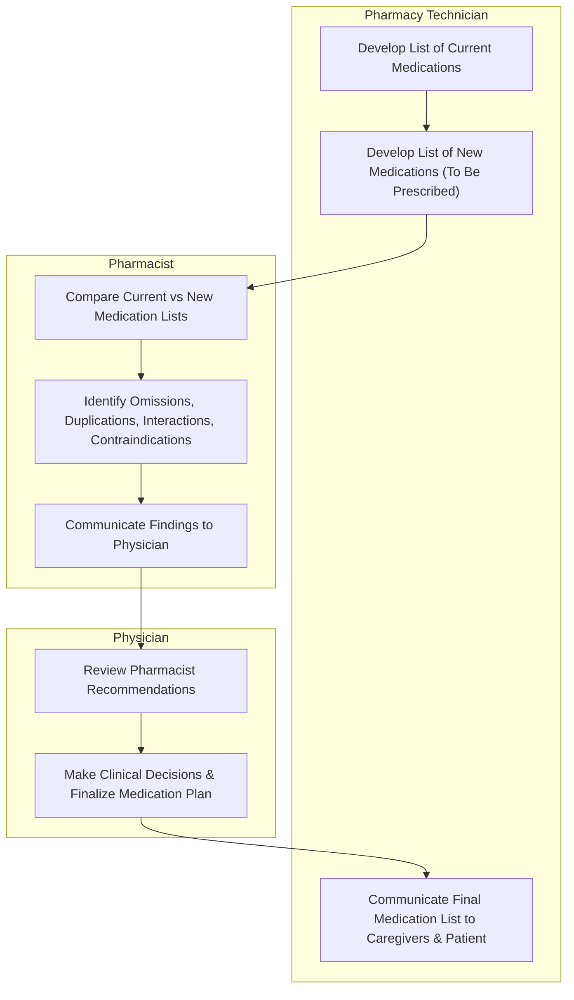

# SOP: Medication Reconciliation

## Definitions

### Medication Reconciliation

**Medication Reconciliation** is the process of comparing medications a patient is taking (and should be taking) with newly ordered medication in order to resolve discrepancies or potential problems.

This process was developed to ensure clinicians do not inadvertantly add, change, or leave out medications, write duplications, or cause unwanted interactions, and to communicate accurate information to all relevant caregivers.

### NPSG.03.06.01

The Joint Commission developed National Patient Safety Goal (NPSG) **NPSG.03.06.01** to maintain & communicate accurate patient medication information.

This goal applies to:

- Ambulatory Care
- Behavioral Health Care
- Critical Access Hospitals
- Home Care
- Hospitals
- Long Term Care
- Office-based Surgery Settings

#### NPSG Performance Recommendations

- Obtain and/or update information on medications the patient is currently taking. This information is documented in a list or other format that is useful to those who manage medications.
- Compare the medication information the patient brought to the organization/ is currently taking with the medications ordered for the patient by the organization in order to identify & resolve discrepancies.
- Provide the patient (or family as needed) with written information on the medications the patient should be taking when they leave the organization's care.
- Explain the importance of managing medication information to the patient (individual).

### The Joint Commission's Definition of Medication

**Medications**, as defined by TJC, are:

- prescription medications
- sample medications
- herbal remedies
- vitamins
- nutraceuticals
- vaccines
- Over-the-Counter Drugs
  - *prescription optional*
- diagnostic & contrast agents used on or administered to diagnose, treat, or prevent disease or other abnormal conditions
- radioactive medications
- respiratory therapy treatments
- parenteral nutrition
- blood derivatives
- Intravaneous Solutions (plain, with electrolytes and/ or drugs)
- any product designated by the FDA as a drug

### Definition of Medication For the Purpose of Reconciliation

**Medications**, for the purpose of reconciliation, include:

- Prescriptions, over-the counter drugs, herbal & dietary supplements
- Substances that may have an impact on the patient's care & treatments
- Substances that may interact with other therapies potentially used during the medical care episode

### Non-Compliance

**Non‑Compliance** occurs when a patient does not take their medication as instructed.  

It is one of the most common causes of medication history discrepancies and can significantly impact MTM outcomes, safety, and therapeutic effectiveness.

Non‑compliance may be **unintentional** or **intentional**, and identifying the underlying cause is essential for accurate reconciliation and patient safety.

#### Causes of Non‑Compliance

##### 1. Unintentional Non‑Compliance

Patients may be confused or misinformed for several reasons:

- Lack of understanding about **why** the medication is needed  
- Misunderstanding or forgetting **directions for use**  
- Not recognizing **intended or unintended effects**  
- Difficulty understanding **healthcare terminology**  
- Physical limitations (vision impairment, dexterity issues, cognitive decline)  
- Financial barriers (cannot afford refills, transportation issues)  
- Complex regimens that are difficult to manage  

Unintentional non‑compliance is often rooted in **low health literacy**, cognitive challenges, or system‑level barriers.

##### 2. Intentional Non‑Compliance

Patients may choose not to adhere because they:

- Disagree with the provider’s assessment of acceptable risk  
- Experience side effects they find intolerable  
- Believe the medication is unnecessary  
- Prefer alternative therapies  
- Fear dependency or long‑term effects  
- Want to “stretch” medication by skipping doses  

Intentional non‑compliance is still a **clinical issue**, not a moral failing.  
Understanding the patient’s reasoning is essential for safe care.

#### Health Literacy and Its Impact

**Health literacy** is the degree to which individuals can obtain, process, and understand health information needed to make appropriate decisions.

Low health literacy is an **independent risk factor** for:

- Increased mortality  
- Lower satisfaction with care  
- Lower quality of care  
- Worse patient safety outcomes  
- Higher healthcare costs  

Patients with low literacy may struggle to:

- Understand instructions  
- Interpret drug warning labels  
- Follow complex regimens  
- Navigate refills, prior authorizations, or pharmacy processes  

Most patients will **not disclose** that they do not understand their medications.

**Red Flags for Low Literacy or Non‑Compliance**:

- Does not know the names or purposes of medications  
- Passive communication style; rarely asks questions  
- Difficulty completing forms  
- Trouble navigating diagnostic tests, procedures, or refills  
- Inconsistent or vague descriptions of medication use  
- Brings in disorganized or outdated medication bottles  
- Reports “I take the white pill” or “the little round one” without details  

Because low literacy cannot always be identified, staff should use **universal precautions**:

- Communicate clearly and simply  
- Avoid jargon  
- Use teach‑back (“Can you show me how you take this?”)  
- Provide written materials in plain language  

#### Identifying Non‑Compliance

The first step in addressing non‑compliance is **recognizing it**.

Indicators include:

- Missed refills or delayed refill patterns  
- Patient reports skipping doses or altering schedules  
- Medication bottles with inconsistent pill counts  
- Conflicting information between patient, caregiver, and pharmacy records  
- Patient expresses confusion, frustration, or fear about medications  

Once identified, the technician should document concerns and escalate to the pharmacist for clinical review.

---

## Personnel

### Pharmacy Technician

Pharmacy technician's main responsibilities are to:

- Research & document patient medication histories
  - Noting omissions or unclear information
- Support physicians, nurses, & pharmacists in program facilitation
- Assist with the logistics of patient medication transfer
- Provide translation assistance services for patients not fluent in English

### Pharmacist

The pharmacist will perform clinical review of the collected medication history; noting omissions, duplications, contraindications, or unclear information. This report is passed to the provider.

### Physician

The provider will make clinical decisions based on the pharmacist's input & provided reconciliation report.

---

## Medication Reconciliation Workflow

---

## Medication History Workflow

Medication history collection begins with a **direct patient interview** and is the foundation of accurate medication reconciliation.

A high‑quality history reduces medication errors, improves MTM outcomes, and ensures safe transitions of care.

### Medication History Tips

- Ask **open‑ended questions** that cannot be answered with yes/no.  
- Prompt the patient or caregiver to think beyond “typical” medications.  
- Document clearly, concisely, and consistently.  
- Verify information using **multiple sources** whenever possible.

**Common Errors to Watch For**:

- Omitted medications  
- Medications listed but **not actually being taken**  
- Missing information (dose, route, frequency)  
- LASA (Look‑Alike Sound‑Alike) medication confusion  
- Errors in transcription or data entry

Always document **where each piece of information came from** (patient, caregiver, pill bottles, pharmacy, EHR, etc.).

### 1. Interview Preparation

`Accuracy depends on the patient's willingness & ability to provide correct information.`

Before speaking with the patient:

- Review available EHR data, prior medication lists, and recent provider notes.  
- Identify high‑risk medications or disease states requiring closer attention.

Ask the patient to bring **all medications**, including:

- Creams, lotions, solutions, syrups  
- Sprays, inhalers, eye drops  
- Insulin vials, pens, injections  
- Nasal sprays, nebulizers  
- Over‑the‑counter medications  
- PRN (“as needed”) medications  
- Herbal products  
- Food supplements

If the patient does not speak English as their first language, encourage them to bring a family member to interpret.  
If no one is available, request a professional interpreter to ensure accuracy and avoid miscommunication.

### 2. Introductions

Begin with a professional, patient‑centered introduction:

- Confirm patient identity using **name and date of birth**.  
- Explain the purpose of the medication history and how it improves their care.  
- Ask about:
  - Medication allergies  
  - Food allergies  
  - Environmental allergies  
  - Reactions (not just “yes/no”)
- Determine how many pharmacies (including mail‑order) and providers the patient uses.  
- Identify each pharmacy and prescriber for later verification.

> If the patient has brought an interpreter, make sure to stress the importance of open‑ended questions and instruct them not to summarize. The interpreter should translate word‑for‑word, not filter or condense the patient’s responses.

### 3. Determine Medications

Review and individually verify **each medication** (OTC & Rx) with the patient or caregiver.

For every medication, obtain:

- **Name** (brand/generic, abbreviations, formulations)  
  - Patient may know brand or generic name
  - Patient may not know the names at all
- **Dosage form**  
- **Dose & strength**  
  - To determine amount of active ingredient
- **Frequency** (directions for use)  
- **Duration** (how long they’ve taken it)  
- **Route of administration**  
- **Indication** (why they take it)  
  - indication is critical for MTM and deprescribing decisions

> Any information the patient provides may be incomplete or incorrect.  
> Verification is essential.

Also gather the same information for **herbal medications, supplements, and OTC products**.

Helpful prompts:

- “What do you take for pain?”  
- “What medications do you take only sometimes or as needed?”  
- “What do you buy off the shelf?”  
- “What do you take if you have allergies?”

### 4. Determine Compliance & Identify Possible Issues

Clarify **how** the patient is actually taking their medications:

- “In the last week, how many doses did you miss?”  
- “When was the last time you took your blood pressure medicine?”  

Identify barriers:

- Side effects  
- Cost  
- Forgetfulness  
- Difficulty opening bottles or using devices  
- Misunderstanding directions

If the patient is non‑compliant, ask:

- “What do you not like about your medications?”  
- “Is cost ever a factor?”  
- “Have you noticed any side effects?”

### 5. Educate the Patient on the Importance

Explain why maintaining and carrying an accurate medication list matters:

- Many providers are unaware of medications prescribed by others.  
- OTCs and supplements can interact with prescription drugs.  
- An accurate list reduces the risk of medication errors.  

Encourage the patient to:

- Update their list after **every** provider visit or hospital discharge.  
- Bring the list to **all** appointments, pharmacy visits, and care transitions.  

### 6. Cross-Examination

Ask for permission to contact family or caregivers to fill in gaps:

- “Is there someone at home who can read your medication labels to us?”  

After the interview:

- Call **all pharmacies** the patient uses to cross‑reference active prescriptions.  
- Document any discrepancies found.

### 7. Gather Pending Medications

Review pending or newly ordered medications in the EHR:

- Identify new prescriptions  
- Identify discontinued medications  
- Identify dose changes

### 8. Submit Report to Pharmacist & Provider

Provide the completed medication history to the pharmacist for clinical review.

The pharmacist will:

- Compare current vs new medications  
- Identify omissions, duplications, interactions, contraindications  
- Communicate findings to the provider  

The provider will:

- Make clinical decisions based on the reconciliation report  

---

## Navlinks

- 🔙🔗 Back to [**Core Pharmacy Workflows & Standard Operating Procedures (SOP)**](../core_operations.md#medication-reconciliation)
