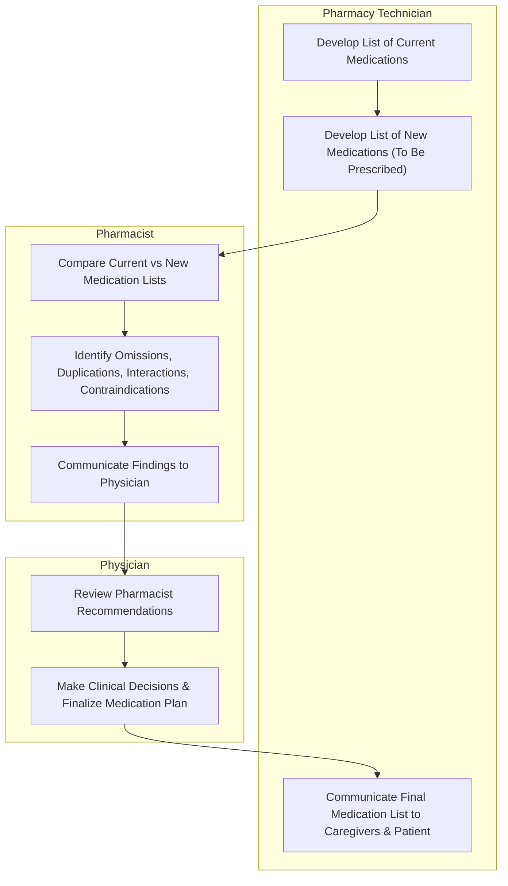

# Medication Reconciliation for Assisting with MTM Services

## Definitions

### Medication Reconciliation

**Medication Reconciliation** is the process of comparing medications a patient is taking (and should be taking) with newly ordered medication in order to resolve discrepancies or potential problems.

This process was developed to ensure clinicians do not inadvertantly add, change, or leave out medications, write duplications, or cause unwanted interactions, and to communicate accurate information to all relevant caregivers.

### NPSG.03.06.01

The Joint Commission developed National Patient Safety Goal (NPSG) **NPSG.03.06.01** to maintain & communicate accurate patient medication information.

This goal applies to:

- Ambulatory Care
- Behavioral Health Care
- Critical Access Hospitals
- Home Care
- Hospitals
- Long Term Care
- Office-based Surgery Settings

#### NPSG Performance Recommendations

- Obtain and/or update information on medications the patient is currently taking. This information is documented in a list or other format that is useful to those who manage medications.
- Compare the medication information the patient brought to the organization/ is currently taking with the medications ordered for the patient by the organization in order to identify & resolve discrepancies.
- Provide the patient (or family as needed) with written information on the medications the patient should be taking when they leave the organization's care.
- Explain the importance of managing medication information to the patient (individual).

### The Joint Commission's Definition of Medication

**Medications**, as defined by TJC, are:

- prescription medications
- sample medications
- herbal remedies
- vitamins
- nutraceuticals
- vaccines
- Over-the-Counter Drugs
  - *prescription optional*
- diagnostic & contrast agents used on or administered to diagnose, treat, or prevent disease or other abnormal conditions
- radioactive medications
- respiratory therapy treatments
- parenteral nutrition
- blood derivatives
- Intravaneous Solutions (plain, with electrolytes and/ or drugs)
- any product designated by the FDA as a drug

### For the Purpose of Reconciliation

**Medications**, for the purpose of reconciliation, include:

- Prescriptions, over-the counter drugs, herbal & dietary supplements
- Substances that may have an impact on the patient's care & treatments
- Substances that may interact with other therapies potentially used during the medical care episode

---

## Personnel

### Pharmacy Technician

Pharmacy technician's main responsibilities are to:

- Research & document patient medication histories
  - Noting omissions or unclear information
- Support physicians, nurses, & pharmacists in program facilitation
- Assist with the logistics of patient medication transfer
- Provide translation assistance services for patients not fluent in English

### Pharmacist

The pharmacist will perform clinical review of the collected medication history; noting omissions, duplications, contraindications, or unclear information. This report is passed to the provider.

### Physician

The provider will make clinical decisions based on the pharmacist's input & provided reconciliation report.

---

## Medication Reconciliation Workflow

---

## Medication History Workflow

Starts with a direct patient interview

### Medication History Tips

- Ask open ended questions that can't be answered with yes or no.
- Prompt the patient or caregiver beyond typical medications.
- Document in a clear & concise manner.

Look for potential errors in medication history:

- Omissions
- medication listed, but not taking
- missing information (dose, route, frequency)
- LASA Medications
- Errors in data entry

Obtain as much information as possible and list the source for documentation

### 1. Interview preparation

familiarize yourself with relevant and accessible information regarding patient history.
ask patient to bring in all medications, including: creams, lotions, solutions, syrups, sprays, inhalers, eye drops, insulin vials, injections, nasal sprays, nebulizers, over the counter medications, as needed medications, herbal products, and food supplements.
<!-- preserve list exactly because it's for a patient that doesnt know better -->

### 2. Introductions

The technician should begin the interview with an introduction

confirm patient identification by asking for name & date of birth

explain what you're doing and why

determine if the patient has any medication, food, and/or environmental allergies/ intolerances (and reactions)

determine how many pharmacies (including mail-order) and providers the patient use then identify them.

### 3. Determine Medications

Review and individually verify each medication (OTC & Rx) with patient or caregiver. The technician must obtain the following information for every drug the patient takes:

- Name (abbreviations & formulations)
  - Patient may know brand or generic name
- Dosage Form
- Dose & Strength
  - To determine amount of active ingredient
- Frequency
  - Directions for Use
- Duration
  - How long the patient has taken the medication
- Route of administration
- Reason for taking the medicaiton

> Any information the patient provides may be completely wrong.

Gather the same information about herbal medications or supplements.

"what do you take for pain"
what medications do you only take sometimes or as needed
what do you take that you buy off the shelf
what do you take if you have allergies

### 4. Determine Compliance & Identify Possible Issues

Clarify how the patient is actually taking the medication.

- "in the last week, how many doses did you miss?"
- "when was the last time you took your blood pressure medicine"

Determine if the patient is having any problems with their medications.

If the patient is noncompliant with medication, ask why.

- "What do you not like about your medications? Cost? Side effects?"

### 5. Educate the Patient on the Importance

Educate the patient and/ or caregiver about the importance of carrying accurate and up-to-date medication information with them.
Many providers are not aware of medication prescribed by other clinicians and OTCs the patient chooses.
An accurate list could decrease the chance of medication error.
recommend updating the list after every provider visit and hospital discharge
list should be shown at every office visit, trip to the pharmacy, or admission to care facilities to prevent errors.

### 6. Cross-Examination

Ask for permission to call family to address any omissions.

"Is there someone at home that can read off your medications from the prescriptions?"

After the interview, call all pharmacies to cross-reference prescription medications & document discrepancies

### 7. Gather Pending Medications

look at pending physician's orders in the EHR

### 8. Submit Report to Pharmacist & Provider

provide your completed report
